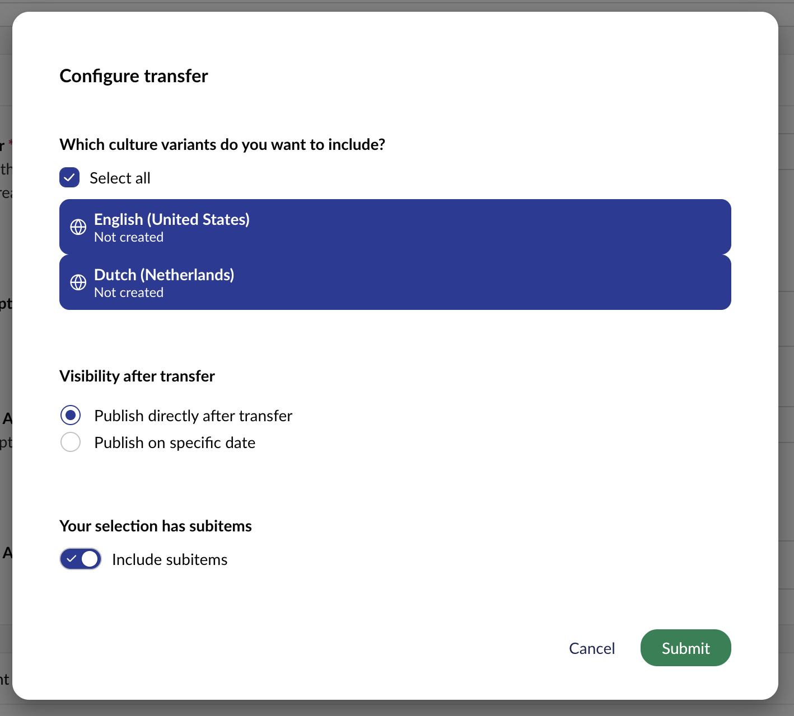
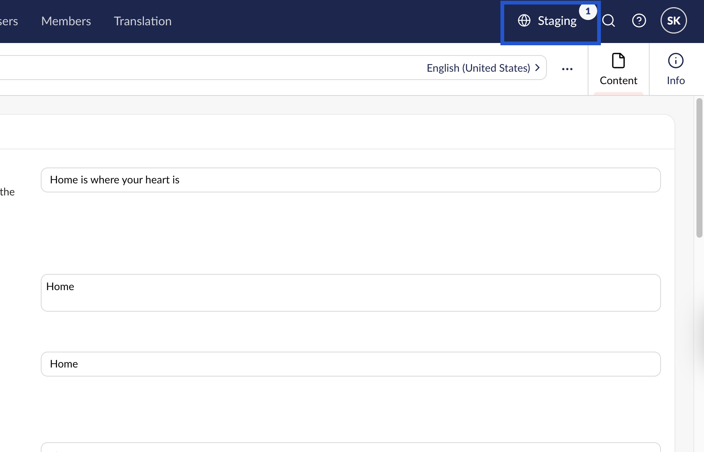
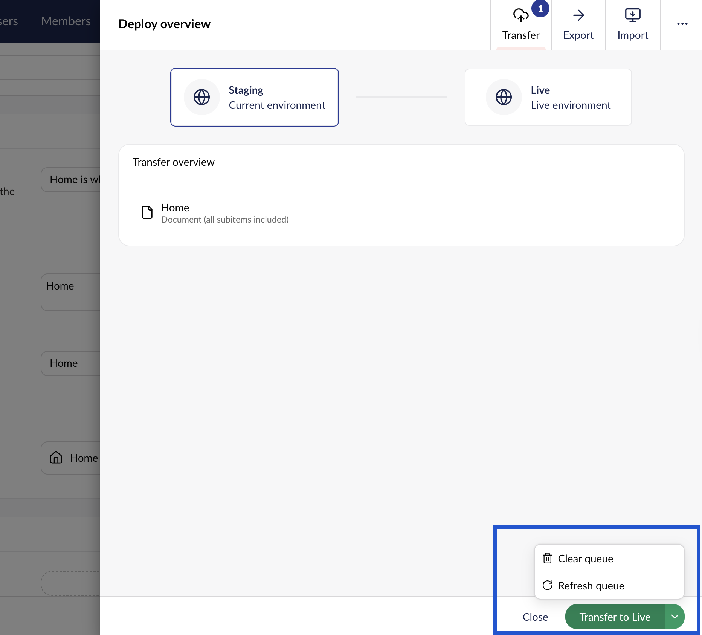
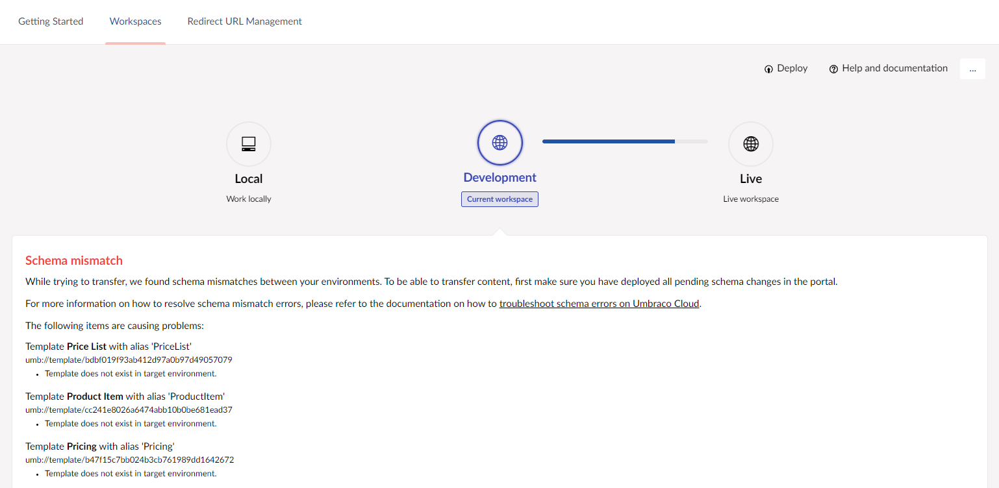

# Transfer Items

Once all code and metadata are in sync between your environments, it's time to transfer your content and media. This is done from the Umbraco Backoffice.

Transfers are flexible, which means you have complete control over which items you want to transfer. You can transfer it all in one go, a few at a time, or transfer only a single item.

Transferring items will overwrite the same item on the target environment if it already exists. A transfer will transfer the items that you select in the "source" environment to the "target" environment exactly the same as it was in the "source".


Content and Media transfers will only work if you've deployed all changes to your metadata beforehand. Please refer to our documentation on how to deploy metadata from either [Local to Cloud](local-to-cloud.md) or [between your Cloud environments](cloud-to-cloud.md).


## Transfer Queue

The first step when transferring items from your environment is to add them to the Transfer Queue. You can add items to the Transfer queue from the following sections:

* Content from the **Content** section.
* Elements from the **Library section**.
* Media from the **Media** section.
* Forms from the **Forms** section ([additional configuration is required](content-transfer.md#umbraco-forms)).
* Members and Member Groups from the **Members** section ([additional configuration is required](content-transfer.md#members-and-member-groups)).

Choose between two methods when adding items to the Transfer Queue:

* **Option 1:** Add a specific item, specify variants, and include/exclude subitems.
* **Option 2:** Add everything from a specific section (Content, Media, Library, or Forms).

### Add items to the queue

The steps below take you through the options available when choosing **Option 1**:&#x20;

1. Click on the ellipsis node next to **the root item** in the tree.
   1. For **Option 2**, click on the ellipses next to the tree title (Content, Media, Elements, or Forms).
2. Choose **Add to Transfer Queue**.
3. Select the culture variants you want to add.
   1. Only languages for which you have permission to access will be selectable.
4. Choose to either publish the content directly after transferring or set a specific date and time.
5. Choose whether or not to include any subitems.

<figure><figcaption><p>Queue for transfer window</p></figcaption></figure>

6. Click **Submit** to add the content to the Transfer Queue.

### Transfer queued items

Once you have items in your Transfer Queue, a notification icon is added to the Environment name in the top-right corner. The number is increased depending on how many different items are queued.

1. Open the **Deploy Overview** by clicking on the **Environment name**.

<figure><figcaption></figcaption></figure>

2. Review the items added to the Transfer Queue.
   1. You will be able to see which items are currently ready to be transferred - this will include both content and media that you've _queued for transfer_.
   2. Hover an item to get the **Remove** option, or use the Refresh and Clear queue options found via the arrow at the bottom.
3. Click **Transfer to \[Environment name]** to transfer the items to the next environment.

<figure><figcaption><p>Transfer queue</p></figcaption></figure>

The transfer can take a few minutes, depending on the number of items being transferred to the next environment. You can follow the process from the Deploy Overview.

When the transfer is done, close the Deploy Overview and verify that the items are now available on the next environment.

## [Transfer Members and Member Groups](https://docs.umbraco.com/umbraco-deploy/deploy-settings#allowmembersdeploymentoperations-and-transfermembergroupsascontent)

To be able to transfer Members and Member groups, make sure that `AllowMembersDeploymentOperations` is configured to `transfer` and `TransferMemberGroupsAsContent` is set to `true`. This needs to be done in the `appSettings.json` file

```json
"Umbraco": {
    "Deploy": {
        "Settings": {
            "AllowMembersDeploymentOperations": "Transfer",
            "TransferMemberGroupsAsContent": true,
        }
    }
  }
```

Once the settings have been configured, Members can be transferred as described [using steps above](content-transfer.md#add-items-to-the-transfer-queue).

## Transfer Forms

You'll need to ensure the `TransferFormsAsContent` setting is set to `true` in the `appsettings.json` file:

```json
"Umbraco": {
    "Deploy": {
        "Settings": {
            "TransferFormsAsContent": true,
        }
    }
  }
```


This does not include entries submitted via the forms.


## Transfer Dictionary Items <a href="#transferdictionaryascontent" id="transferdictionaryascontent"></a>

Deploy can be configured to allow for backoffice transfers of dictionary items instead of using files serialized to disk by setting `TransferDictionaryAsContent` as `true`.

```json
"Umbraco": {
    "Deploy": {
        "Settings": {
             "TransferDictionaryAsContent": true,
        }
    }
  }
```


When changing the values for`TransferDictionaryAsContent` and `TransferFormsAsContent` to `true,`remove any `.uda` files for Forms and Dictionary entities that have been serialized to disk. These will no longer be updated. By deleting them you avoid any risk of them being processed in the future and inadvertently reverting a form to an earlier state.


## Schema Mismatches

Sometimes, a content transfer is not possible. For example, adding a new property to the _HomePage_ Document Type that's missing in another Cloud environment throws an error. The error contains details on how to fix it.



If you encounter this issue while transferring content, refer to the [Schema Mismatches](../../../optimize-and-maintain-your-site/monitor-and-troubleshoot/resolve-issues-quickly-and-efficiently/deployments/schema-mismatches.md) article. This article provides guidance on resolving these issues.
