# Deploy Settings

This article shows the different sections under **Deploy** in the **Settings** section and how they can be used.

The layout of the Deploy settings changed with **Umbraco Deploy 18**. Where the steps or screens differ, this article shows both versions in tabs. Check which version your project is running and follow the matching tab.


Not sure which version you're on? Check the **Version** shown at the top of the **Deploy Status** page, or your project's Umbraco version in the Umbraco Cloud Portal.


## Accessing the Deploy Settings

To access the Deploy settings in the Umbraco backoffice, follow these steps:

1. Log in to the [Umbraco Cloud Portal](https://www.s1.umbraco.io/).
2. Select your project from the project list.
3. Choose the environment you want to work with.
4. Click **Backoffice** to open the Umbraco backoffice for that environment.

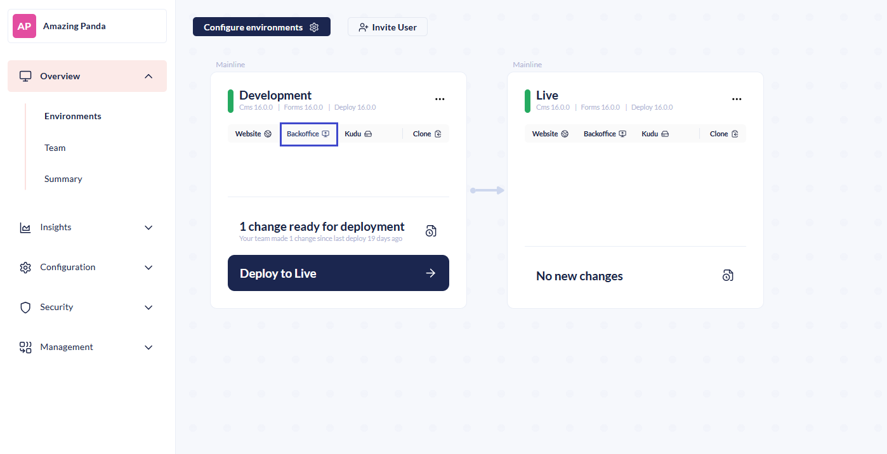

5. Navigate to the **Settings** section in the Backoffice.



Locate the **Deploy** section in the **Settings** tree.

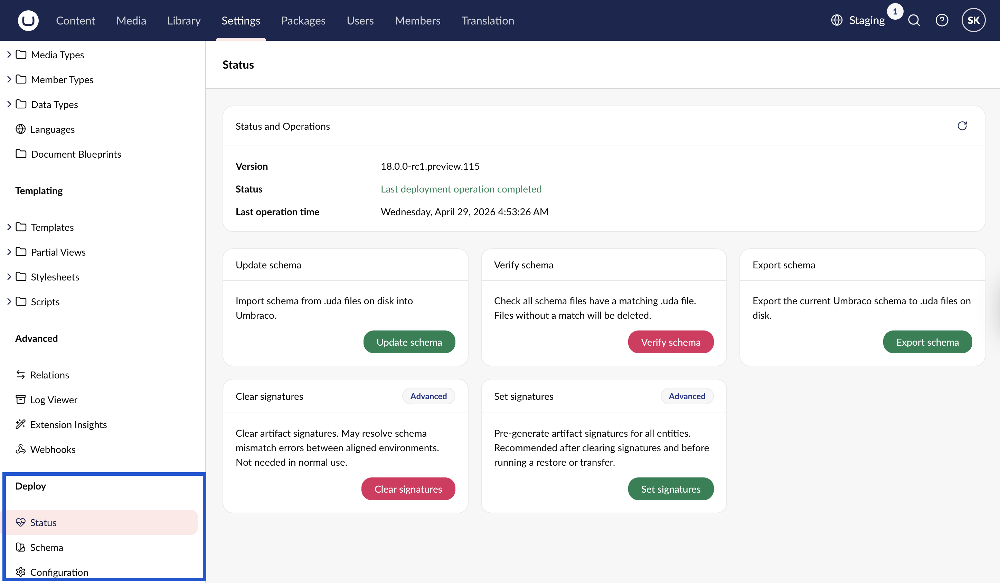




Locate the **Deploy** dashboard.

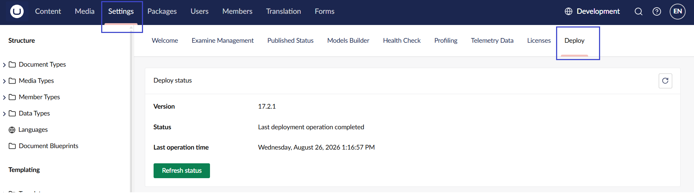




## Status

Here you can see whether the latest deployment has been completed or failed. You can see the version of Umbraco Deploy you are running and the last time an operation was run.




**Status**, **Schema**, and **Configuration** are separate pages. You can access each page from the Deploy section in the Settings tree.

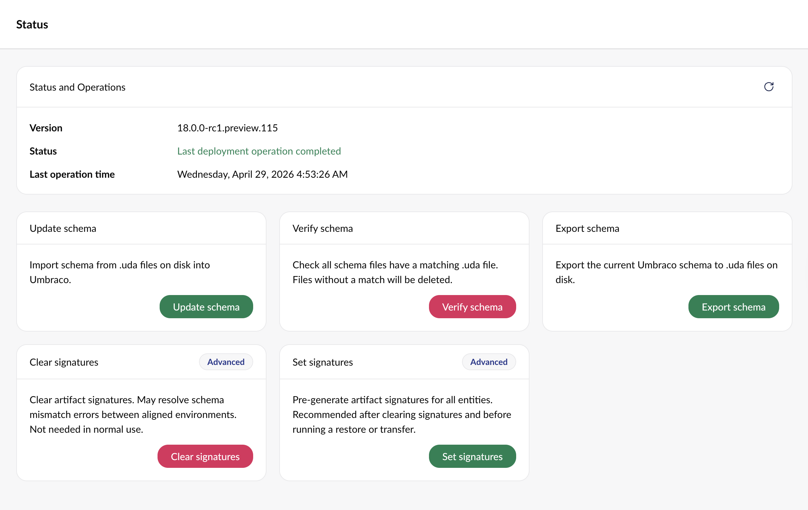





The Deploy dashboard contains information about the Deploy status, Deploy operations, Download Deploy artifacts, the Schema comparison table, and Configuration details.

 

### Deploy Operations

The Deploy operations provide the option to run different operations.

Below, you can read what each operation will do when run through the dashboard.

#### Update schema

Running this operation will update the Umbraco Schema based on the information in the `.uda` files on disk.

#### Verify schema

This operation deletes the schema from your current environment if it does not have a matching UDA file. It manually deletes each item in the Schema Comparison overview with an exclamation mark in the 'File Exists' column.

#### Export schema

Running this operation will extract the schema from Umbraco and output it to the `.uda` files on disk.

#### Clear signatures

Running this operation will clear the cached artifact signatures from the Umbraco environment. This should not be necessary; however, it may resolve reports of schema mismatches when transferring content that has been aligned.

#### Set signatures

This operation will set the cached artifact signatures for all entities within the Umbraco environment. Use this when signatures have been cleared, and you want to ensure they are pre-generated before attempting a potentially longer restore or transfer operation.

#### Cleaning up export archives

After running an export, exported zip archives are stored temporarily on the environment. You can delete them from here once you no longer need them.



On the Status page, a **Delete export archives** card appears after at least one export archive exists. The card lists the current number of stored archives.

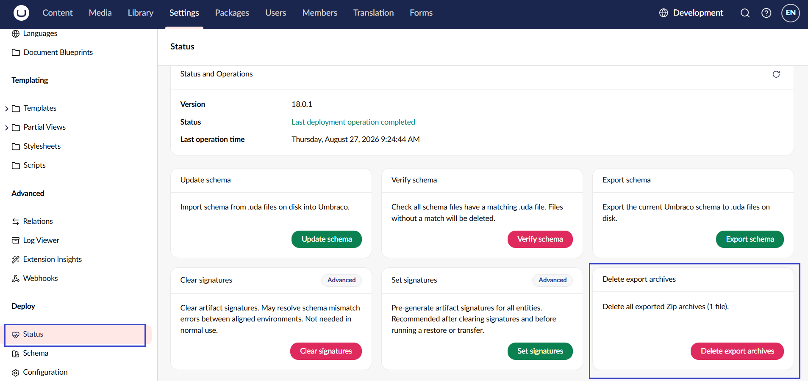




On the Deploy dashboard, a **Delete all exported ZIP archives** section appears after at least one export archive exists. The section shows the number of stored archives.

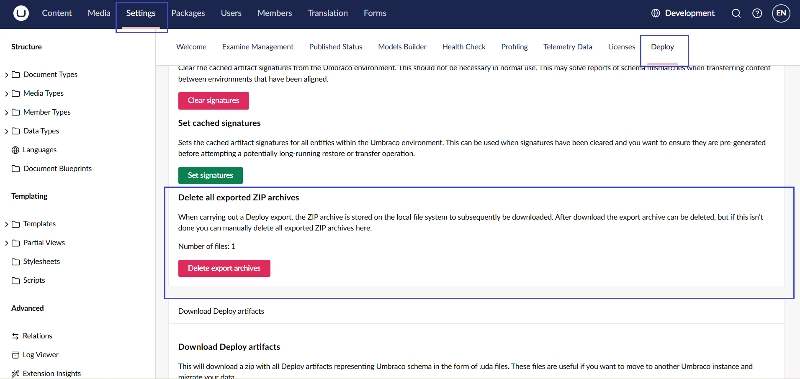




## Schema

On the Schema page, you get an overview of the state of the schema in your environment.



The first thing you'll see is a summary of the state of the schema. It'll show how many entities were found across how many entities, and it will also highlight if any items require attention.

<figure>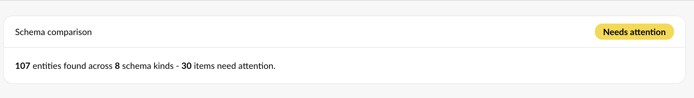<figcaption>Schema Comparison</figcaption></figure>

The following table gives you a full comparison between the information that is held in Umbraco and the information in the `.uda` files on disk.

You have the option to hide the schema that is up-to-date, and use quick-links to zoom in on specific types of schema.

<figure>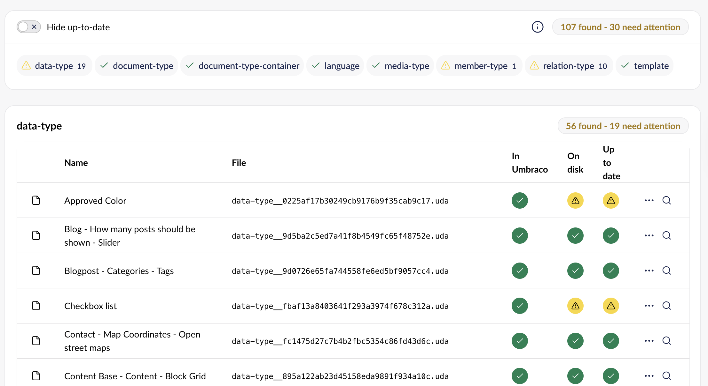<figcaption>
Document type schema comparison
</figcaption></figure>

The table shows:

* The name of the schema.
* The file name.
* Whether the item exists in Umbraco.
* Whether the file exists on disk.
* Whether the file is up-to-date.

You can also view details about a certain element by clicking on either the ellipses or the loop.

This will show the difference between entities stored in Umbraco and the `.uda` file stored on disk.

<figure>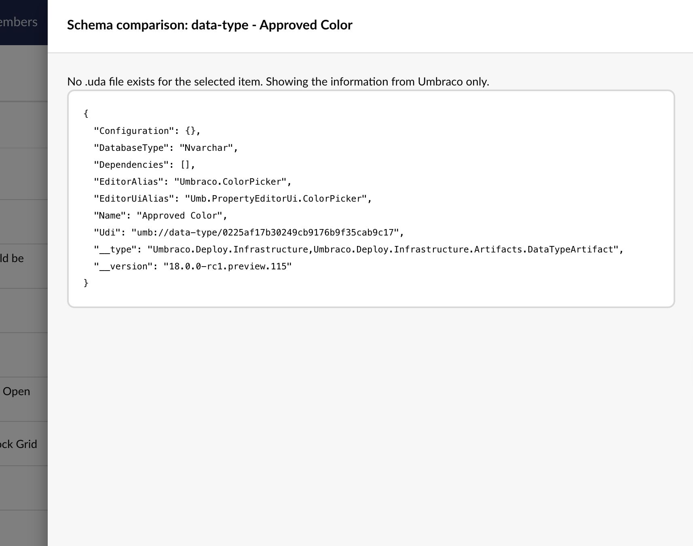<figcaption>
Showing a Schema Comparison for the Data Type Approved Color.
</figcaption></figure>





The Schema comparison table is further down the Deploy dashboard. It shows a short description followed by **Jump to** quick-links per schema kind, and a **Hide up to date** toggle.

<figure>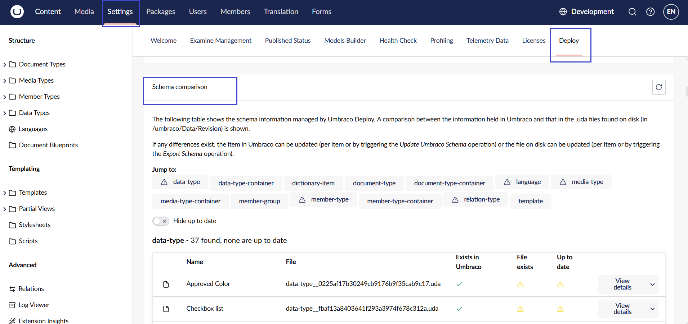<figcaption>Schema Comparison</figcaption></figure>

The table shows:

* The name of the schema.
* The file name.
* Whether the item Exists in Umbraco.
* Whether the File exists on disk.
* Whether the file is Up to date.

Each row has a **View details** dropdown with two actions: **Create file** and **Delete item**.




## Configuration



In the Configuration page, you can see how Deploy has been [configured](https://docs.umbraco.com/umbraco-deploy/getting-started/deploy-settings) for your environment. You get an overview of the configuration options, the current value(s), and notes that help you understand each of the settings. Updates need to be applied in the `appsettings.json` file.

<figure>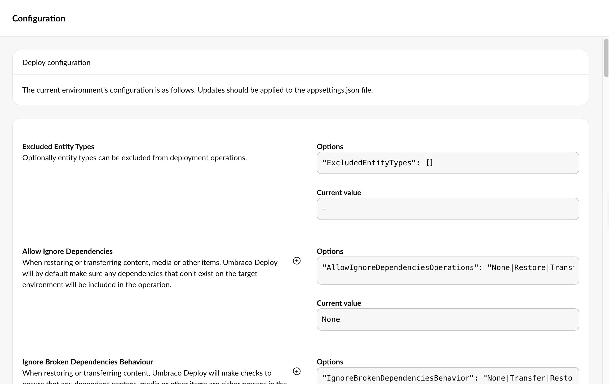<figcaption>
Example of Umbraco Deploy configuration.
</figcaption></figure>





The Configuration details table is further down the Deploy dashboard, below the Schema comparison table. It shows how Deploy has been [configured](https://docs.umbraco.com/umbraco-deploy/17.latest/getting-started/deploy-settings) for your environment. It displays a Setting options column, the Current value(s), and Notes with a Read more link for further detail on each setting. Updates need to be applied in the `appsettings.json` file.

<figure>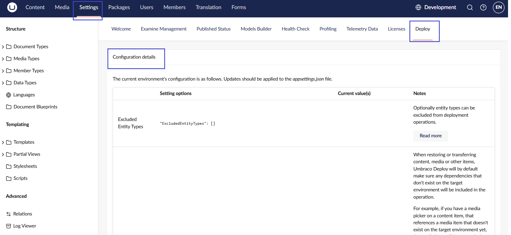<figcaption>
Example of Umbraco Deploy configuration.
</figcaption></figure>

 