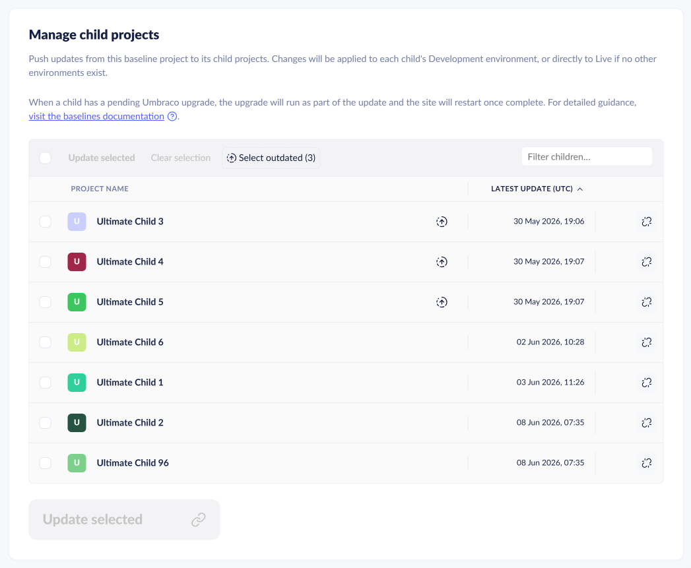
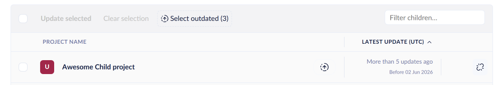
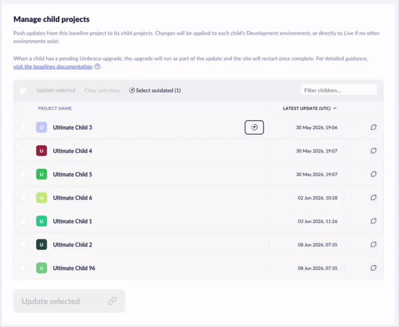
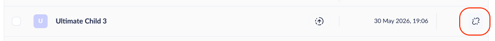

# Manage Baseline Children

Use the **Manage child projects** page to push updates from your Baseline to connected child projects, monitor each child's update status, and break the connection when needed.

The page is available on any project used as a baseline. Access it in multiple ways:

1. Go to the Baseline project in the Umbraco Cloud portal.
2. Navigate to the **Manage child projects** page.
   * Click the **Baseline** label at the bottom of the left-side menu.
   * Alternatively, go to **Management** > **Baselines**.

<figure><figcaption>
Navigation showing how to navigate to the <strong>Manage child projects</strong> page.
</figcaption></figure>

## Page overview

The page shows a list of projects that are based on the baseline.

<figure><figcaption>
The Manage child projects page lists child projects connected to the baseline.
</figcaption></figure>

Each child project shows the **Last update (UTC)**. A child that has not been updated within the last 5 baseline updates shows a generic message.

<figure><figcaption>
A child project that has not been updated within the last 5 baseline updates shows a generic message.
</figcaption></figure>

### Pushing changes from baseline to children

You can push changes coming from the baseline out to the children.

Use the checkboxes to select which child projects you want to update. Click **Update selected** to push changes from the baseline to the child projects.

Pushing changes from the baseline creates an entry in **Project history**. Each targeted child project also gets its own entry.

### Actions, sorting and filters

Click a column header to sort the list by `Project name` or `Last update (UTC)`.

The **Filter children** input field filters the list by project name.

Use the **Select outdated** button in the action bar to select all children where component versions are behind the baseline. Then click **Update selected** to push changes.

### Outdated components

A child project can show an indicator for components that are behind the baseline. Tracked components include Umbraco CMS, Deploy, Forms, Umbraco ID, `Umbraco.Cloud.Cms`, and more.

<figure><figcaption>
Child projects showing components that are behind the baseline.
</figcaption></figure>

## Break Reference between Baseline and Child Project

To remove the connection between a Baseline and a Child project, you need admin privileges. Once disconnected, the Child project becomes a standalone project and will no longer receive updates from the Baseline.


Breaking the connection cannot be undone.


1. Navigate to the **Manage child projects** page
2. Click the disconnect icon next to the Child project you want to disconnect.

   A confirmation window appears, showing the consequences of disconnecting.
3. Enter the Child project name you wish to disconnect.
4. Click **Disconnect**.

   

## Related articles


[Pushing Upgrades to a Child Project](../../optimize-and-maintain-your-site/monitor-and-troubleshoot/resolve-issues-quickly-and-efficiently/baseline-merge-conflicts/upgrading-child-projects.md)



[Configuration files](../../optimize-and-maintain-your-site/monitor-and-troubleshoot/resolve-issues-quickly-and-efficiently/baseline-merge-conflicts/configuration-files.md)



[Baseline Merge Conflicts](../../optimize-and-maintain-your-site/monitor-and-troubleshoot/resolve-issues-quickly-and-efficiently/baseline-merge-conflicts/)

