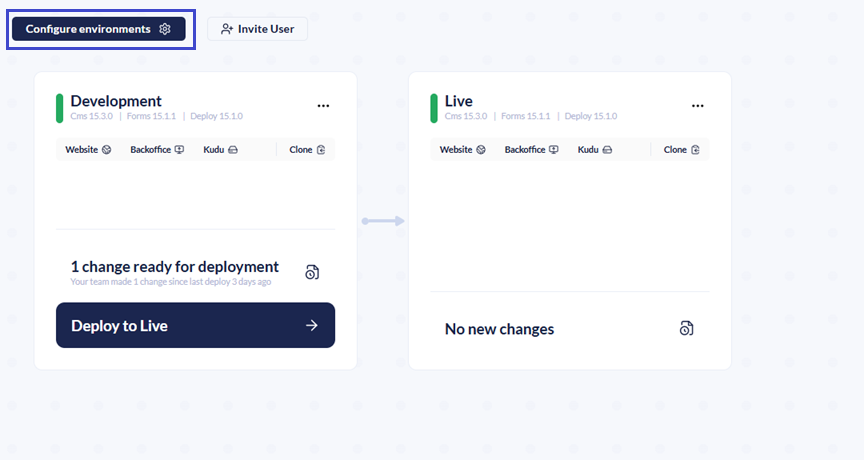

# Manage Environments

The number of environments available on your project is dependent on which plan you are on:

<table><thead><tr><th width="117">Plan</th><th width="116" data-type="number">Environments</th><th width="167" data-type="checkbox">Flexible Environments</th><th>Environment Combinations Examples</th></tr></thead><tbody><tr><td>Starter</td><td>2</td><td>false</td><td><em>QA + Production</em></td></tr><tr><td>Standard</td><td>3</td><td>true</td><td><em>Flexible + QA + Production</em> <em>Development + QA + Production</em></td></tr><tr><td>Professional</td><td>4</td><td>true</td><td><em>Flexible + Development + QA + Production</em></td></tr></tbody></table>

[Learn more about Umbraco Cloud Pricing](https://umbraco.com/cloud-pricing/).

## Configuring Environments

Clicking Configure environments from the project overview gives you access to environment management options. From here, you can:

* Rename an existing environment.
* Create a new environment.
* Delete an environment you no longer need.

These options help keep your deployment pipeline organized and aligned with your team's workflow.

## Adding or Removing Environments

Most Umbraco Cloud plans give you the flexibility to work with multiple environments. You can decide how many to add and how to organize them as flexible or mainline environments. For more information on environment types, see the [Environments](../../project-overview/environments.md) article.

The following sections provide guidance on managing your Cloud environments.

### Adding an Environment

Before adding an environment, ensure there are no local changes that haven’t been pushed to Live. Adding an environment will push all changes in the current deployment chain.

To add an environment:

1. Click **Configure environments**.

2. Click **Create environment**.

3. Choose an **Environment name**.
4. Click **Confirm**.

After adding a new left-most mainline environment or a flexible environment, you need to clone this environment instead. The current local clone will be set up to push to Live, while the fresh clone will push to the new environment.

### Removing an Environment

To remove an environment:

1. Navigate to the environment you want to delete.
2. Click on the three dots.
3. Click **Delete**.

It may take a few minutes for Cloud to set up the changes after adding or removing an environment.
