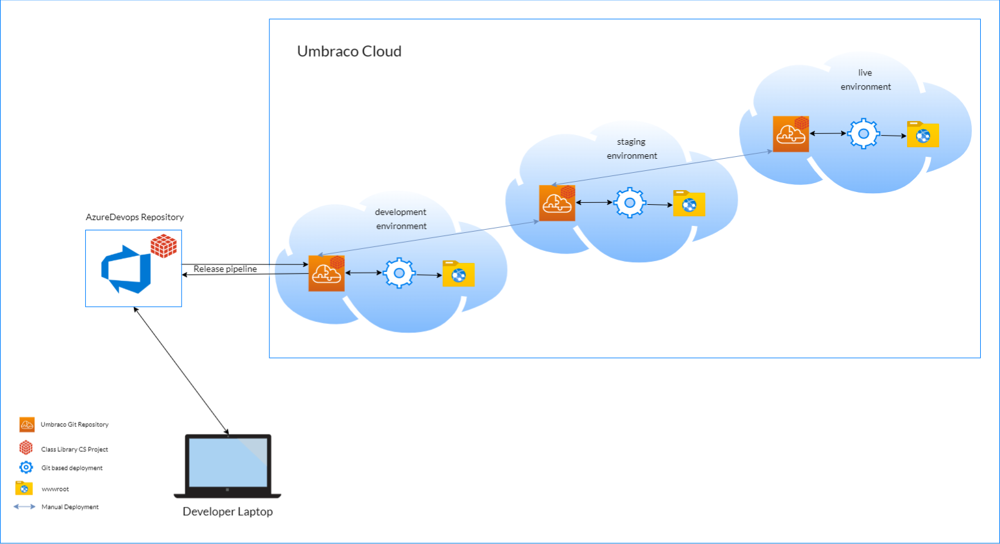
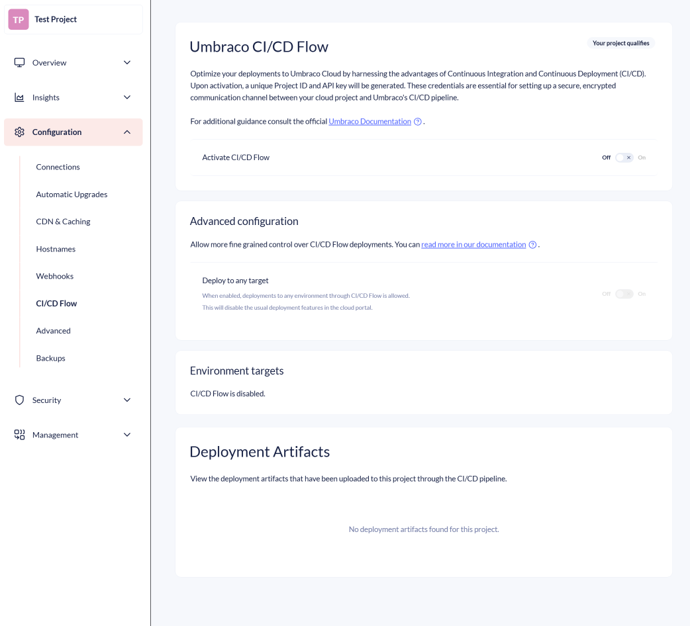
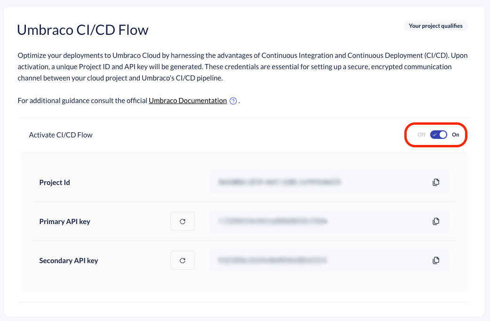
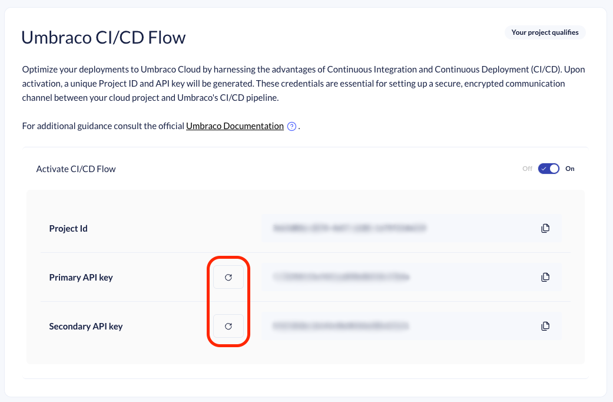
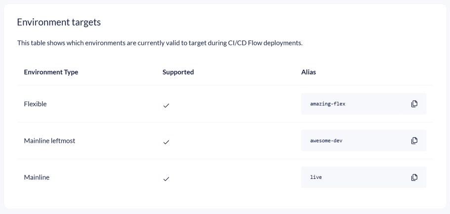
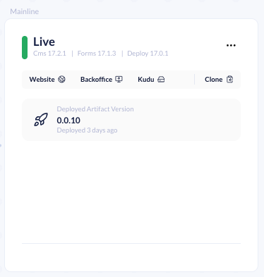
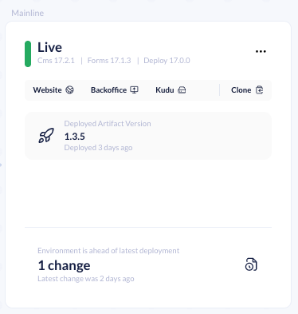

# Configuring a CI/CD pipeline

In this section, you can learn how to configure a CI/CD pipeline using either **Azure DevOps** or **GitHub Actions Workflows**.

You'll find sample shell scripts and pipeline configurations in the **Sample scripts** section. These cover both Azure DevOps and GitHub Actions Workflows.


Samples are provided "AS IS" to get you started. Please familiarize yourself with them and feel free to change them to fit your needs.


## Why configure a sample CI/CD pipeline?

Umbraco Cloud repositories are not meant as source code repositories. For more information on repositories, see the [Repositories in a Cloud Project](../../../../explore-umbraco-cloud/technology-overview/repositories-in-a-cloud-project.md) article.

Once you commit your code to the Cloud, the build pipeline converts your C# code into DLLs and deploys them to the respective environment.


In Umbraco Cloud, only C# code is built. This means that all frontend artifacts need to be built before they are committed to the repository.


You can use Azure DevOps as an external repository, and with the pipelines, it will automatically keep your Azure DevOps source code repository in sync. The sync is done with the git repository of the Umbraco Cloud environment that you are targeting.

## Setting Up an Umbraco Cloud Project

Before proceeding, you'll need an Umbraco Cloud project and a CI/CD pipeline. You will also need the required files to add to your pipeline for successful interaction with the Umbraco Cloud API.

1. Pick an Umbraco Cloud project, preferably with more than one environment (but not a requirement).
   1. Create a new Umbraco Cloud Project.
      * You can take a [trial here](https://try.umbraco.com/cloud?utm_source=github.com\&utm_medium=referral\&utm_campaign=).
      * [Create a new project](https://www.s1.umbraco.io/createproject) in the Umbraco Cloud Portal.
   2. Use one of your [existing projects](https://www.s1.umbraco.io/projects).
2. Create a new or an existing CI/CD pipeline in [Azure DevOps](https://learn.microsoft.com/en-us/azure/devops/organizations/projects/create-project?view=azure-devops\&tabs=browser) or [GitHub Actions](https://github.com/features/actions).


In this guide, deployments target the left-most environment in your Umbraco Cloud setup. This means if you have more than one environment, the left-most environment will automatically be selected for deployment. If only a single environment exists, this environment will be used.


<figure><figcaption>
"Umbraco CI/CD Flow" page under Configuration.
</figcaption></figure>

## Obtaining the Project ID and API Key

To get started with API interactions, you'll need to obtain your Project ID and API key. If you haven't already enabled the CI/CD feature, follow these steps:

1. Navigate to the [Umbraco Cloud Portal](https://www.s1.umbraco.io/projects) and select your project.
2. Go to `Configuration` -> `CI/CD Flow`. 
3. Toggle "Activate CI/CD Flow" to enable the feature.

<figure><figcaption>
Enabling Umbraco CI/CD Flow.
</figcaption></figure>

The box will expand to show your Project Id and two API keys. You can use either key to interact with the APIs.


The API keys are tied to the specific project for which it is generated. Ensure to keep the one you use secure in Azure or GitHub. It will be used for all subsequent API interactions related to that project.


### Regenerate API Keys

The regenerate button next to each API key allows you to regenerate the key.

If you regenerate a key that is currently used in your pipeline, you must update the value in your pipeline configuration. 
It is not possible to restore an API Key to its previous value.
If an invalid API key is used, the API will respond with 401 Unauthorized errors.

<figure><figcaption>
Buttons for regenerating the API Keys needed for CI/CD flow.
</figcaption></figure>

## Getting environment aliases to target

When the CI/CD flow feature is enabled, navigate down to the section called "Environment targets". This section expands to show a table with all your environments. 

The table shows you which environments you can currently target with CI/CD Flow. The environment aliases in the tables are the ones you need. You can click the button next to the environment alias to copy it and save it for later use.

<figure><figcaption>
"Umbraco CI/CD Flow - Environment targets" section showing the environments you can target for deployments.
</figcaption></figure>



If the alias is greyed out and without a check mark, it is currently not a valid target through the Umbraco CI/CD flow API.

By default, flexible environments and the left-most environment are considered valid targets.

You can enable all environments to be valid targets by enabling the "Deploy to any target" toggle in the "Advanced configuration" section. 

If you are using the old CI/CD samples targeting the V1 endpoint, you can only target the left-most environment.



If you are setting up CI/CD Flow for the first time, you should skip ahead to the section about ["Sample pipelines"](#sample-pipelines).

## Advanced configuration

The "Advanced configuration" section expands the capabilities of CI/CD Flow.



This setting is for advanced users.

Enabling "Deploy to any target" will drastically change the deployment workflow between environments in the Cloud Portal for the affected project.



### Deploy to any target

By default, CI/CD flow only allows deployments to the left-most or the flexible environment. With the "Deploy to any target" toggle you now have control to enable CI/CD Flow deployments to all your environments. 

<figure><figcaption>
"Umbraco CI/CD Flow - Advanced configuration" section showing the enabled "Deploy to any target".
</figcaption></figure>

When the setting is enabled, the ability to deploy between environments through the Cloud Portal is disabled. All deployments should now be handled by you through CI/CD Flow.

The environments overview on your project will no longer show:

- Pending changes indicator; you will not be able to see how far ahead your environments are compared to the next.
- The Deploy button is removed; you will not be able to push changes forward by using the Cloud Portal UI.

<figure><figcaption>
Example of the updated environment overview.
</figcaption></figure>

Instead you will now be able to see which artifact is deployed to your environment.

<figure><figcaption>
Example of an environment card showing the current deployed artifact.
</figcaption></figure>

The git repository under the environment can still receive changes from outside of the CI/CD flow:

- Adding or removing an environment will in most cases write to each affected environment. 
- Auto upgrades on Cloud also create commits.
- Adding or editing Document types in the backoffice (or other work that changes schema) on the cloud environment will also create commits. 

If changes outside CI/CD have been applied to an environment, the environment card will indicate how far ahead it is of the latest deployment.

<figure><figcaption>
Example of an environment card showing the current deployed artifact, but with a change committed to the environment after the deployment.
</figcaption></figure>

You are in control of deploying to all environments through your CI/CD setup. 

Next step after enabling "Deploy to any target": [Advanced Setup: Deploy to multiple targets](./advanced-multiple-targets.md).

Disabling "Deploy to any target" will change the UI back to Umbraco Clouds original environments overview. Bringing back Deploy-buttons and pending changes on the environments cards.


#### A note about disabling "Deploy to any target"

The default behavior is to promote changes between environments using the Cloud Portal. This keeps environments aligned following the left-to-right flow, and they will eventually share the same commits. The Portal uses this alignment to track pending changes between environments.

Sticking to this flow means pushing locally or via CI/CD to the leftmost environment, then promoting changes rightward through the Portal.

When "Deploy to any target" is enabled, commits are no longer pushed between environments. The Portal can no longer track changes between environments in the traditional way. Instead, each CI/CD deployment creates a new unique commit on each receiving environment. For example, deploying the same artifact to two environments results in two different commits — one per environment.

The more you use "Deploy to any target", the more each environment's git repository will diverge. Disabling the feature later is problematic, as realigning the environments is a time-consuming task.



## Sample pipelines

Below are a couple of examples on how to set up a CI/CD Pipeline using either Azure DevOps or GitHub Actions.

Each guide describes:

* How to set up a new repository in either GitHub or Azure DevOps.
* How to get a copy of your Umbraco Cloud project into that repository.
* How to configure a new pipeline using the provided samples.

The sample pipelines use either Bash or PowerShell scripts to facilitate communication with the Umbraco CI/CD API.


During the guides, you will have the option to choose between PowerShell or Bash scripts. You can select the scripting technology you feel most comfortable with.


### Azure DevOps sample

Covers setting up a CI/CD pipeline using Azure DevOps.

* [Azure DevOps Sample](azure-devops.md)

### GitHub Actions sample

Covers setting up a CI/CD pipeline using GitHub Actions.

* [GitHub Actions Sample](github-actions.md)

### Samples for version 1

If you are using version 1 endpoints, use the guides referenced below:

* [Azure DevOps Sample](azure-devops-v1.md)
* [GitHub Actions Sample](github-actions-v1.md)
