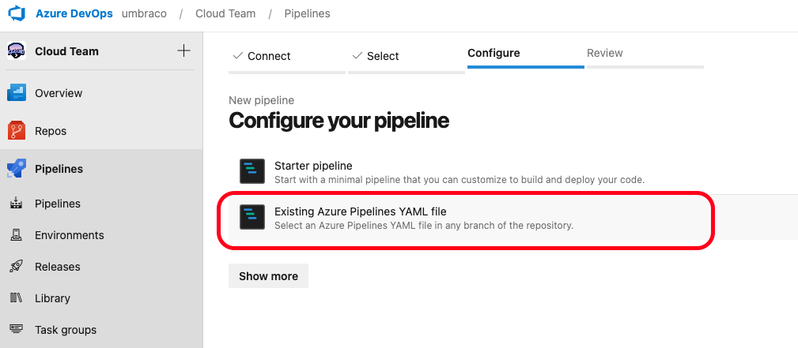
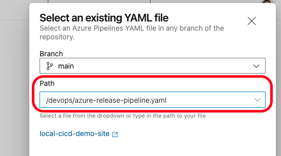
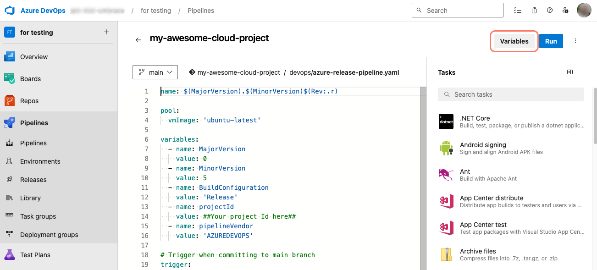
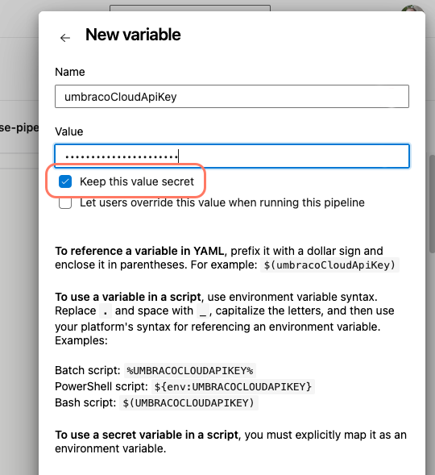

# Azure DevOps

Before setting up the pipeline in Azure DevOps, make sure that the following steps from the [Configuring a CI/CD pipeline](README.md) are done:

* Pick a Cloud project.
* Activate CI/CD Flow.

Next, you will need to define your pipeline in YAML and use it to interact with the Umbraco Cloud API.


Are you using version 1 endpoints? Follow the [guide for Azure DevOps v1 instead](azure-devops-v1.md).


## Before you start

The Umbraco CI/CD Team has created a sample pipeline for Azure DevOps.

The Scripts are provided as is. This means that the scripts will do the bare minimum for a pipeline that is utilizing the CI/CD flow.

You'll need to **adapt and integrate the script into your own pipelines to gain the ability to do deployments to your Umbraco Cloud projects**.

The sample includes YAML-files and custom Powershell and Bash scripts to interact with the Umbraco Cloud API.

You can get the samples for both `Azure DevOps` and `GitHub Actions` from the [GitHub repository](https://github.com/umbraco/Umbraco.Cloud.CICDFlow.Samples).

Samples that target the endpoints described here are located in the `V2` folder.


Since following this guide involves using your custom pipeline, any issues that arise will need to be resolved by you.


## Import Cloud project repository to Azure DevOps

Follow these steps to import your repository to Azure DevOps:

1. Go to your repositories in Azure DevOps and click on "Create a repository".
2. Create a new empty repository but don't add a README and a .gitignore file.
3. Note down the clone URL.
4. Go to the Umbraco Cloud Portal and [clone down your Cloud project](../../working-locally/#cloning-an-umbraco-cloud-project).
5. Open a Shell window on your machine.
6. Use the following command to remove the Git Remote called `origin`, that currently points to Umbraco Cloud:

```sh
git remote remove origin
```

7. Rename `master` branch to `main`.

```sh
git branch -m  main
git symbolic-ref HEAD refs/heads/main
```

8. Add a new remote called origin pointing to the Azure DevOps clone URL.

```sh
git remote add origin https://{your-organization}@dev.azure.com/{your-organization}/{azure-project-scope}/_git/{your-repository}
```

9. Push the changes.

```sh
git push -u origin --all
```

In the next part, you will be setting up the actual pipeline.

## Set up the Azure DevOps pipeline files

While working with the project on your local machine, follow these steps to prepare the pipeline. Use the [samples from the repository](https://github.com/umbraco/Umbraco.Cloud.CICDFlow.Samples).


Download the provided sample scripts as ZIP from the [GitHub repository](https://github.com/umbraco/Umbraco.Cloud.CICDFlow.Samples/).

1. Click on "Code" and choose "Download ZIP".
2. Unzip it and use the appropriate files from the `V2` folder for the next steps.


The next steps are outlined based on the scripting language your prefer using.



For a pipeline that uses Powershell scripts you will need the following files:

| Root (/) | powershell/ | powershell/azuredevops/ |
| :--- | :--- | :--- |
| `cloud.zipignore` | `Get-LatestDeployment.ps1` | `azure-release-pipeline.yml` |
| | `Get-ChangesById.ps1` | `cloud-sync.yml` |
| | `Apply-Patch.ps1` | `cloud-artifact.yml` |
| | `Add-DeploymentArtifact.ps1` | `cloud-deployment.yml` |
| | `Start-Deployment.ps1` | |
| | `Test-DeploymentStatus.ps1` | |

### Prepare the pipeline

1. Copy the `cloud.zipignore` file to the root of your repository.
2. Make a copy of the `.gitignore` from your repository and call the copy `cloud.gitignore`.
  * Both files should be in the root of your repository.
  * In the bottom of the `.gitignore` file add the line `**/git-patch.diff`.
3. Create a folder in the root, and call it `devops`.
4. Copy the 4 YAML files from the `powershell/azuredevops` folder into the `devops` folder.
5. Create an additional folder within `devops`, and call it `powershell`.
6. Copy the Powershell scripts from the `powershell` folder to the `powershell` folder.
7. Commit all changes, and push to Azure DevOps.





For a pipeline that uses Bash scripts you will need the following files:

| Root (/) | bash/ | bash/azuredevops/ |
| :--- | :--- | :--- |
| `cloud.zipignore` | `get_latest_deployment.sh` | `azure-release-pipeline.yml` |
| | `get_changes_by_id.sh` | `cloud-sync.yml` |
| | `apply-patch.sh` | `cloud-artifact.yml` |
| | `upload_artifact.sh` | `cloud-deployment.yml` |
| | `start_deployment.sh` | |
| | `get_deployment_status.sh` | |

### Prepare the pipeline

1. Copy the `cloud.zipignore` file to the root of your repository.
2. Make a copy of the `.gitignore` from your repository and call the copy `cloud.gitignore`.
  * Both files should be in the root of your repository.
  * In the bottom of the `.gitignore` file add the line `**/git-patch.diff`.
3. Create a folder in the root and call it `devops`.
4. Copy the 4 YAML files from the `bash/azuredevops` folder into the `devops` folder.
5. Create an additional folder within `devops` and call it `scripts`.
6. Copy the Bash scripts from the `bash` folder to the `scripts` folder.
7. Commit all changes, and push to Azure DevOps.






To learn more about the components used in the pipeline, read the [High level overview of the pipeline components](#high-level-overview-of-the-pipeline-components) section further down this article.



## Configure Azure DevOps

The pipeline needs to know which Umbraco Cloud project to deploy to. To define this, you need the `Project ID` and the `API Key`. The [Obtaining the Project ID and API Key](./#obtaining-the-project-id-and-api-key) section describes how to get these values.

You will also need the alias of the environment you want to target. The [Getting environment aliases to target](./#getting-environment-aliases-to-target) section describes how to view the list of environments you can target.

1. Note down the **Project ID**, **API Key** and the **environment alias**.
2. Go to the repository in Azure and click on "Set up build".

<figure><figcaption><p>Azure DevOps Repository</p></figcaption></figure>

3. Select "Existing Azure Pipelines YAML file" on the next screen.

<figure><figcaption><p>Configure pipeline with existing YAML file</p></figcaption></figure>

4. Select `main` in Branch.
5. Select `/devops/azure-release-pipeline.yaml` in Path and continue.

<figure><figcaption><p>Select Branch and Path</p></figcaption></figure>

Now you are on the "Review your pipeline YAML" screen

6. Replace the `##Your project Id here##` with the Project Id you got from Umbraco Cloud Portal.
7. Replace the `##Your target environment alias here##` with the alias of the environment you want to target.
8. Click on "Variables".

<figure><figcaption><p>Pipeline variables in Azure DevOps</p></figcaption></figure>

9. Add the variable `umbracoCloudApiKey` with the value of the API Key you got from Umbraco Cloud Portal.
10. Toggle the "Keep this value secret" checkbox to ensure the API Key is handled as a secret.




You can customize the names for the variables as you like, however, this requires that you rename the affected variables in `azure-release-pipeline.yaml`.

Check the references to the variables in the YAML files match the variable syntaxes in the created variable. Example: `umbracoCloudApiKey` = `UMBRACOCLOUDAPIKEY`.


When you click on "Save and Run" your first deployment will be triggered. This means that Azure DevOps is set up with all the needed information to be able to deploy your Cloud project back to Umbraco Cloud.

## Optional: Test the pipeline

With everything set up, it is recommended to run a test deployment to confirm that the pipeline works.

While working on your project locally:

1. Add a new Document Type.
2. Commit the change to `main` branch and push it to your repository.
3. Wait for the pipeline to complete.
4. Log into Backoffice on your left-most environment in Umbraco Cloud.
5. Go to the Settings section and see that your new Document Type has been deployed.

## High level overview of the pipeline components

The mentioned scripts are provided as a starting point.

It is recommended that you familiarize yourself with the scripts and with documentation related to how to use Azure DevOps.

The scripts demonstrates the following:

* How to sync your Azure DevOps repository with an environment in Umbraco Cloud via the environment alias.
* How to prepare and upload an artifact that can be used for a deployment.
* How to deploy changes to an environment in Umbraco Cloud, targeted via the environment alias.

### Main

The `azure-release-pipeline.yaml` defines the main pipeline, and is the one that will be triggered on a push to the `main` branch in your repository. You can configure a different trigger behavior in this file.

You can add your Build and Test stage between the `cloudSyncStage` and `cloudPrepareArtifact` stages. Keep in mind that you do not need to retain the dotnet build artifact for upload later. The `cloudPrepareArtifact` job will take care of packaging all your source code and upload to Umbraco Cloud.

Make sure that you checkout the potentially updated code if you add Build and Test steps.

### Cloud-sync

The `cloud-sync.yml` shows how you can sync your Azure DevOps repository with the targeted environment of your Cloud project. In this sample, it accepts any change from the API and applies and commits it back to the branch which triggered the pipeline. The commit does not trigger the pipeline again.

If you don't want the pipeline to commit back to the triggering branch, this is where you need to change the pipeline.

### Cloud-artifact

The `cloud-artifact.yml` shows how you can prepare and package an artifact and finally upload it to Umbraco Cloud.

There are a couple of things here to be aware of:

* The sample is overwriting the `.gitignore` file with `cloud.gitignore`. This is a way to accommodate your gitignore-needs when working locally. For instance you might want to ignore frontend builds, but you want them build and published to cloud.
* The sample contains a special `cloud.zipignore` file. This is a convenient way to tell the pipeline which files **not** to include when creating the zip package to send to cloud.

If you want to customize the artifact take a look at the [Artifact Best Practice](artifact-best-practice.md) article.

### Cloud-deployment

The `cloud-deployment.yml` shows how you can deploy to a named environment of your Cloud project. The sample shows how to request the deployment and wait for Cloud to finish the operation.



If you have frontend assets that needs to be built (using tools like npm/yarn or others), you should add the needed steps before `cloudPrepareArtifact`. This is to ensure that the fresh frontend assets will be part of the package to be sent to Umbraco Cloud.



## Next steps

After following the guide in this article, you can advance your knowledge further by diving into the following articles:

* [Deployment options](advanced-deployment-options.md)
* [Deploy to multiple targets](advanced-multiple-targets.md)

## Further information

* [Azure Pipelines Documentation](https://learn.microsoft.com/en-us/azure/devops/pipelines/)
