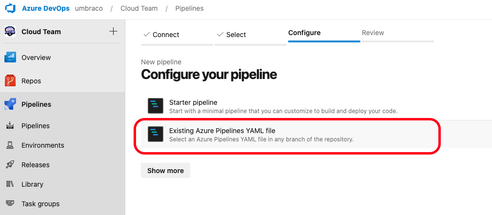
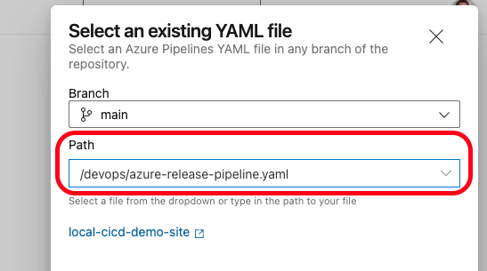

# Azure DevOps

Before setting up the pipeline in Azure DevOps, make sure that the following steps from the [Configuring a CI/CD pipeline](./) are done:

* Pick a Cloud project
* Activate CI/CD Flow

Next, you will need to define your pipeline in YAML and use it to interact with the Umbraco Cloud API.


Are you using version 1? Follow the [guide for Azure DevOps v1 instead](azure-devops-v1.md).



The Umbraco CI/CD Team has created a sample pipeline for Azure DevOps.

The Scripts are provided as is. This means that the scripts will do the bare minimum for a pipeline that is utilizing the CI/CD flow.

You'll need to adapt and integrate the script into your own pipelines to gain the ability to do deployments to your Umbraco Cloud projects.

The sample includes YAML-files and custom Powershell and Bash scripts to interact with the Umbraco Cloud API.

You can get the samples for both `Azure DevOps` and `GitHub Actions` from the [GitHub repository](https://github.com/umbraco/Umbraco.Cloud.CICDFlow.Samples).

Samples that target the endpoints described here are located in the V2 folder.



Please be aware that since this involves using your custom pipeline, any issues that arise will need to be resolved by you.


## Import Cloud project repository to Azure DevOps

Go to your repositories in Azure DevOps and click on "Create a repository".

* Create a new empty repository (don't add a README and don't add a .gitignore), and note down the clone URL.
* Go to the Umbraco Cloud Portal and clone your cloud project down locally. [This article](../../working-locally/#cloning-an-umbraco-cloud-project) describes how you can find the clone URL.
* Now working locally remove the Git Remote called `origin`, which currently points to Umbraco Cloud

```sh
git remote remove origin
```

* Optionally rename branch `master` to `main`

```sh
# optional step
git branch -m  main
git symbolic-ref HEAD refs/heads/main
```

* Add a new remote called origin and pointing to the Azure DevOps clone URL and push

```sh
git remote add origin https://{your-organization}@dev.azure.com/{your-organization}/{azure-project-scope}/_git/{your-repository}
git push -u origin --all
```

Now we can move on to setting up a pipeline.

## Set up the Azure DevOps pipeline files

While working with the project on your local machine, follow these steps to prepare the pipeline, using the [samples from the repository](https://github.com/umbraco/Umbraco.Cloud.CICDFlow.Samples).


Download the provided sample scripts as ZIP from the [GitHub repository](https://github.com/umbraco/Umbraco.Cloud.CICDFlow.Samples/). Click on "Code" and then choose "Download ZIP". Then unzip it and use the appropriate files from the V2 folder for the next steps.


Select your preferred scripting language:



For a pipeline that uses Powershell scripts you will need the following files:

* From the root folder
  * `cloud.zipignore`
* From the `powershell` folder
  * `Get-LatestDeployment.ps1`
  * `Get-ChangesById.ps1`
  * `Apply-Patch.ps1`
  * `Add-DeploymentArtifact.ps1`
  * `Start-Deployment.ps1`
  * `Test-DeploymentStatus.ps1`
* From the `powershell/azuredevops` folder
  * `azure-release-pipeline.yml`
  * `cloud-sync.yml`
  * `cloud-artifact.yml`
  * `cloud-deployment.yml`

**Do the following to prepare the pipeline:**

* Copy the `cloud.zipignore` file to the root of your repository
* Make a copy of the `.gitignore` from your repository and call the copy `cloud.gitignore`
  * Both files should be in the root of your repository
  * In the bottom of the `.gitignore` file add the line `**/git-patch.diff`
* Also in the root, create a folder called `devops`
* Copy the 4 YAML files from the `powershell/azuredevops` folder into the `devops` folder
* Inside `devops` create an additional folder called `powershell`
* Copy the Powershell scripts from the `powershell` folder to the `powershell` folder
* **Note**: If you have not changed the branch to `main`, then in the `azure-release-pipeline.yaml` file change the branch from `main`to `master.`
* Commit all changes, and push to Azure DevOps



For a pipeline that uses Bash scripts you will need the following files:

* From the root folder
  * `cloud.zipignore`
* From the `bash` folder
  * `get_latest_deployment.sh`
  * `get_changes_by_id.sh`
  * `apply-patch.sh`
  * `upload_artifact.sh`
  * `start_deployment.sh`
  * `get_deployment_status.sh`
* From the `bash/azuredevops` folder
  * `azure-release-pipeline.yml`
  * `cloud-sync.yml`
  * `cloud-artifact.yml`
  * `cloud-deployment.yml`

**Do the following to prepare the pipeline:**

* Copy the `cloud.zipignore` file to the root of your repository
* Make a copy of the `.gitignore` from your repository and call the copy `cloud.gitignore`
  * Both files should be in the root of your repository
  * In the bottom of the `.gitignore` file add the line `**/git-patch.diff`
* Also in the root, create a folder called `devops`
* Copy the 4 YAML files from the `bash/azuredevops` folder into the `devops` folder
* Inside `devops` create an additional folder called `scripts`
* Copy the Bash scripts from the `bash` folder to the `scripts` folder
* **Note**: If you have not changed the branch to `main`, then in the `azure-release-pipeline.yaml` file change the branch from `main`to `master.`
* Commit all changes, and push to Azure DevOps



## Configure Azure DevOps

The pipeline needs to know which Umbraco Cloud project to deploy to. In order to do this you will need the `Project ID` and the `API Key`. [This article](./#obtaining-the-project-id-and-api-key) describes how to get those values.

You will also need the alias of the environment you want to target. [This article](./#getting-environment-aliases-to-target) described how you can see a list of environments you can target here. Note the environment alias you want to target.

* Now go to the repository in Azure and click on "Set up build".

<figure><figcaption><p>Azure DevOps Repository</p></figcaption></figure>

* On the next screen click on "Existing Azure Pipelines YAML file"

<figure><figcaption><p>Configure pipeline with existing YAML file</p></figcaption></figure>

* Select `main` (or `master` if you did not change the branch name) in Branch
* Select `/devops/azure-release-pipeline.yaml` in Path and continue

<figure><figcaption><p>Select Branch and Path</p></figcaption></figure>

* Now you are on the "Review your pipeline YAML" screen
  * Replace the `##Your project Id here##` with the Project Id you got from Umbraco Cloud Portal
  * Replace the `##Your target environment alias here##` with the alias of the environment you want to target
  * Click on "Variables"

<figure><figcaption><p>Pipeline variables in Azure DevOps</p></figcaption></figure>

* Add the variable `umbracoCloudApiKey` with the value of the API Key you got from Umbraco Cloud Portal


It is recommended to handle the `API Key` as a secret. This can be done by ticking the "Keep this value secret" checkbox.





You can customize the names for the variables as you like, however, you then need to rename the affected variables in `azure-release-pipeline.yaml`.

Check the references to the variables in the yaml files match the variable syntaxes in the created variable. Example: `umbracoCloudApiKey` = `UMBRACOCLOUDAPIKEY`.


When you click on "Save and Run" your first deployment will be triggered. Which means that Azure DevOps is set up with all the needed information to be able to deploy your Cloud project back to Umbraco Cloud.

### Optional: Test the pipeline

With everything set up, you may want to confirm that Umbraco Cloud reflects the changes you are sending via your pipeline.

While working on your project locally, add a new Document type.

* Commit the change to `main` branch (or `master` if you did not change the branch name) and push to your repository.
* The pipeline starts to run
* Once the pipeline is done log into Backoffice on your left-most environment in Umbraco Cloud
* Go to the Settings section and see that your new Document type has been deployed

## High level overview of the pipeline components

The mentioned scripts are provided as a starting point.\
It is recommended that you familiarize yourself with the scripts and with documentation related to how to use Azure DevOps.

The scripts demonstrates the following:

* How to sync your Azure DevOps repository with an environment in Umbraco Cloud via the environment alias
* How to prepare and upload an artifact that can be used for a deployment
* How to deploy changes to an environment in Umbraco Cloud, targeted via the environment alias

### Main

The `azure-release-pipeline.yaml` is the main pipeline, and is the one that will be triggered on a push to the `main` branch in your repository. You can configure a different trigger behavior in this file.

You can add your Build and Test stage between the `cloudSyncStage` and `cloudPrepareArtifact` stages. Keep in mind that you do not need to retain the dotnet build artifact for upload later. The `cloudPrepareArtifact` job will take care of packaging all your source code and upload to Umbraco Cloud.

Make sure that you checkout the potentially updated code if you add Build and Test steps.

### Cloud-sync

The `cloud-sync.yml` shows how you can sync your Azure DevOps repository with the targeted environment of your Cloud project. In this sample, it accepts any change from the API and applies and commits it back to the branch which triggered the pipeline. However the commit does not trigger the pipeline again.

If you don't want the pipeline to commit back to the triggering branch, this is where you need to change the pipeline.

### Cloud-artifact

The `cloud-artifact.yml` shows how you can prepare and package an artifact and finally upload it to Umbraco Cloud.

There are a couple of things here to be aware of:

* The sample is overwriting the `.gitignore` file with `cloud.gitignore`. This is a way to accommodate your gitignore-needs when working locally. For instance you might want to ignore frontend builds, but you want them build and published to cloud.
* The sample contains a special `cloud.zipignore` file. This is a convenient way to tell the pipeline which files **not** to include when creating the zip package to send to cloud.

If you want to customize the artifact take a look at [Artifact Best Practice](../../../../set-up/project-settings/umbraco-cicd/artifact-best-practice.md).

### Cloud-deployment

The `cloud-deployment.yml` shows how you can deploy to a named environment of your Cloud project. The sample shows how to request the deployment and wait for cloud to finish the operation.


If you have frontend assets that needs to be built (using tools like npm/yarn or others), you should add the needed steps before `cloudPrepareArtifact`. This is to ensure that the fresh frontend assets will be part of the package to be sent to Umbraco Cloud.


## Next step

Please follow the above guide first.

* [Deploy to multiple targets](advanced-multiple-targets.md)

## Further information

* [Azure Pipelines Documentation](https://learn.microsoft.com/en-us/azure/devops/pipelines/)
