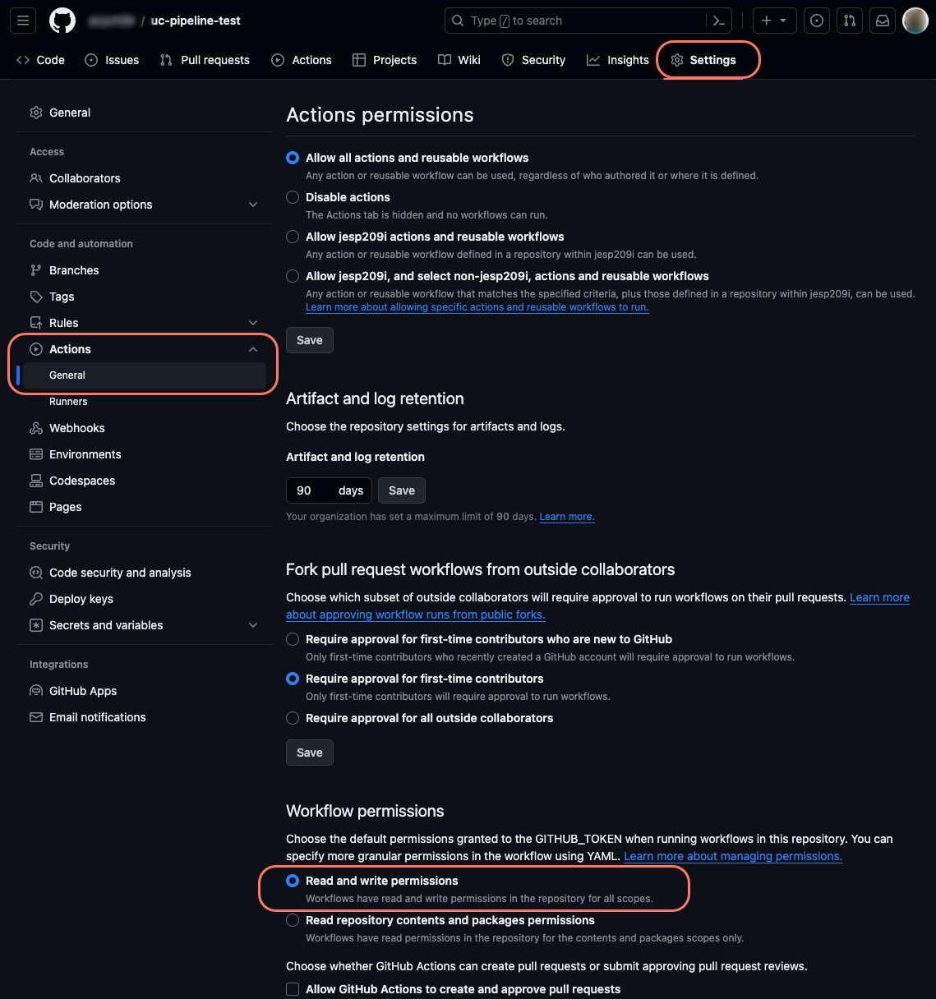

# GitHub Actions

Before setting up the pipeline in Azure DevOps, make sure that the following steps from the [Configuring a CI/CD pipeline](./) article are complete:

* Pick a Cloud project.
* Activate CI/CD Flow.

Next, you will need to define your pipeline in YAML and use it to interact with the Umbraco Cloud API.


Are you using version 1 endpoints? Follow the [guide for GitHub Actions version 1](github-actions-v1.md).


## Before you start

The Umbraco CI/CD Team has created a sample pipeline for GitHub Actions.

The Scripts are provided as is. This means the scripts will do the bare minimum for a pipeline to utilize the CI/CD flow.

**Adapt and integrate the script into your pipelines to enable deployments to your Umbraco Cloud projects.**

The sample includes YAML files and custom PowerShell and Bash scripts to interact with the Umbraco Cloud API.

You can get the samples for both `Azure DevOps` and `GitHub Actions` from the [GitHub repository](https://github.com/umbraco/Umbraco.Cloud.CICDFlow.Samples).

Samples that target the endpoints described here are located in the `V2` folder.


Since following this guide involves using your custom pipeline, any issues that arise will need to be resolved by you.


## Import Cloud project repository to GitHub

Follow these steps to import your repository to GitHub:

1. Go to your repositories in GitHub and click on "New".
2. Create a new empty repository, and note down the clone URL.
3. Go to the Umbraco Cloud Portal and [clone down your Cloud project](../../working-locally/#cloning-an-umbraco-cloud-project).
4. Remove the Git Remote called `origin`, which points to Umbraco Cloud, using the following command:

```sh
git remote remove origin
```

5. Rename `master` branch to `main`.

```sh
git branch -m  main
git symbolic-ref HEAD refs/heads/main
```

6. Add a new remote called origin and point it to the GitHub clone URL.

```sh
git remote add origin https://github.com/{your-organization}/{your-repository}.git
```

7. Push the changes.

```sh
git push -u origin --all
```

## Set up GitHub repository variables

The pipeline needs to know which Umbraco Cloud project to deploy to. To do this, you need the `Project ID` and the `API Key`. The [Obtaining the Project ID and API Key](./#obtaining-the-project-id-and-api-key) section describes how to get these values.

You will also need the target environment alias. The [Getting environment aliases to target](./#getting-environment-aliases-to-target) section describes how to view the list of environments you can target. Note down the alias of the environment you want to target.

1. Note down the **Project ID**, **API Key** and the **environment alias**.
2. Go to the repository in GitHub, and navigate to the Settings section.
3. Expand Secrets and Variables in the left-hand menu titled `Security` and select `Actions`.

<figure><figcaption><p>Security and Actions menu GitHub</p></figcaption></figure>

4. Create a `repository secret` called `UMBRACO_CLOUD_API_KEY` with the `API Key` value from the Umbraco Portal.
5. Create another `repository secret` with the name `PROJECT_ID` and the `Project ID` value from the Umbraco Portal.
6. Navigate to the **Variables** tab.
7. Create a `repository variable` called `TARGET_ENVIRONMENT_ALIAS` and enter the environment alias you noted down earlier.


If you want to use different names for secrets and variables, you need to rename the `secrets` and `with` variables in each of the `main.yml` files jobs.

```yaml
jobs:
  cloud-sync:
    uses: ./.github/workflows/cloud-sync.yml
    secrets:
      projectId: ${{ secrets.PROJECT_ID }} # change the part inside the curly braces
      umbracoCloudApiKey: ${{ secrets.UMBRACO_CLOUD_API_KEY }} # change the part inside the curly braces
    with:
      targetEnvironmentAlias: ${{ vars.TARGET_ENVIRONMENT_ALIAS }} # change the part inside the curly braces

  cloud-artifact:
    uses: ./.github/workflows/cloud-artifact.yml
    secrets:
      projectId: ${{ secrets.PROJECT_ID }} # change the part inside the curly braces
      umbracoCloudApiKey: ${{ secrets.UMBRACO_CLOUD_API_KEY }} # change the part inside the curly braces

  cloud-deployment:
    needs: cloud-sync
    uses: ./.github/workflows/cloud-deployment.yml
    secrets:
      projectId: ${{ secrets.PROJECT_ID }} # change the part inside the curly braces
      umbracoCloudApiKey: ${{ secrets.UMBRACO_CLOUD_API_KEY }} # change the part inside the curly braces
    with:
      targetEnvironmentAlias: ${{ vars.TARGET_ENVIRONMENT_ALIAS }} # change the part inside the curly braces
```


GitHub is now configured with the required information to enable deployments back to Umbraco Cloud.

### Allow GitHub to commit to your repository

The sample pipelines have a job called `cloud-sync`. This job checks for changes in your Umbraco Cloud project, fetches them, and applies them back to your repository. For this to work, you need to give the `GITHUB_TOKEN` write permissions to the repository during workflow runs.

This is how you can grant these permissions:

1. Navigate to your repository on GitHub.
2. Click on `Settings` in the top right.
3. Select `Actions` from the left-side menu, and locate the `General` section.
4. Scroll down to the `Workflow permissions` section.
5. Select the `Read and write permissions`.
6. Click save.

<figure><figcaption><p>GitHub Workflow permissions</p></figcaption></figure>

## Set up the GitHub Actions pipeline

While working with the project on your local machine, follow these steps to prepare the pipeline, using the [samples from the repository](https://github.com/umbraco/Umbraco.Cloud.CICDFlow.Samples).


Download the provided sample scripts as a ZIP from the [GitHub repository](https://github.com/umbraco/Umbraco.Cloud.CICDFlow.Samples/).

1. Click on "Code" and choose "Download ZIP".
2. Unzip it and use the appropriate files from the `V2` folder for the next steps.


The next steps are outlined based on the scripting language you prefer using.



For a pipeline that uses PowerShell scripts, you will need the following files:

| Root (`/`)        | `powershell/`                | `powershell/github/`   |
| ----------------- | ---------------------------- | ---------------------- |
| `cloud.zipignore` | `Get-LatestDeployment.ps1`   | `main.yml`             |
|                   | `Get-ChangesById.ps1`        | `cloud-sync.yml`       |
|                   | `Apply-Patch.ps1`            | `cloud-artifact.yml`   |
|                   | `Add-DeploymentArtifact.ps1` | `cloud-deployment.yml` |
|                   | `Start-Deployment.ps1`       |                        |
|                   | `Test-DeploymentStatus.ps1`  |                        |

#### Prepare the pipeline

1. Copy the `cloud.zipignore` file to the root of your repository.
2. Make a copy of the `.gitignore` from your repository and call the copy `cloud.gitignore`.
   * Both files should be in the root of your repository
3. Add the line `**/git-patch.diff` at the bottom of the `.gitignore`file.
4. Create a folder in the root and call it `.github`.
5. Create two additional folders within `.github`: `workflows` and `powershell`.
6. Copy the 4 YAML files from the `github` folder into the `workflows` folder.
7. Copy the PowerShell scripts from the `powershell` folder to the `powershell` folder.
8. Commit all changes and push to GitHub.



For a pipeline that uses Bash scripts, you will need the following files:

| Root (`/`)        | `bash/`                    | `bash/github/`         |
| ----------------- | -------------------------- | ---------------------- |
| `cloud.zipignore` | `get_latest_deployment.sh` | `main.yml`             |
|                   | `get_changes_by_id.sh`     | `cloud-sync.yml`       |
|                   | `apply-patch.sh`           | `cloud-artifact.yml`   |
|                   | `upload_artifact.sh`       | `cloud-deployment.yml` |
|                   | `start_deployment.sh`      |                        |
|                   | `get_deployment_status.sh` |                        |

#### Prepare the pipeline

1. Copy the `cloud.zipignore` file to the root of your repository.
2. Make a copy of the `.gitignore` from your repository and call the copy `cloud.gitignore`.
   * Both files should be in the root of your repository
3. Add the line `**/git-patch.diff` at the bottom of the `.gitignore` file.
4. Create a folder in the root and call it `.github`.
5. Create two additional folders within `.github`: `workflows` and `powershell`.
6. Copy the 4 YAML files from the `github` folder into the `workflows` folder.
7. Copy the PowerShell scripts from the `powershell` folder to the `powershell` folder.
8. Commit all changes and push to GitHub.




To learn more about the components used in the pipeline, read the [High-level overview of the pipeline components](github-actions.md#high-level-overview-of-the-pipeline-components) section further down this article.


### Optional: Test the pipeline

With everything set up, it is recommended to run a test deployment to confirm that the pipeline works.

While working on your project locally:

1. Add a new Document Type.
2. Commit the change to the `main` branch and push it to your repository.
3. Wait for the pipeline to complete.
4. Log in to Backoffice on your left-most environment in Umbraco Cloud.
5. Go to the Settings section and see that your new Document Type has been deployed.

## High-level overview of the pipeline components

The mentioned scripts are provided as a starting point.

It is recommended that you familiarize yourself with the scripts and documentation related to using GitHub Actions.

The scripts demonstrate the following:

* How to sync your GitHub repository with an environment in Umbraco Cloud via the environment alias.
* How to prepare and upload an artifact that can be used for a deployment.
* How to deploy changes to an environment in Umbraco Cloud, targeted via the environment alias.

### Main

The `main.yml` is the main pipeline, and is the one that will be triggered on a push to the `main` branch. You can configure a different trigger behavior in this file.

You can add your Build and Test jobs between the `cloud-sync` and `cloud-artifact` jobs. Keep in mind that you do not need to retain the dotnet build artifact for upload later. The `cloud-artifact` job will package all your source code and upload it to Umbraco Cloud.

Make sure that you check out the potentially updated code if you add Build and Test steps.

### Cloud-sync

The `cloud-sync.yml` shows how to sync your GitHub repository with the Cloud environment. In this sample, it accepts any change from the API, applies it, and commits it back to the branch that triggered the pipeline. However, the commit does not trigger the pipeline again.

If you don't want the pipeline to commit back to the triggering branch, this is where you need to change the pipeline.

### Cloud-artifact

The `cloud-artifact.yml` shows how to prepare and package an artifact and finally upload it to Umbraco Cloud.

There are a couple of things here to be aware of:

* The sample is overwriting the `.gitignore` file with `cloud.gitignore`. This is a way to accommodate your gitignore needs when working locally. For instance, you might want to ignore frontend builds, but you want them built and published to the Cloud.
* The sample contains a special `cloud.zipignore` file. This is a convenient way to tell the pipeline which files **not** to include when creating the zip package to send to the Cloud.

To customize the artifact, take a look at [Artifact Best Practice](artifact-best-practice.md).

### Cloud-deployment

The `cloud-deployment.yml` shows how to deploy to a named environment of your Cloud project. The sample shows how to request the deployment and wait for the Cloud to finish the operation.


If you have frontend assets that need to be built (using tools like npm/yarn or others), you should add the required steps before `cloud-artifact`. This ensures that the fresh frontend assets are included in the package sent to Umbraco Cloud.


## Next step

After following the guide in this article, you can advance your knowledge further by diving into the following articles:

* [Deployment options](advanced-deployment-options.md)
* [Deploy to multiple targets](advanced-multiple-targets.md)

## Further information

* [GitHub Actions Documentation](https://docs.github.com/en/actions)
