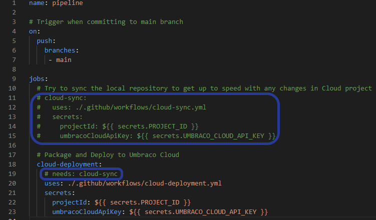
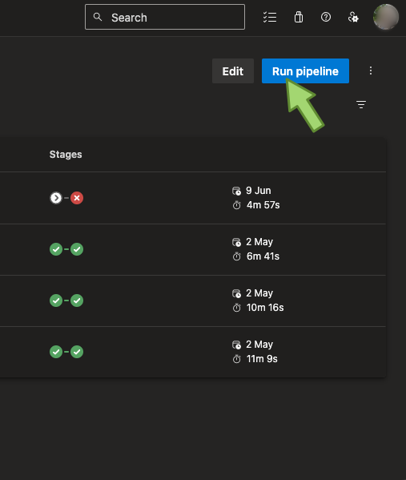
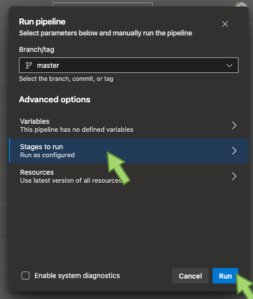
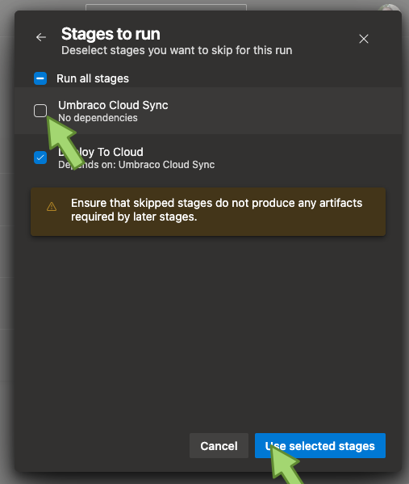

# Troubleshooting

## Special Cases

### Using `RestorePackagesWithLockFile` in your .csproj file

If `RestorePackagesWithLockFile` is used and set to true, you will experience that no changes will be made to the website. This happened even though the CI/CD deployments were completed successfully, and files were updated as expected in the Cloud repository.

The reason for this is that the KUDU deploy process fails. This process takes the newly committed files from the cloud repository and runs restore, build, and publish on the cloud environment.

To resolve this issue, remove the `RestorePackagesWithLockFile` to allow the deployments to go through as expected.

### Deployment reports: No changes detected - cleaning up

The package you uploaded didn't contain any changes that would affect the Git repository on the Cloud Environment. The CI/CD job will skip the remaining steps and complete.

If the expected that the deployment should create a change to the Cloud Environment, please make sure that you are uploading the correct zip file.

## Cloud Sync

### The projects left-most mainline environment has changed

The mechanism to determine changes since the last deployment is not able to do so when the left-most mainline environment has changed. This happens when you either add or remove a mainline environment. The [get diff endpoint](umbracocloudapi.md#get-deployment-diff) responds with status 409 and the following json payload:

```json
{
  "type":"LeftMostEnvironmentChanged",
  "title":"The projects left-most environment has changed",
  "status":409,
  "detail":"Unable to calculate changes based on a different left-most environment",
  "traceId":"..."
}
```

You need to _manually_ make sure that all latest changes on your left-most mainline environment is also present in your local copy.

Once this is done you can run a new deployment, where you skip the cloud-sync step.

* [Skip cloud-sync in GitHub](troubleshooting.md#skip-cloud-sync-in-github)
* [Skip cloud-sync in Azure DevOps](troubleshooting.md#skip-cloud-sync-in-azure-devops)

If you experience problems with your environment not properly booting up after deployment, [read the Unable to determine environment by its {environment-id} guide](troubleshooting.md#unable-to-determine-environment-by-its-environment-id).

### “Apply Remote Changes” step is failing

The sample pipelines are naively trying to apply any change coming from the generated patch file on cloud. This doesn't always work and you might see an error similar to the following:

```sh
error: patch failed: src/UmbracoProject/UmbracoProject.csproj:9
error: src/UmbracoProject/UmbracoProject.csproj: patch does not apply
```

The root cause is due to conflicts between your source and the code in the repository on Umbraco Cloud. This is usually due to one of two things:

1. Cloud project package(s) has been auto-upgraded, and that diff was already applied.
2. You and your team are not following the ["left to right" deployment model](../deployment/).

In both cases you have to make sure that your repository is up too speed with any changes there are in the cloud environment. You will have to resolve potential conflicts manually.

Once that has been done, you should run a new deployment without the `cloud-sync` step.

### Skip cloud-sync in GitHub

For Azure DevOps, see the [Skip cloud-sync in Azure DevOps](troubleshooting.md#skip-cloud-sync-in-azure-devops) section.

1. Ensure your GitHub repository is up-to-date with any changes in your Umbraco Cloud environment.
2. Locate the `main.yml` file in the following directory: `{projectname}.github\workflows` on tour local project.
3. Open the `main.yml` file in a text editor and navigate to the “jobs” section.
4. Comment out the entire “cloud-sync” section and the “needs: cloud-sync” under “cloud-deployment”. An example is provided in the screenshot below.



5. Commit the changes, and push them to GitHub. This action will trigger a build and run the pipeline.
6. At this point, the pipeline should execute successfully and your changes will be pushed to Umbraco Cloud. If this is the case, proceed to the next step.
7. Uncomment the lines you previously commented out and make a new commit. Push these changes to GitHub.

* Optional: Add "\[skip ci]" to the last commit message, to avoid automatically triggering the pipeline

Your pipeline should now be functioning as expected.

### Skip cloud-sync in Azure DevOps

For GitHub, see the [Skip cloud-sync in GitHub](troubleshooting.md#skip-cloud-sync-in-github) section.

Navigate to your `azure-release-pipeline.yaml` and comment out these two lines:

```sh
dependsOn: cloudSyncStage
condition: in(dependencies.cloudSyncStage.result, 'Succeeded', 'Skipped')
```

Trigger a code deployment and ensure that you uncheck the "Umbraco Cloud Sync" stage as mentioned below.

1. Ensure that your Azure DevOps repository is up to date with any changes in your Umbraco Cloud environment.
2. Find the pipeline in Azure DevOps.
3. Click on "Run Pipeline" in the top right corner.



4. Click on "Stages to run"



5. Uncheck the "Umbraco Cloud Sync" checkbox. Confirm on "Use selected stages".



5. Click on "Run" back in the "Run Pipeline" view.

As no changes were made to your pipeline, it will run as usual on next push to Azure DevOps.

## Upload Errors

### Failed to read the request form. Multipart body length limit 134217728 exceeded

We currently have a size limit set to 134217728 bytes or about \~128 MB.

Make sure that the package you are trying to upload does not contain anything unnecessary.

You can see an example of how you could zip your repository before uploading it, by referring to our [GitHub](samplecicdpipeline/github-actions.md) or [Azure DevOps](samplecicdpipeline/azure-devops.md) samples.

## Deployment failed

### File missing: The `.umbraco` file cannot be found in the root of the repository

The `.umbraco` file is missing or has been renamed. This file needs to be present in the root of the zipped package.

### File format Error: The `.umbraco` file is not valid

The `.umbraco` file has invalid characters. Sometimes people need to change the repository's folder structure and the default project's name. Ensure that the base field does not use backslashes ('') as the folder denominator.

Below is an example of the default `.umbraco` file that comes with a new Umbraco Cloud project.

```
[project]
base = "src/UmbracoProject"
csproj = "UmbracoProject.csproj"
```

### Cannot apply update because the following packages would be downgraded: Package: Umbraco.{abc}, Version: {x.y.z}

The service goes through all .csproj-files contained in the uploaded package, and compares that to the versions running in your left-most cloud environment. We do this to try to prevent you from downgrading the crucial Umbraco packages used by cloud.

The full error could look like this:

```
Cannot apply update because the following packages would be downgraded: Package: Umbraco.Cms, Version: 13.4.0 ==> Project file: /Update/src/MyAwesomeProject.Code/MyAwesomeProject.Code.csproj contains lower Version: 13.1.0 .
```

The error tells you which package to look for and which version is currently in your left-most cloud environment. The error also contains the problematic incoming .csproj-file and the version referenced by it.

If the incoming package references multiple packages with lower versions, the error will list each one.

We recommend aligning the package versions in your _.csproj_ files with the higher version mentioned in the error for that package or a later version.

If you have orphaned csproj-files you should remove them or rename them. Orphaned would be backup _.csproj_ files or files not referenced by any of the main project files nor referenced in a _.sln_ file.

### Could not find `/app/work/repository/Readme.md` to stat: No such file or directory

In some instances we see an issue where filename casing is causing an error.

Rename the `Readme.md` file in the root of your repository to something different, the file can keep the markdown-extension. Commit the change to your repository and run the pipeline.

If you want you can change the filename back to `Readme.md` after a successful CI/CD deployment.

### The site can't be upgraded as it's blocked with the following markers: updating

In rare cases deployments fail, and the cloud infrastructure doesn't clean up correctly. This leaves behind an "updating" marker. The next time you try to deploy through your pipeline you will encounter an error.

In order to fix this issue, you need to use [KUDU](../../../optimize-and-maintain-your-site/monitor-and-troubleshoot/power-tools/) to remove the leftover marker file.

1. Access KUDU on the affected environment

* If you only have one environment you want the live environment
* If you use V1 endpoints and have more than one environment, you want the left-most mainline environment

3. Navigate to `site` > `locks` folder In there, there should be a file named `updating`
4. Remove the `updating` file.

Once the marker file is removed, run your pipeline again.

### Unable to verify Deployment has finished

This error will be shown when the system is unable to verify the latest deployment is pushed and deployed in Kudu.
When a change is pushed to a Cloud Environment the Kudu deployment is started. CI/CD is also utilizing this flow.

A couple of steps to try:
- Make sure your code can compile and run (relevant only if you have enabled the skipBuildAndRestore toggle in V2)
- Running npm commands via csproj files is generally unsupported on Umbraco Cloud
- Create and commit a small change and try deploying again
  - A small change can be adding a dummy text file next to you code files or adding a comment in a cs file.

## Environment errors after deployment

### Unable to determine environment by its {environment-id}

This happens when using CI/CD to deploy changes to your live environment, and later add a new Cloud environment. Your environment will fail to boot up and will show the following error message:

```
“System.InvalidOperationException: Unable to determine environment by its {environment-id}”
```

This issue arises because the environment is missing in the local `umbraco-cloud.json` file. To resolve this issue, follow these steps:

1. Navigate to Kudu in your Live environment
2. Select “Debug console” and choose “CMD”.
3. Find the umbraco-cloud.json file. Path to this file may vary depending on your setup, but the default location on cloud is C:\home\site\repository\src\UmbracoProject
4. Click ‘edit’ on the file and copy all its content. This content is consistent across environments, so it’s safe to do so.
5. Paste the copied content into the `umbraco-cloud.json` file in your local project and push the changes.

After completing these steps, your left-most mainline environment should be correctly registered across all environments, allowing you to continue your work without any issues.
