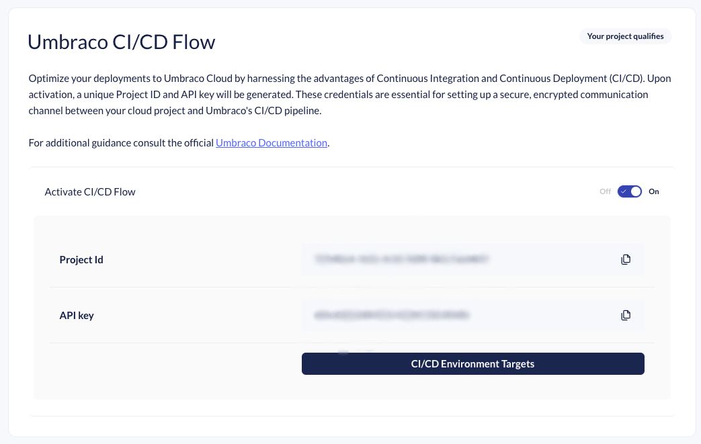

# Cloud API For CI/CD Flow

The Umbraco Cloud API serves as a publicly accessible endpoint that customers can utilize to execute relevant tasks.

While its initial focus is on automating and managing deployments in Umbraco Cloud projects via the "Umbraco CI/CD Flow," future enhancements will broaden its capabilities to encompass a wider range of activities and options for Umbraco Cloud users.


### Changes between endpoints for version 1 and 2

With the endpoints for version 2, you are given more control over the process.

These are the most important differences between the V1 and V2 endpoints:

* With version 2, it is possible to target a flexible environment or the left-most environment.
* More options are available when deploying.
* Simplified api call flow: Uploading an artifact is decoupled from the actual deployment.

[Do you want to migrate from V1 to V2 endpoints?](samplecicdpipeline/migrate.md)

The V1 endpoints are still available, you can see the [V1 api documentation here](v1-umbraco-cloud-api.md).


## Getting started

To integrate Umbraco Cloud into your CI/CD pipeline, you'll need to make API calls to the following endpoint [`https://api.cloud.umbraco.com`](https://api.cloud.umbraco.com):

**Path for artifacts**

* `/v2/projects/$projectId/deployments/artifacts`

**Paths for deployments**

* `/v2/projects/$projectId/deployments`
* `/v2/projects/$projectId/deployments/$deploymentId`

**Paths for querying deployments and fetching changes**

* `/v2/projects/$projectId/deployments`
* `/v2/projects/$projectId/deployments/$latestCompletedDeploymentId/diff`

You will find relevant examples using `HTTP Request Syntax` in the sections below.

### How to enable CI/CD Integrator in the Umbraco Cloud Portal

To authenticate with the Umbraco Cloud API, you'll need your Project ID and API Key. These credentials can be found under **Configuration > Advanced** in the Umbraco Cloud portal.



The two elements to be used for the authentication are:

* **Cloud Project ID**: The ID of your Umbraco project.
* **CI/CD API Key**: Your unique identifier.

By including the API key header in your HTTP requests, you ensure secure access to your Umbraco Cloud project's resources.

For enhanced security, it's crucial to store the provided API key in a secure location. Options include a variable group in Azure DevOps or using the Secrets feature in GitHub Actions.\
It's important to note that each API key is tightly coupled with a specific Umbraco Cloud project and can only be used for deployments related to that project.

### How to authenticate your requests

To authenticate your API requests, you'll need to include your API key in a custom HTTP header named Umbraco-Cloud-Api-Key.



```http
GET https://api.cloud.umbraco.com/v2/projects/{{projectId}}/deployments  
Umbraco-Cloud-Api-Key : {{apiKey}}
```



```powershell
Invoke-RestMethod -Uri https://api.cloud.umbraco.com/v2/projects/$projectId/deployments -Headers @{ "Umbraco-Cloud-Api-Key" = $apiKey } -Method Get
```



```
curl -s -X GET https://api.cloud.umbraco.com/v2/projects/$projectId/deployments -H "Umbraco-Cloud-Api-Key: $apiKey"
```



## Deployment Artifacts

### Upload artifact

Artifacts are tied to a project. The uploaded artifact will be available to use in any deployment to an environment on that project.\
The artifact needs to be a zip file with the source code needed to build your website.

[Read about artifact Best Practices](../../../set-up/project-settings/umbraco-cicd/ArtifactBestPractice.md).

```http
@projectId = Get this value from the portal
@apiKey = Get this value from the portal
@description = my awesome optional description text
@version = my awesome optional version text
@file = path to file + filename

POST https://api.cloud.umbraco.com/v2/projects/{{projectId}}/deployments/artifacts
Umbraco-Cloud-Api-Key: {{apiKey}}
Content-Type: multipart/form-data; boundary=--TheFormDataBoundary

----TheFormDataBoundary
Content-Disposition: form-data; name="file"; filename="package.zip"
content-type: application/octet-stream

< {{file}}
----TheFormDataBoundary
Content-Disposition: form-data; name="description"

{{description}}
----TheFormDataBoundary
Content-Disposition: form-data; name="version"

{{version}}
----TheFormDataBoundary--
```

Once the file is uploaded, you will get a response which follows the following JSON schema:

```json
{
  "artifactId": string,
  "fileName": string,
  "blobUrl": string,
  "filesize" : number,
  "createdUtc": string,
  "description": string,
  "version": string
}
```

### List artifacts

List artifacts uploaded related to a project. The endpoint is paged and accepts the options `skip` and `take`.\
If `skip` is not supplied, its value will default to 0.\
If `take` is not supplied, its value will default to 10.

```http
@skip = 0
@take = 10
@projectId = Get this value from the portal
@apiKey = Get this value from the portal

GET https://api.cloud.umbraco.com/v2/projects/{{projectId}}/deployments/artifacts?skip={{skip}}&take={{take}}
Umbraco-Cloud-Api-Key: {{apiKey}}
Content-Type: application/json
```

Response looks like:

```json
{
  "projectId": string,
  "data":
    [
      {
        "artifactId": string,
        "fileName": string,
        "blobUrl": string,
        "filesize" : number,
        "createdUtc": string,
        "description": string,
        "version": string
      }
    ],
  "totalItems": number,
  "skippedItems": number,
  "takenItems": number
}
```

## Deployments

### Start the deployment

The Create Deployment endpoint starts a new deployment and returns a unique `deploymentId`.

Some new options are available to use in the request payload:

* `artifactId` **REQUIRED** Id of the artifact you want to deploy
* `targetEnvironmentAlias` **REQUIRED** Alias of the environment you want to deploy to
* `commitMessage` **OPTIONAL** The commit message you want stamped in the Umbraco Cloud environment repository.
* `noBuildAndRestore` **OPTIONAL** Option to skip the restore and build in the isolated instance, default to false
* `skipVersionCheck` **OPTIONAL** Option to skip the version check in the isolated instance, default to false

```http
@projectId = Get this value from the portal
@apiKey = Get this value from the portal
@targetEnvironmentAlias = left-most or flexible environment alias
@artifactId = Use artifact id from recent upload
@commitMessage = My awesome commit message for cloud
@noBuildAndRestore = false
@skipVersionCheck = false

POST https://api.cloud.umbraco.com/v2/projects/{{projectId}}/deployments
Umbraco-Cloud-Api-Key: {{apiKey}}
Content-Type: application/json

{
    "commitMessage": {{commitMessage}},
    "artifactId": {{artifactId}},
    "targetEnvironmentAlias": {{targetEnvironmentAlias}},
    "noBuildAndRestore": {{noBuildAndRestore}},
    "skipVersionCheck": {{skipVersionCheck}}
}
```

The response from the API should be an HTTP 201 Created response including a `deploymentId`.

```json
{
  "deploymentId": string,
  "projectId": string,
  "environmentAlias": string,
  "deploymentState": string,
  "deploymentStatusMessages":
  [
    {
      "message": string,
      "timestampUtc": string
    },
  ],
  "createdUtc": string,
  "completedUtc": string,
  "modifiedUtc": string
}
```

You can use the deploymentId to query the Get Deployment status endpoint.


It is not recommended to enable the `skipVersionCheck`. This is to ensure that versions of the various Umbraco packages in the Cloud environment aren't overwritten by older versions. However, there may be instances where you would like to deploy an older artifact, and for those cases, it is possible to enable this setting to skip the step.

Enabling the `noBuildAndRestore` only disabled the restore and build inside the isolated instance. Once the system pushes the source code to the environment, the regular Cloud flow takes over, and a build and publish operation will run as usual. One minute or more can be saved during the deployment process by enabling this option.


### Get Deployment status

To monitor the status of a deployment, you can periodically query the 'Get Deployment Status' API. This API endpoint is an HTTP GET request to the Umbraco Cloud API, and it requires both the `projectId` and the `deploymentId` obtained from previous steps to be included in the path.

Deployments in Umbraco services can take varying amounts of time to complete. Therefore, it's advisable to poll this API at regular intervals to stay updated on the deployment's current state. For example, in a simple project, you might choose to poll the API every 25 seconds for a duration of 15 minutes. These figures are just a starting point; the optimal polling frequency and duration may differ for your specific pipeline.

A new query parameter has been added to limit the deploymentStatusMessages. As a value for the query parameter you can use the `modifiedUtc` value from a previous response.

* `lastModifiedUtc` **OPTIONAL** Only show new deploymentStatusMessages since this point in time.

```http
@projectId = Get this value from the portal
@apiKey = Get this value from the portal
@deploymentId = Get this value from the response of the endpoint above
@lastModifiedUtc = Get this value from a previous call to this endpoint

GET https://api.cloud.umbraco.com/v2/projects/{{projectId}}/deployments/{{deploymentId}}?lastModifiedUtc={{lastModifiedUtc}}
Umbraco-Cloud-Api-Key: {{apiKey}}
Content-Type: application/json
```

The response from this API call will return the same deployment object in JSON format as you would receive from other API interactions. Ultimately, the `deploymentState` field will indicate either 'Completed' or 'Failed'.\
Should the deployment fail, check the `deploymentStatusMessages` for more information.

```json
{
  "deploymentId": string,
  "projectId": string,
  "environmentAlias": string,
  "deploymentState": string,
  "deploymentStatusMessages":
  [
    {
      "message": string,
      "timestampUtc": string
    },
  ],
  "createdUtc": string,
  "completedUtc":string,
  "modifiedUtc": string
}
```

## Query Deployments and fetch Changes

### Get Deployments

The endpoint lets you retrieve a list of completed deployments. It can only list deployments that have been run through the api.

The API allows you to filter and limit the number of returned deployments using query parameters:

* `Skip` : **OPTIONAL** zero or positive integer
* `Take` : **OPTIONAL** zero or positive integer
* `Includenulldeployments` : **OPTIONAL** boolean, defaults to true
* `TargetEnvironmentAlias` **OPTIONAL** Will query only for deployments to a specific environment.

The `skip` and `take` parameters, while optional, are always required to be used together.

With `includenulldeployments` set to true, you will get all completed deployments, including those that did not create any new changes in the cloud repository.

```http
@projectId = Get this value from the portal
@apiKey = Get this value from the portal
@skip = Defaults to zero
@take = Defaults to 100
@includeNullDeployments = 
@targetEnvironmentAlias = 

GET https://api.cloud.umbraco.com/v2/projects/{{projectId}}/deployments?skip={{skip}}&take={{take}}&includeNullDeployments={{includeNullDeployments}}&targetEnvironmentAlias={{targetEnvironmentAlias}}
Umbraco-Cloud-Api-Key: {{apiKey}}
Content-Type: application/json

```

The response from this API call will return an object containing a list of deployment objects. The deployment objects are consistent with the structure used in other API responses. Deployments are listed in descending order based on their creation timestamp.

```json
{
  "projectId": string,
  "data":
    [
      {
        "id": string,
        "artifactId": string,
        "targetEnvironmentAlias": string,
        "state": string,
        "createdUtc": string,
        "modifiedUtc": string,
        "completedUtc": string,
      }
    ],
  "totalItems": number,
  "skippedItems": number,
  "takenItems": number
}
```

### Get Deployment diff

Sometimes updates are done directly on the Umbraco Cloud repository. It is encouraged not to do any actual work there, but auto-upgrades and environment changes will affect the Umbraco Cloud git repositories. To keep track of such changes, you can use the 'Get Deployment Diff' API. This API endpoint will provide you with a git-patch file detailing the changes between a specific deployment and the current state of the repository. To make this API call, you'll need to include both the `projectId` and the `deploymentId` of the deployment you want to check for differences against. This is a standard HTTP GET request.

The required query parameter has been added to the endpoint:

* `TargetEnvironmentAlias` **REQUIRED** The intended deployment target environment for the diff.

```http
@projectId = Get this value from the portal
@apiKey = Get this value from the portal
@deploymentId = 
@targetEnvironmentAlias = 

GET https://api.cloud.umbraco.com/v2/projects/{{projectId}}/deployments/{{deploymentId}}/diff?targetEnvironmentAlias={{targetEnvironmentAlias}}
Umbraco-Cloud-Api-Key: {{apiKey}}
Content-Type: application/json

```

The API response will vary based on whether or not there are changes to report. If no changes are detected, you'll receive an HTTP 204 No Content status. On the other hand, if there are changes, the API will return an HTTP 200 OK status along with a git-patch file as the content. This git-patch file can then be applied to your local repository to sync it with the changes.


It is only possible to generate git-patch files when the selected `deploymentId` points to a deployment where the `targetEnvironmentAlias` then, is the same as in this request.


## Possible errors

When interacting with the Umbraco Cloud API, you may encounter various HTTP status codes that indicate the success or failure of your API request. Below is a table summarizing the possible status codes, their corresponding errors, and basic root causes to guide your troubleshooting:

| Status Code | Error               | Basic Root Cause                                                                    |
| ----------- | ------------------- | ----------------------------------------------------------------------------------- |
| 400         | BadRequest          | Check the requested path, supplied headers, and query parameters                    |
| 401         | Unauthorized        | Check the Project ID and Api Key                                                    |
| 404         | NotFound            | Usually related to the supplied deploymentId in the path not being found            |
| 409         | Conflict            | The state of the referenced deployment is not ready for the work you are requesting |
| 500         | InternalServerError | InternalServerError                                                                 |

Most errors have a response body that corresponds to this JSON, and the “detail” field will have a more complete error message.

```
{
  “title”: string,
  “status”: number,
  “detail”: string,
}
```
