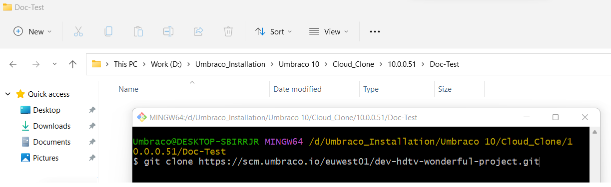
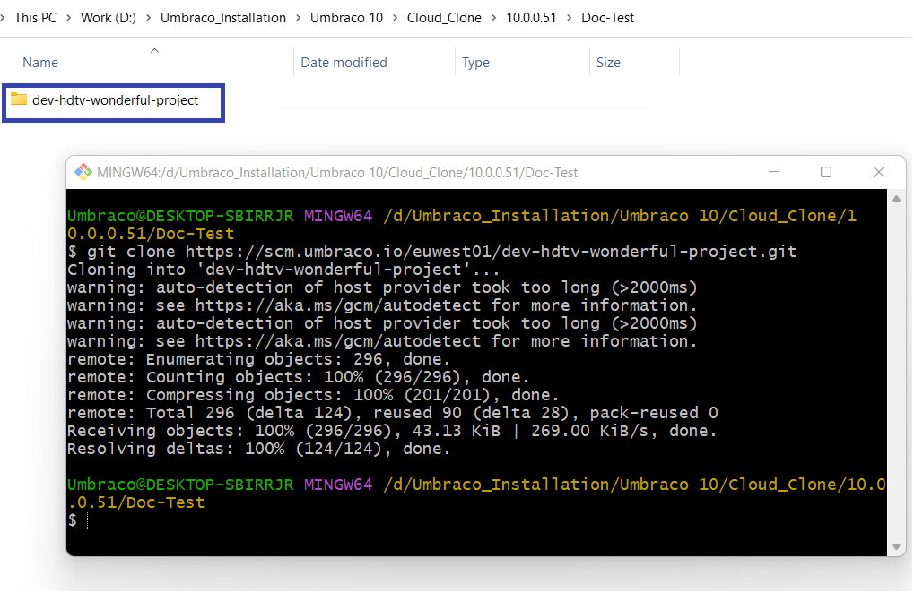
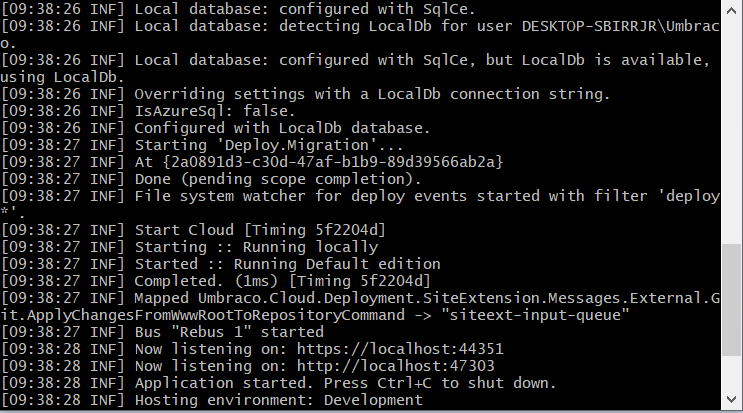
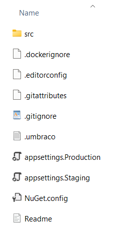
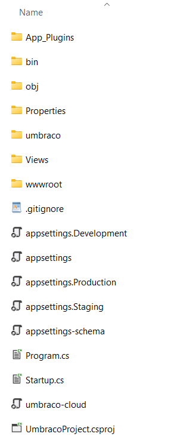
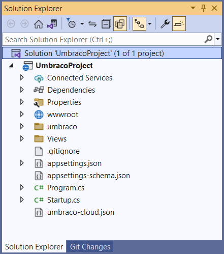
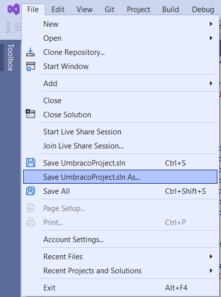
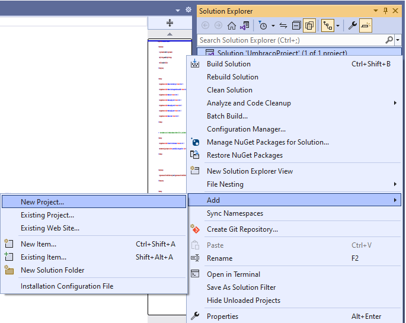
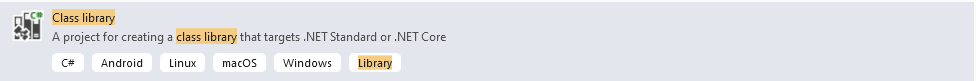
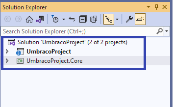

# Working with a Local Clone

## Video Tutorial


Learn how to clone your Umbraco Cloud project and work with it locally.


## Tools

We recommend using the following tools to work with a local clone of your Umbraco Cloud project:

* Git needs to be installed on your computer to clone down the project and push your changes up to Cloud.
  * We recommend using one of the following git-clients if you are new to Git:&#x20;
    * [Fork](https://git-fork.com/)
    * [SourceTree](https://www.sourcetreeapp.com/)
    * [GitKraken](https://www.gitkraken.com/)
* [Microsoft Visual Studio](https://www.visualstudio.com/) or [JetBrains Rider](https://www.jetbrains.com/rider) - for running the project on your local machine.



In the root of your local project, you'll find a *README* file with details about the project structure and build process on Umbraco Cloud.



## Cloning an Umbraco Cloud Project

To clone an Umbraco Cloud project, follow these steps:

1. Open the project you wish to clone in the Umbraco Cloud Portal.
2. Click on the arrow next to the **Development** environment.
3. Select **Clone project**.

<div align="center"><figure><figcaption><p>Clone project option</p></figcaption></figure></div>

4. **Copy** the clone URL to copy the Development environment's git repository endpoint.

<figure><figcaption><p>Copy the clone URL</p></figcaption></figure>

5. Use your favorite Git client to clone down the project. In this guide, we will use **Git Bash**.
6. Type the following command in the **Git Bash** terminal:

```cs
git clone <Git clone URL>
```

The `<Git clone URL>` should be the URL you copied from the Cloud Development environment.

<figure><figcaption></figcaption></figure>

7. Press **Enter**.

Once the project has been cloned, you will get a folder with files for your Umbraco Cloud project. Now, you have a copy of your Umbraco Cloud Development environment that you can run locally.



## Running the site Locally

To run your Umbraco Cloud project locally, you will need to [install the latest .NET SDK](https://dotnet.microsoft.com/download) (if you do not have this already).

With dotnet installed, run the following commands in a terminal application of your choice. You can also refer to the `Readme` file in the project folder.

1. Navigate to the newly created project folder.
2. Run the following commands:

```cs
cd src/UmbracoProject
```

1. Build and run the project:

```cs
dotnet build
dotnet run
```

The terminal output will show the application starting up and will include localhost URLs which you can use to browse to your local Umbraco site.




We recommend setting up a developer certificate and running the website under HTTPS. If you haven't configured one already, run the following command:

```cs
dotnet dev-certs https --trust
```


The first time the project is run locally, you will see the **Restore from Umbraco Cloud** screen. If the cloned environment has Umbraco Deploy metadata files, they are automatically extracted with the option to restore content from Cloud to the local installation.


Click **Restore** to restore your site's content if any. Wait until this process is completed as it also creates the local SQLite database for your site.

## Working with Visual Studio

When working locally, we recommend using Visual Studio but you can use any other development tool of your choice.

Once the project has been cloned down, you will get a folder with files for your Umbraco Cloud project.

<figure><figcaption><p>Umbraco files</p></figcaption></figure>

1. Navigate to `src/UmbracoProject`. Here, you will find the files for your Umbraco installation.

<figure><figcaption><p>Umbraco files</p></figcaption></figure>

2. Open the `UmbracoProject.csproj` file in Visual Studio.
3. Build and run your solution in Visual Studio.

You can create content, add media, and create your custom code. When you're ready to deploy your changes make sure to have a look at the [deployments](../deployment/) documentation.


If you have more than "a few" media items, see our recommendations for working with [Media on Umbraco Cloud](../media/).


### Adding a Solution File to your Cloud Project

To collaborate effectively in an Umbraco Cloud project, ensure you have a solution file in Visual Studio. This allows for adding additional projects.

If you want to add a solution file for your Cloud project, you can do it either:

* [Using the Command Line](./#using-the-command-line)
* [Using Visual Studio](./#using-visual-studio)

#### Using the Command Line

Using the terminal of your choice, navigate to the root of the git repository of your Umbraco Cloud project and enter the following command:

```cs
dotnet new sln --name <MyAwesomeSolution>
```

#### Using Visual Studio

1. Open the `UmbracoProject.csproj` project in Visual Studio.
2. Click on the solution:



3. Save the solution file using the **Save as** option:



4. Provide a **File name** to create the solution file in the folder that you specified.


When creating a solution file, we recommend placing it at the root of the git repository.


### Adding Additional Projects to Your Solution


When creating new projects alongside the default Umbraco project, we recommend adding the projects to the `src` folder in the git repository.


If you want to add additional projects to your solution, you can do it either through the:

* [Command Line](./#command-line)
* [Visual Studio](./#visual-studio)

#### Command Line

Run the following commands to add additional projects to your solution:

```cs
dotnet new classlib --name MyAwesomeProject.Web --output src/MyAwesomeProject.Web
dotnet sln add .\src\MyAwesomeProject.Code\MyAwesomeProject.Code.csproj
dotnet sln add .\src\MyAwesomeProject.Web\MyAwesomeProject.Web.csproj
```

#### Visual Studio

1. Open the `UmbracoProject.csproj` project in Visual studio.
2. Click on the solution:

<div align="center"></div>

3. Right-click the solution and choose `Add` -> `New Project...`

<div align="center"></div>

1. Add a class library using the latest .NET SDK to your project:

<div align="left"></div>

Once the Class library (`.Core`) has been added, you can see the project(s) that have been added in Solution Explorer.



## Renaming the Project Files and Folders

To rename your Umbraco Cloud project files and folder, do the following:

1. Navigate to the `.umbraco` file at the root of the project and view the following:

```csharp
[project]
base = "src/UmbracoProject"
csproj = "UmbracoProject.csproj"
```

The `base` property provides the folder location which contains the application and the `csproj` property is the name of the .csproj file.

1. Rename the `UmbracoProject` directory and `.csproj` file.
2. Update the `.umbraco` file with the new name and any C# code namespaces reflecting the name of your project.
3. Additionally, if you prefer to organize your code, you can add additional Class Library projects that are referenced by the Umbraco application .csproj file.

For example: Rename `UmbracoProject.csproj` to `MyAwesomeProject.Web.csproj` and have one or more additional class library projects such as `MyAwesomeProject.Code.csproj`

```csharp
[project]
base = "src/MyAwesomeProject.Web"
csproj = "MyAwesomeProject.Web.csproj"
```


It's a good practice to update the namespaces in the `Program.cs`, `Startup.cs`, and `_ViewImports.cshtml` files to ensure consistent naming throughout your project. After making these updates, be sure to clear the `bin` and `obj` folders locally to prevent any build errors. Once you have completed these steps, commit your changes and push them to the cloud.


If you've built and run the project locally, update your local Git repository to reflect any changes made. When a Cloud project first runs, a Git hook is created. It triggers a schema update via Umbraco Deploy when changes are pulled from an upstream environment.

The file you'll need to update is  `post-merge` within `.git/hooks/` in your cloned environment files. It can be opened with a text editor. You can either delete the file so it will be recreated with the new path or update it. The default contents are shown below and can be updated to reflect the new path to the `umbraco/Deploy` folder.

```
#!/bin/sh
echo > src/UmbracoProject/umbraco/Deploy/deploy
```

## Working with Linux/macOS

You can work locally with your Umbraco Cloud site without needing a Windows machine or a local web server installed. This enables users on macOS or Linux-based operating systems to use their preferred editor to modify code in their Umbraco Cloud site.

### The Solution

1. On the Umbraco Cloud portal, go to your project and clone the site using your favorite Git client.

    <figure><figcaption><p>Clone project down</p></figcaption></figure>

2. Configure a SQL Server connection string using `ConnectionStrings` in `appsettings.json` or `appsettings.Development.json` (the `launchSettings.json` configures the local instance to run as 'Development'):

    ```json
    "ConnectionStrings": {
        "umbracoDbDSN": ""
    }
    ```

3. Configure the local instance to install unattended by adding the following settings to `appsettings.Development.json`:

    ```json
    {
    "Umbraco": {
        "CMS": {
        "Unattended": {
            "InstallUnattended": true,
            "UnattendedUserName": "",
            "UnattendedUserEmail": "",
            "UnattendedUserPassword": ""
        }
        }
    }
    }
    ```


The `UnattendedUserName`, `UnattendedUserEmail`, and `UnattendedUserPassword` are optional. They are only required if you want to create a local backoffice user. You can alternatively use your Umbraco ID to sign in.


4. In your terminal, navigate to the `src/UmbracoProject` folder and run the following commands to start the project:

    ```
    dotnet build
    dotnet run
    ```
  
5. When running the site for the first time, the database schema will be inserted automatically into the database (with `"InstallUnattended": true` in `appsettings.Development.json`), so the site will start up ready for use.
