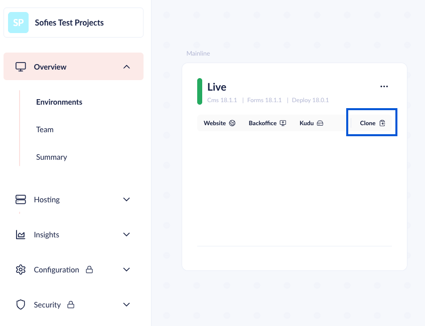
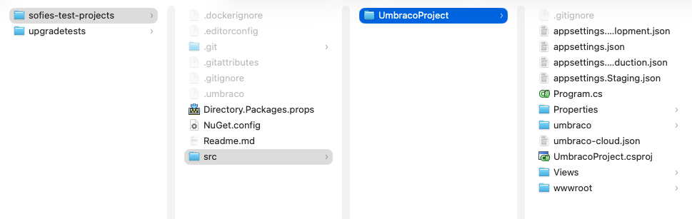
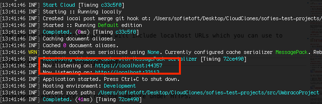
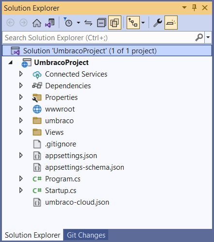
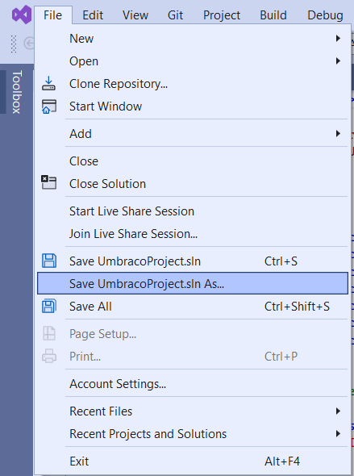
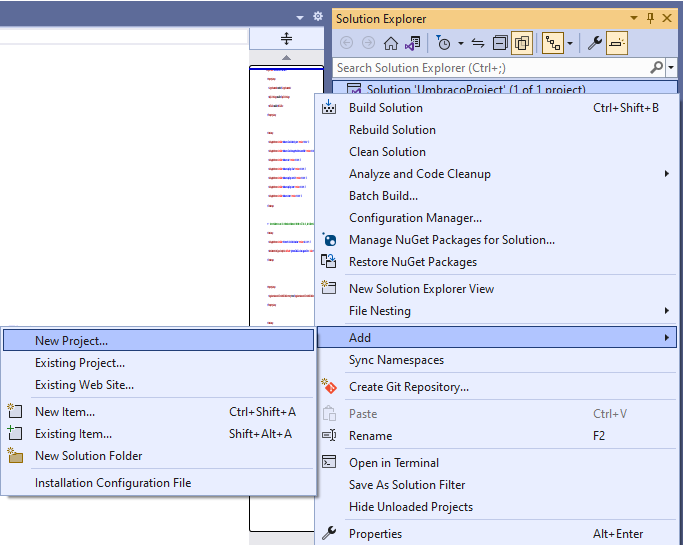
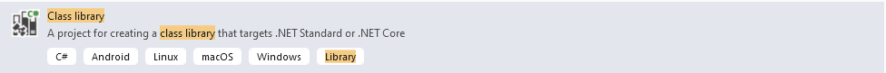
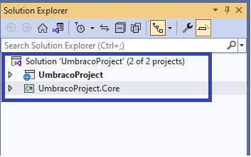

# Working with a Local Clone

## Video Tutorial


Learn how to clone your Umbraco Cloud project and work with it locally.


## Tools

It is recommended to use one of the following tools to work with a local clone of your Umbraco Cloud project:

* Git needs to be installed on your computer to clone down the project and push your changes up to Cloud.
  * Use a command line tool (Git Bash or the terminal) or one of these Git GUI clients:
    * [Fork](https://git-fork.com/)
    * [SourceTree](https://www.sourcetreeapp.com/)
    * [GitKraken](https://www.gitkraken.com/)
* An IDE like [Microsoft Visual Studio](https://www.visualstudio.com/) or [JetBrains Rider](https://www.jetbrains.com/rider), for running the project on your local machine.
* The [.NET SDK version that matches your projects](https://docs.umbraco.com/umbraco-cms/get-started/installation/requirements) Umbraco CMS version.



In the root of your local project, you'll find a _README_ file with details about the project structure and build process on Umbraco Cloud.



## Cloning an Umbraco Cloud Project

To clone an Umbraco Cloud project, follow these steps:

1. Click **Clone** on the environment you want to work with locally.

<div align="center"><figure><figcaption><p>Click "Clone" on a Cloud environment to copy the clone URL.</p></figcaption></figure></div>

The clone URL is now in your clipboard.

4. Paste the clone URL into your preferred Git Client.

If you are using a command line tool, use the following command:

```bash
git clone <Git clone URL>
```



If this is the first time your cloning a Cloud project to your machine, you will be prompted to login using Umbraco ID.



Once the project has been cloned, you have a folder with files for your Umbraco Cloud project. This is a copy of your Umbraco Cloud Development environment that you can run locally.

The screenshot below shows the project folder structure of a default Cloud environment.



## Running the site Locally

Use a command line tool of your choice for the following steps. You can also refer to the `Readme` file in the project folder.

1. Open the command line tool in the newly cloned project folder.
2. Run the following command:

```bash
cd src/UmbracoProject
```

3. Build and run the project:

```bash
dotnet build
dotnet run
```

The terminal output will show the application starting up and will include localhost URLs which you can use to browse to your local Umbraco site.





It is recommended to set up a developer certificate and run the website under HTTPS.

If you haven't a developer certificate already, run the following command:

```bash
dotnet dev-certs https --trust
```



The first time the project is run locally, you will see the **Restore from Umbraco Cloud** screen. If the cloned environment has Umbraco Deploy metadata files, they are automatically extracted with the option to restore content from Cloud to the local installation.


Click **Restore** to restore your site's content if any. Wait until this process is completed as it also creates the local SQLite database for your site.

## Working with Visual Studio

When working locally, you can use whichever IDE you prefer. Refer back to the [Tools](#tools) section for recommendations.

1. Locate the `UmbracoProject.csproj` file within the UmbracoProject folder.
2. Open it in your preferred IDE to start working with your project.

You can create content, add media, and write your custom code. When you're ready to deploy your changes make sure to have a look at the [deployments](../deployment/) documentation.


If you have more than "a few" media items, see our recommendations for working with [Media on Umbraco Cloud](../media/).


### Adding a Solution File to your Cloud Project

To collaborate effectively around an Umbraco Cloud project, it is recommended to have a solution file. This allows for adding additional .NET projects.

 To add a solution file for your Cloud project, you can do it either:

* [Using the Command Line](./#using-the-command-line)
* [Using Visual Studio](./#using-visual-studio)
* [Using Rider](./#using-rider)

#### Using the Command Line

Using the terminal of your choice, navigate to the root of the git repository of your Umbraco Cloud project and enter the following command:

```bash
dotnet new sln --name <MyAwesomeSolution>
```

#### Using Visual Studio

1. Open the `UmbracoProject.csproj` project in Visual Studio.
2. Click on the solution:



3. Save the solution file using the **Save as** option:



4. Provide a **File name** to create the solution file in the folder that you specified.


When creating a solution file, we recommend placing it at the root of the git repository.


#### Using Rider

1. Open the `UmbracoProject.csproj` file in Rider.
2. Rider automatically creates a solution structure for the project.
3. In the **Explorer** pane, right-click the solution at the top level.
4. Select **Save '...' as Solution...** to save the `.sln` file to your preferred location.


When creating a solution file, we recommend placing it at the root of the git repository.


### Adding Additional Projects to Your Solution


When creating new projects alongside the default Umbraco project, we recommend adding the projects to the `src` folder in the git repository.


If you want to add additional projects to your solution, you can do it either through the:

* [Command Line](./#command-line-1)
* [Visual Studio](./#visual-studio)
* [Rider](./#rider)

#### Command Line

Run the following commands to add additional projects to your solution:

```bash
dotnet new classlib --name MyAwesomeProject.Web --output src/MyAwesomeProject.Web
dotnet sln add ./src/MyAwesomeProject.Code/MyAwesomeProject.Code.csproj
dotnet sln add ./src/MyAwesomeProject.Web/MyAwesomeProject.Web.csproj
```

#### Visual Studio

1. Open the `UmbracoProject.csproj` project in Visual studio.
2. Click on the solution:

<div align="center"></div>

3. Right-click the solution and choose `Add` -> `New Project...`

<div align="center"></div>

1. Add a class library using the latest .NET SDK to your project:

<div align="left"></div>

Once the Class library (`.Core`) has been added, you can see the project(s) that have been added in Solution Explorer.



#### Rider

1. Open the solution in Rider.
2. In the **Explorer** pane, right-click the solution.
3. Select **Add** > **New Project...**.
4. Choose **Class Library** as the project type and configure the project name.
5. Set the location to the `src/` folder in your repository.
6. Click **Create**.

## Renaming the Project Files and Folders

To rename your Umbraco Cloud project files and folder, do the following:

1. Navigate to the `.umbraco` file at the root of the project and view the following:

```csharp
[project]
base = "src/UmbracoProject"
csproj = "UmbracoProject.csproj"
```

The `base` property provides the folder location which contains the application and the `csproj` property is the name of the .csproj file.

1. Rename the `UmbracoProject` directory and `.csproj` file.
2. Update the `.umbraco` file with the new name and any C# code namespaces reflecting the name of your project.
3. Additionally, if you prefer to organize your code, you can add additional Class Library projects that are referenced by the Umbraco application .csproj file.

For example: Rename `UmbracoProject.csproj` to `MyAwesomeProject.Web.csproj` and have one or more additional class library projects such as `MyAwesomeProject.Code.csproj`

```csharp
[project]
base = "src/MyAwesomeProject.Web"
csproj = "MyAwesomeProject.Web.csproj"
```


It's a good practice to update the namespaces in the `Program.cs`, `Startup.cs`, and `_ViewImports.cshtml` files to ensure consistent naming throughout your project. After making these updates, be sure to clear the `bin` and `obj` folders locally to prevent any build errors. Once you have completed these steps, commit your changes and push them to the cloud.


If you've built and run the project locally, update your local Git repository to reflect any changes made. When a Cloud project first runs, a Git hook is created. It triggers a schema update via Umbraco Deploy when changes are pulled from an upstream environment.

The file you'll need to update is `post-merge` within `.git/hooks/` in your cloned environment files. It can be opened with a text editor. You can either delete the file so it will be recreated with the new path or update it. The default contents are shown below and can be updated to reflect the new path to the `umbraco/Deploy` folder.

```
#!/bin/sh
echo > src/UmbracoProject/umbraco/Deploy/deploy
```
