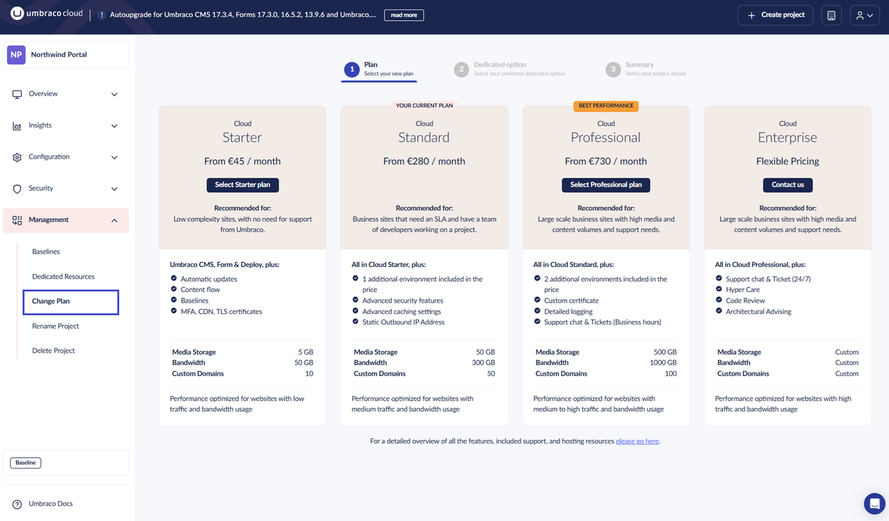
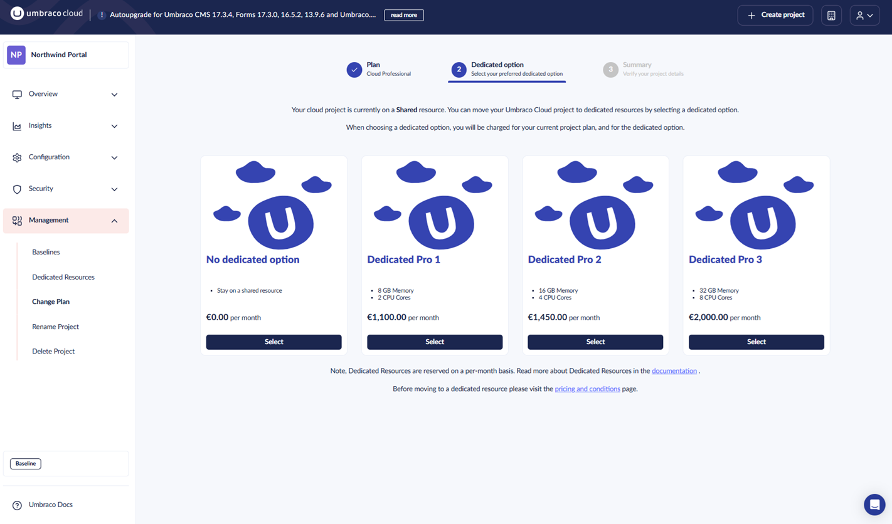
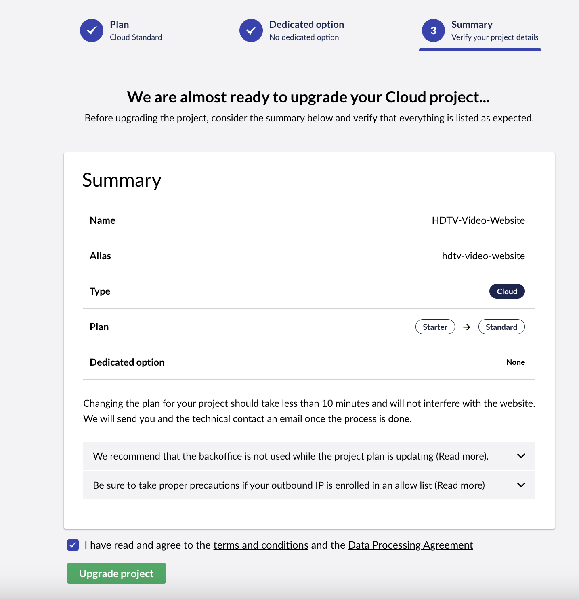
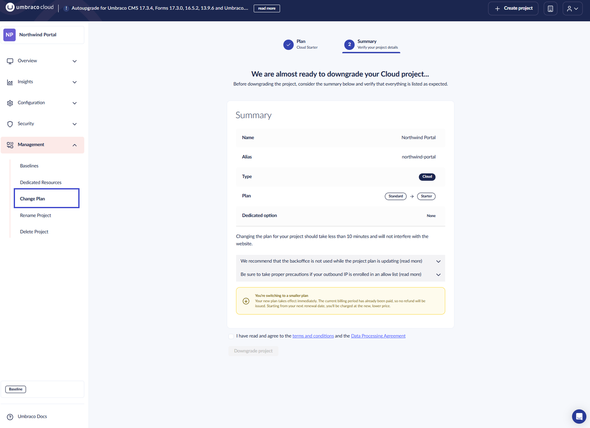

# Change your Plan

This article explains how to change your Umbraco Cloud plan. You can upgrade to a higher plan or downgrade to a lower plan depending on your project needs.

## Before you change your plan

Before you change your Umbraco Cloud plan, consider the following:

* **IP address change** — Changing a plan for a project will change the outgoing IP of the project. If your solution has an external service that requires whitelisting the outgoing IP, visit the [external services](../../../expand-your-projects-capabilities/external-services/) documentation first.
* **Plan constraints** — Review the environment limits for each plan to ensure the target plan supports your current number of environments.
* **Pricing** — Check the [Umbraco Cloud pricing](https://umbraco.com/umbraco-cloud-pricing) page to understand the cost difference between plans.


When changing your plan, log files such as trace logs will not be transferred to the new environment.

If you need to retain log history, download and back up the log files before changing your plan. For more information on accessing logs, see the [Log files](../../../optimize-and-maintain-your-site/monitor-and-troubleshoot/resolve-issues-quickly-and-efficiently/log-files.md) article.


## Plan Types

**Umbraco Cloud:**

* Starter → Standard → Professional → Enterprise

**Heartcore:**

* Starter → Standard → Professional → Enterprise

Enterprise plans require contact through [Umbraco Support](mailto:contact@umbraco.com) and are not available for self-service changes.

## Environment Limits

Each plan supports a specific number of environments. If your project exceeds the target plan's environment limit, the downgrade will be blocked until you remove environments.

**Umbraco Cloud** (supports extra paid environments):

* **Starter:** 1 included, max 2
* **Standard:** 2 included, max 3
* **Professional:** 3 included, max 4
* **Enterprise:** 3 included, max 4

**Heartcore** (extra environments allowed):

* **Starter:** 1 included
* **Standard:** 2 included
* **Professional:** 3 included
* **Enterprise:** 3 included

If a Heartcore project exceeds the target plan's limit, the downgrade is blocked entirely.

## How to Upgrade your Plan

To upgrade your plan, follow these steps:

1. Go to [Umbraco.io](https://www.s1.umbraco.io/projects).
2. Locate the project you want to upgrade in the project overview.
3. On the project card, open the Management dropdown (left-side).
4. Select **Change Plan**.

<figure><figcaption>
Change Plan menu option
</figcaption></figure>

5. Review the available plans, pricing, and limits.
6. Click **Select Plan** on the plan you want to upgrade to:
    * **Starter** → **Standard** or **Professional**
    * **Standard** → **Professional**
7. _[Optional]_ Choose a **dedicated option** in the next step.

<figure><figcaption>
Dedicated option on Cloud
</figcaption></figure>

8. Review the **Summary** to confirm your selections.

<figure><figcaption>
Summary of project upgrade.
</figcaption></figure>

9. Click **Upgrade Project** to apply the new plan.


When changing your plan, the project ID is appended with `-1`. If `-1` already exists, it is removed. Update any references to your project ID in external services or configurations.


## How to Downgrade your Plan

Downgrading your plan is handled through the same **Change Plan** interface. However, you need to be aware of downgrade rules and restrictions.

### Downgrade Rules

Before downgrading, review the following rules:

#### **Too many environments → Hard block**

If your project has more environments than the target plan supports, the downgrade is blocked entirely. Remove environments until your project meets the target plan's environment limit, then retry the downgrade.

Example message: "Your project has 4 environments but this plan only supports up to 3. Please remove 1 environment before downgrading."

#### **Losing dedicated resources → Warning**

If you're downgrading from dedicated to shared hosting, you'll see a warning that your dedicated resources will be switched to shared hosting.

#### **Extra environment costs → Warning**

If your project has paid extra environments beyond the plan's included count, you'll see a warning about additional monthly costs.

Example message: "Your extra environment will incur an additional cost of €100 on top of the plan price."

### Steps to Downgrade

1. Go to [Umbraco.io](https://www.s1.umbraco.io/projects).
2. Locate the project you want to downgrade in the project overview.
3. On the project card, open the **Management** dropdown (left-side).
4. Select **Change Plan**.
5. Review available plans. Plans below your current plan are marked as downgrades.
6. Click **Select Plan** on the plan you want to downgrade to.
7. Review any warnings about downgrade restrictions.
8. Review the **Summary** to confirm the changes.
9. Click **Downgrade project** to apply the downgrade.

<figure><figcaption>
Summary of project downgrade.
</figcaption></figure>

Your new plan takes effect immediately. From the next billing period, you are charged at the new, lower plan rate.

## Billing

* **Upgrades:** The price difference is prorated and added to your next invoice. If you upgrade mid-month, the remaining days are charged at the new plan's rate.

* **Downgrades:** Your new plan takes effect immediately. Since you've already been billed for the current month, there is no refund for the remaining days. From next month, you are charged the new, lower price.

## Automatic Plan Upgrades

If your project exceeds usage limits, you are automatically upgraded to a suitable plan to keep your website running smoothly.

You receive an email notification to the project owner and technical contact(s). The upgrade appears on your next bill and takes effect on the upgrade date.

Once upgraded, you gain access to all features in the new plan. See [Umbraco Cloud pricing](https://umbraco.com/umbraco-cloud-pricing/) for feature details.
