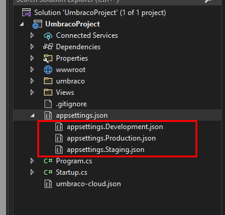

# Config Transforms

In this article, you will find examples of applying environment-specific configuration to your Umbraco Cloud project.

Common configuration files, like the `web.config` and `appSettings.json` files on your Umbraco Cloud project will be used as examples.

## What are Config Transforms?

Config Transforms are a way to transform your config files without changing the actual config file.

To transform a config file, you need to create a new file in your project with the following naming convention: `{config-file name}.{environment}.config`.


**Legacy Umbraco**

If your project is on Umbraco 7 and 8 the naming convention is the following: `{config-file name}.{environment}.xdt.config.` Find more details on this in the [Legacy Documentation](https://github.com/umbraco/UmbracoDocs/blob/legacy-cloud/Umbraco-Cloud/Set-Up/Config-Transforms/index.md).


If you want to do a transform on your `Web.config` file for the Live environment of your project, the config transform you need to create will look like this:

`Web.Production.config`

The `{environment}` part needs to be replaced with the target environment, for which there are currently three possibilities for each project:

1. `Production`
2. `Staging`
3. `Development`

This file needs to be created on a local clone of your project, as this will ensure that the file is added to the project repository.

 If you don't have a web.config you will need to create one locally as well. 

When the file is deployed to the Live environment, the transforms will be applied to the `Web.config` file in the `Root` of your project. In the case that you have mutliple mainline environments, the `Web.Production.config` will **only** transform the `Web.config` on the Live environment.

For each deployment, the Umbraco Cloud engine searches for all of the `.{environment}.config` files in your site and apply the transforms.


Using config transforms to remove and/or add sections to config files is currently only possible for the `Web.config` file.



Be aware that a misconfigured config transform may [block Data Extraction on your project](../../../optimize-and-maintain-your-site/monitor-and-troubleshoot/resolve-issues-quickly-and-efficiently/deployments/changes-not-being-applied.md).


## Syntax and testing

When creating config transforms you need to follow these three rules:

1. Use the correct file-naming convention.
2. Place the transform file in the same folder as the file you want to transform.
3. Follow the correct [Config Transform syntax](https://docs.microsoft.com/en-us/aspnet/core/host-and-deploy/iis/transform-webconfig?view=aspnetcore-5.0).

Before applying the config transform files to your environments, we recommend running a test using this tool: [Webconfig Transformation Tester](https://elmah.io/tools/webconfig-transformation-tester/).

Using the tool will let you test whether the transform file transforms your config files correctly. The tool can be used for all config files.

## Examples

Rewrite rules are often something you only want to apply to your Live environment. To avoid the rewrites being applied to other mainline environments, create a transform file to apply the rewrite rules only to the Live environment.

Here is an example of how that config transform would look:

```xml
<?xml version="1.0" encoding="utf-8"?>
<configuration xmlns:xdt="http://schemas.microsoft.com/XML-Document-Transform">
	<system.webServer>
		<rewrite>
			<rules>
				<rule xdt:Transform="Insert" name="Redirects umbraco.io to actual domain" stopProcessing="true">
					<match url=".*" />
					<conditions>
						<add input="{HTTP_HOST}" pattern="^(.*)?.euwest01.umbraco.io$" />
						<add input="{REQUEST_URI}" negate="true" pattern="^/umbraco" />
						<add input="{REQUEST_URI}" negate="true" pattern="^/DependencyHandler.axd" />
						<add input="{REQUEST_URI}" negate="true" pattern="^/App_Plugins" />
						<add input="{REQUEST_URI}" negate="true" pattern="localhost" />
					</conditions>
					<action type="Redirect" url="https://mycustomwebsite.com/{R:0}" appendQueryString="true" redirectType="Permanent" />
				</rule>
			</rules>
		</rewrite>
	</system.webServer>
</configuration>
```


The above snippet requires your project to have a web.config file with a matching structure, otherwise, the config transform (and subsequently, the deployment) might fail.


This config transform will add a `<rule>` to `<system.webServer><rewrite><rules>`. The `xdt:Transform` attribute is used to tell the system what to transform. In this case, the value is `Insert`, which means it will add the section if it's not already in the config file.

If you don't have the `<rewrite>` and `<rules>` section in your `web.config` file, you can add the attribute `xdt:Transform="InsertIfMissing"` to those two section in the transform file and they will then get applied to the `web.config`.

## appsettings.json transforms

On Umbraco Cloud, projects come with an **appsettings.json** file for each of your different environments.

With this, you can add different environment-specific settings to your project.

To edit the **appsettings.json** files for the different environments, the Umbraco Cloud project needs to be cloned down to your local machine. Then the files can be edited using your code editor.



Once done editing the files, they will need to be pushed up to your Umbraco Cloud project to be added to the repository.

When the file is deployed to the next environment on Umbraco Cloud, the settings in the **appsettings** file will be applied to that environment. For example, the settings in the **appsettings.Production.json** will be applied to the Live environment of your project.
