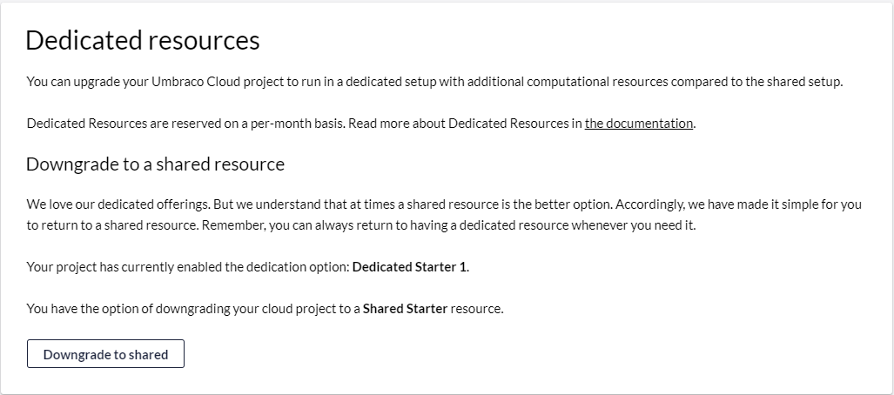

# Dedicated Resources

_Dedicated Resources_ is a feature on Umbraco Cloud that gives you the option to move your project to a dedicated server. You can choose between a number of _dedicated options_ depending on the amount of resources you will need for your project.

In this article, you can read about how to move your Umbraco Cloud project to dedicated resources. You can also find information about what you need to be aware of before doing so.

## Before you move your project to dedicated resources

Before you decide to move your Umbraco Cloud project, you need to consider a few things:

* Umbraco Cloud offers dedicated resources for Starter, Standard, and Professional plans. You can choose among one dedicated option for projects on a Starter plan, two dedicated options for a Standard plan project, and three dedicated options for a Professional plan project.
* Moving from a shared resource to a dedicated resource will change the outgoing IP of the project. If your solution has an external service that requires whitelisting the outgoing IP, we advise you to enable the static outbound IP feature for your project and share that static outbound IP address with the third party. The static outbound IP address will not change when moving from a shared resource to a dedicated resource. For more info on static lease visit the documentation for [external services](../../../expand-your-projects-capabilities/external-services/).

## How to move from shared to dedicated

The first step in moving to a dedicated resource is to access your project in the project overview at [Umbraco.io](https://www.s1.umbraco.io/projects).

* Find and select the project that you want to move to dedicated resources.
* Select _Dedicated Resources_ from the Management menu:

<figure><figcaption>
Dedicated resources
</figcaption></figure>

* There are currently three dedicated options for you to choose from the Professional plan, two dedicated options from the Standard plan, and one dedicated option from the Starter plan. For each of the dedicated options, you will find its name, the memory and CPU cores, and the price per month.

<figure><figcaption>
Dedicated plans (Starter plan)
</figcaption></figure>

* By hitting the "Upgrade" button on your dedicated option of choice and confirming this, you will be redirected to the project page where you will be notified when the move to a dedicated resource has been completed.


Are you moving your Cloud project to a dedicated resource in the middle of the month? Dedicated resources are reserved on a per-month basis. The price of the dedicated resource will take effect from the next period of your subscription. The time from that date until the start of the next subscription period will be added to the next invoice.


## How to move from dedicated to shared

Moving away from dedicated resources and back to a shared plan can be done from the _Dedicated Resources_ page.

* By hitting "Downgrade to shared" and confirming your choice, you will be redirected to the project page where you will be notified when the move back to a shared resource has been completed.
* Your Cloud project is now back on a shared resource.

## Frequently asked questions

Wondering what happens when you move your environment to a dedicated server? Below you can find a list of the most frequently asked questions including answers.

### Will it move all the environments to the dedicated server?

You can choose to only move your live environment to the dedicated server.

### How will the resources be split between the environments?

All environments on the project moved to dedicated will share the resources of the dedicated server.

### Will the customer be able to work on the project during the move?

It will not be possible to work on the project while it is being moved to the dedicated server. The move takes a couple of minutes, and during that time the backoffice will not respond as usual.

### Will the environments be moved at the same time or one by one?

All environments that have been selected to be moved, will be moved simultaneously.

### Will the live environment be unavailable while the Project is moved?

There will always be an active live environment that continues to serve requests and be online during the move operation. When the moved live environment is ready and responding to requests, the hostnames will be switched to point to the moved environment.

If you have any other questions regarding dedicated resource, feel free to reach out to [Umbraco Support](mailto:contact@umbraco.com).
