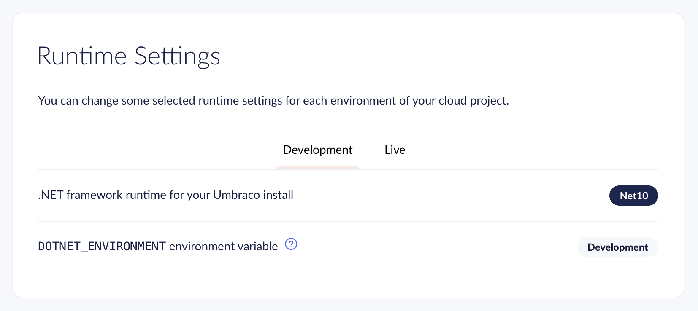

# Environment Naming and Appsettings

Umbraco Cloud sets each environment's `DOTNET_ENVIRONMENT` value based on its name. The value decides which `appsettings.{Name}.json` file the environment loads. Naming an environment `Development` has side effects worth knowing before you create or rename one.

## How the Environment Name Affects Configuration

ASP.NET Core loads `appsettings.json` first, then layers `appsettings.{DOTNET_ENVIRONMENT}.json` on top of it. The values in the second file win wherever the two overlap.

Umbraco Cloud sets the environment variable `DOTNET_ENVIRONMENT` to the environment's alias. The alias is a lowercase version of the environment name with spaces replaced by dashes. Live is the exception and always uses `Production`, even after a rename. You can view or override the value under [Project Settings](README.md#advanced) > Advanced.

Naming an environment `QA`, for example, applies `appsettings.QA.json` if that file exists in your project.


Umbraco Cloud only sets `DOTNET_ENVIRONMENT`. On projects using `WebApplication`, the default from ASP.NET Core 7.0 (Umbraco 14), it takes precedence over `ASPNETCORE_ENVIRONMENT`. On upgraded projects that keep the older hosting model, `ASPNETCORE_ENVIRONMENT` takes precedence.


## Why the Name Development Is Different

.NET and Umbraco project templates use `Development` for local development, set in `launchSettings.json`. The name also switches on development behavior, because `env.IsDevelopment()` returns `true`.

On older projects, Umbraco Cloud named the [left-most mainline environment](../../../begin-your-cloud-journey/project-features/environments.md) `Development` by default. Your project can use the name even if nobody on your team chose it.

When you name a Cloud environment `Development`, that environment takes over `appsettings.Development.json`, the same file your team uses for local development. The environment then runs in development mode.

The resulting issues tend to show up later, and they can look unrelated to the cause:

* Local connection strings or Umbraco Deploy settings apply in the cloud, or the other way around.
* Local development breaks after someone edits `appsettings.Development.json` for the cloud environment.
* Models Builder generates models on the cloud environment, even though you configured model generation for local use only.


An environment that runs as `Development` shows the developer exception page and keeps the Swagger UI enabled. Both can expose details about your implementation on a public URL. To limit this, enable [Public Access](public-access.md) on the environment, or change its `DOTNET_ENVIRONMENT` value as described in [Option B](#option-b-override-the-variable-on-the-cloud-environment).


## File Name Casing

Use the same casing in the environment name and the appsettings file name. For example, name the environment `Development` to match `appsettings.Development.json`, not `development`.

## Two Ways to Keep the Name Development

There is nothing wrong with the name `Development` itself. Some teams develop on the hosted environment and share settings with local development on purpose. Otherwise, decide who owns the name: your local machines or the cloud environment.

Option B is the smaller change, but you need to set the custom value again after every rename. Option A suits teams that want the portal name to match the configuration file name.

### Option A: Move Local Development to Its Own Name

Keep the cloud environment named `Development`, and give local development a new name, for example `Local`. The cloud environment keeps running in development mode, so consider enabling [Public Access](public-access.md) on it.

1. Add an `appsettings.Local.json` file to your project, and move your local-only settings into it, such as connection strings, Umbraco Deploy local settings, and logging verbosity.

From Umbraco 17.7.0 and 18.2.0, the installer writes the connection string to `appsettings.Local.json` when you run the site as `Local`.

2. Add the file to `.gitignore` if it contains secrets.
3. Update `launchSettings.json` so your run profiles use the new name. .NET project templates set the name with `ASPNETCORE_ENVIRONMENT`, as shown below.


```json
{
  "profiles": {
    "MyProject": {
      "commandName": "Project",
      "environmentVariables": {
        "ASPNETCORE_ENVIRONMENT": "Local"
      }
    }
  }
}
```


4. Update any code that checks `env.IsDevelopment()` to also check `env.IsEnvironment("Local")`. `Local` isn't `Development`, so `env.IsDevelopment()` returns `false` on your machine.

### Option B: Override the Variable on the Cloud Environment

Keep local development on `Development`, as the templates expect. Give the cloud environment a different configuration name, even though the portal still displays it as `Development`.

1. Go to **Configuration** > **Advanced** > **Runtime Settings** in the Cloud Portal, and select the environment.



2. Edit `DOTNET_ENVIRONMENT` to a value such as `CloudDev`. Changing the value restarts the site.
3. Add a matching `appsettings.CloudDev.json` file to your project with the settings that environment should use.


Renaming the environment resets `DOTNET_ENVIRONMENT` to the new alias, and overwrites your custom value. Set the custom value again after you rename the environment.


## Naming Checklist

Check the following before you create or rename an environment:

* [ ] Confirm whether an `appsettings.{Name}.json` file already exists in your project, and whether you want its values applied to this cloud environment.
* [ ] Check whether the name is `Development`. If it is, apply Option A or Option B above before you deploy.
* [ ] Match the casing of the name to the casing of the appsettings file exactly.
* [ ] Verify the value under **Configuration** > **Advanced** > **Runtime Settings** matches what you expect, after you create or rename the environment. A rename overwrites any custom value.

## Supported Umbraco Versions

This article applies to Umbraco 9 and later. Umbraco 7 and 8 projects run on .NET Framework instead of ASP.NET Core, so this guidance doesn't apply to them.
