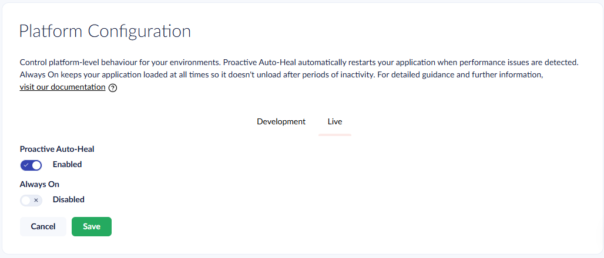
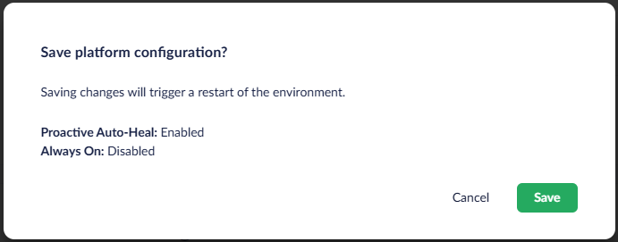

# Platform Configuration

The Platform Configuration section in the Umbraco Cloud Portal lets you manage environment-level settings that affect how your application runs on Azure App Service. You can control the following settings:

* **Proactive Auto-Heal**: Automatically restart an environment when the platform detects unhealthy resource usage.
* **Always On**: Keep your application loaded at all times so it does not unload after periods of inactivity.

Changes to either setting cause the environment to restart and take effect only after you confirm them.

## Proactive Auto-Heal

Proactive Auto-Heal is an Azure App Service feature that automatically monitors the health of your Umbraco Cloud environments. When the platform detects an unhealthy environment due to memory usage or slow requests, it performs an overlapping restart to recover it. This means a new instance is started before the old one is stopped, minimizing downtime.

Proactive Auto-Heal is **enabled by default** on all Umbraco Cloud projects and helps ensure your site remains available without manual intervention.

### When Proactive Auto-Heal is triggered

Proactive Auto-Heal monitors your environment and triggers a restart depending on the following factors:

* **Memory usage**: If the environment's memory consumption exceeds 90% of the available limit for more than 30 seconds, an overlapping restart is triggered. The exact memory limit depends on the worker size and process architecture.
* **Slow requests**: If 80% or more of all requests take longer than 200 seconds within a 2-minute rolling window, a restart is triggered. This rule requires a minimum of 5 requests in the window before it activates. The rule is not applied during the initial warm-up period after a process start.

### When to Disable Proactive Auto-Heal

In most cases, Proactive Auto-Heal should remain enabled. However, there are scenarios where legitimate high-resource workloads may trigger unnecessary restarts. Consider disabling Proactive Auto-Heal when your project performs:

* **Large content imports**: Bulk importing content can temporarily increase memory usage and request processing times.
* **Examine index rebuilds**: Rebuilding search indexes is resource-intensive and can trigger the monitoring thresholds.
* **Schema migrations**: Running database schema migrations may cause slow request processing during the migration.
* **Large content caches**: Projects with large content caches may consistently use higher memory, which could be misidentified as an unhealthy state.


Disabling Proactive Auto-Heal means your environment will no longer be automatically restarted when it enters an unhealthy state. If your site experiences genuine resource exhaustion, you need to manually restart the environment or wait for the issue to resolve itself. Only disable this feature if you understand the trade-offs.



The option to disable Proactive Auto-Heal is only available for projects on a **Dedicated** plan. Projects on Shared plans always have Proactive Auto-Heal enabled.


### Automatic Re-enablement on Plan Downgrade

If you downgrade your project from a **Dedicated** plan to a **Shared** plan, Proactive Auto-Heal is automatically re-enabled. This ensures that projects on shared infrastructure benefit from the automatic recovery behavior.

You do not need to take any action. The setting is applied automatically during the downgrade process.

## Always On

Always On keeps your application loaded, so it does not unload after periods of inactivity. Without Always On, an idle application is unloaded to free resources. The next incoming request then has to wait for the application to start again.

Keeping the application loaded removes this warm-up delay and helps ensure consistent response times.


Changing the Always On toggle is only available for environments on a **Dedicated** plan. Environments on Shared plans use the default value for Always On. This restriction exists for sustainability reasons. Keeping idle applications loaded consumes resources that could otherwise be released on shared infrastructure.


### Default Value on Plan Downgrade

If you downgrade an environment from a **Dedicated** plan to a **Shared** plan, the Always On setting reverts to its default value:

* **Production environments**: Always On is enabled (`true`) by default.
* **Feature environments**: Always On is disabled (`false`) by default.

You do not need to take any action. The default is applied automatically as part of the downgrade process.

## How to Update Platform Configuration

To update Proactive Auto-Heal or Always On for your project:

1. Go to your project in the [Umbraco Cloud Portal](https://www.s1.umbraco.io).
2. Navigate to **Configuration** > **Advanced** in the left-side menu.
3. Locate the **Platform Configuration** section.

<figure><figcaption>
Platform Configuration toggles
</figcaption></figure>

4. Toggle **Proactive Auto-Heal** and **Always On** to the desired state.
5. Select **Save** to apply the changes.
   * Select **Cancel** to discard the changes.
6. On the confirmation dialog, select **Save** to confirm the change. The environment restarts to apply the new settings.
   * Select **Cancel** to keep the environment running and discard the pending changes.

<figure><figcaption>
Platform Configuration confirmation dialog
</figcaption></figure>


Saving changes to Platform Configuration restarts the environment. Selecting **Cancel** on the dialog or the **Cancel** button below the toggles reverts any pending changes.

