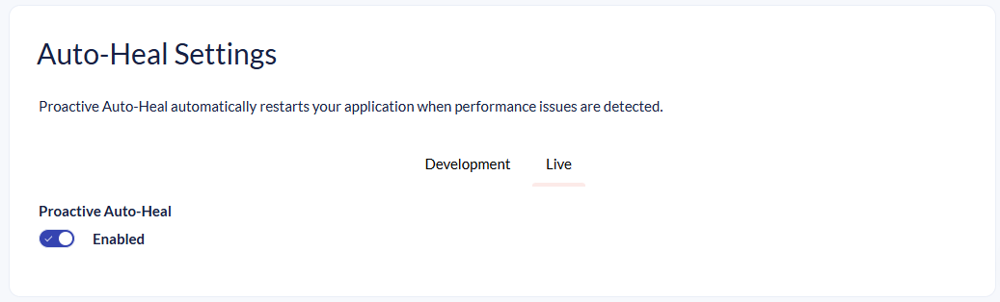
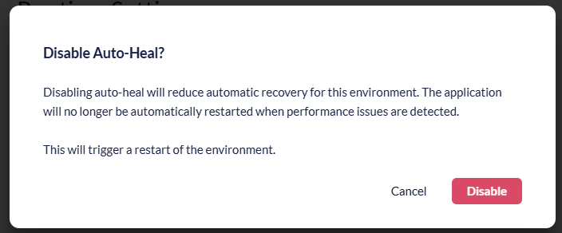

# Proactive Auto-Heal

Proactive Auto-Heal is an Azure App Service feature that automatically monitors the health of your Umbraco Cloud environments. When the platform detects an unhealthy environment due to memory usage or slow requests, it performs an overlapping restart to recover it. This means a new instance is started before the old one is stopped, minimizing downtime.

Proactive Auto-Heal is **enabled by default** on all Umbraco Cloud projects and helps ensure your site remains available without manual intervention.

## When is Proactive Auto-Heal triggered?

Proactive Auto-Heal monitors your environment and triggers a restart depending on the following factors:

* **Memory usage**: If the environment's memory consumption exceeds 90% of the available limit for more than 30 seconds, an overlapping restart is triggered. The exact memory limit depends on the worker size and process architecture.

* **Slow requests**: If 80% or more of all requests take longer than 200 seconds within a 2-minute rolling window, a restart is triggered. This rule requires a minimum of 5 requests in the window before it activates, and it is not applied during the initial warm-up period after a process start.

## When to Disable Proactive Auto-Heal

In most cases, Proactive Auto-Heal should remain enabled. However, there are scenarios where legitimate high-resource workloads may trigger unnecessary restarts. Consider disabling Proactive Auto-Heal when your project performs:

* **Large content imports**: Bulk importing content can temporarily increase memory usage and request processing times.
* **Examine index rebuilds**: Rebuilding search indexes is resource-intensive and can trigger the monitoring thresholds.
* **Schema migrations**: Running database schema migrations may cause slow request processing during the migration.
* **Large content caches**: Projects with large content caches may consistently use higher memory, which could be misidentified as an unhealthy state.


Disabling Proactive Auto-Heal means your environment will no longer be automatically restarted when it enters an unhealthy state. If your site experiences genuine resource exhaustion, you will need to manually restart the environment or wait for the issue to resolve itself. Only disable this feature if you understand the trade-offs.


## Requirements


The option to disable Proactive Auto-Heal is only available for projects on a **Dedicated** plan. Projects on Shared plans always have Proactive Auto-Heal enabled.


## How to Enable or Disable Proactive Auto-Heal

To manage the Proactive Auto-Heal setting for your project:

1. Go to your project in the [Umbraco Cloud Portal](https://www.s1.umbraco.io).
2. Navigate to **Configuration** > **Advanced** in the left-side menu.
3. Locate the **Proactive Auto-Heal** toggle.

<figure><figcaption>
Proactive Auto-Heal toggle
</figcaption></figure>

4. Toggle the setting to **enable** or **disable** Proactive Auto-Heal.

5. Confirm the dialog that has a warning about the change causing a restart.
<figure><figcaption>
Proactive Auto-Heal confirmation dialog
</figcaption></figure>

## Automatic Re-enablement on Plan Downgrade

If you downgrade your project from a **Dedicated** plan to a **Shared** plan, Proactive Auto-Heal is automatically re-enabled. This ensures that projects on shared infrastructure benefit from the automatic recovery behavior.

You do not need to take any action, the setting is applied automatically as part of the downgrade process.
