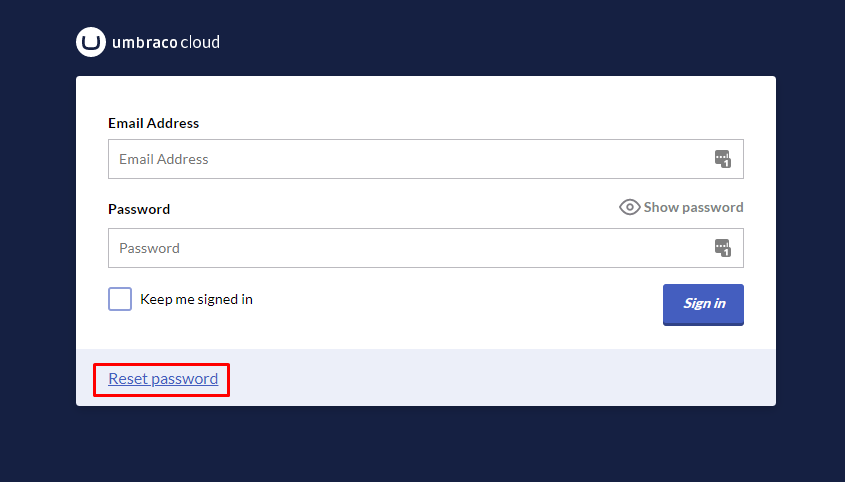

# SMTP Settings

In many cases, you might want to send emails from your Umbraco Cloud project. This could be for inviting users to the Backoffice or as part of an Umbraco Forms Workflow. To do so, you need a SMTP server and must configure it in your `appsettings.json` file.

SMTP servers are not included with Umbraco Cloud projects. You will need to set up your own SMTP server elsewhere and configure it with your Umbraco Cloud project.

## Why Configure SMTP?

Configuring an SMTP service for your Umbraco Cloud project enables email features like user invitations, password resets, and email workflows in Umbraco Forms.

### Umbraco Forms


**Legacy Umbraco**

If your Cloud project runs Umbraco version 7 or 8, configure the _SenderEmail_ in the `<notifications>` section of the `web.config` file. For more information, see the [Legacy Documentation](https://our.umbraco.com/documentation/Reference/Configuration-for-Umbraco-7-and-8/umbracoSettings/).


When working with Umbraco Forms, you can set up email workflows. This allows you to create forms that send out emails. For example, a contact form where customers can directly email you.

To set up an email workflow, you must configure the SMTP service. In some cases, you may also need to configure a _SenderEmail_ for notifications.

Configure _SenderEmail_ in the `appsettings.json` file under `Umbraco:CMS:Global:Smtp`. For more details, see the [Send Email](https://docs.umbraco.com/umbraco-forms/editor/attaching-workflows/workflow-types#send-email) section in the Workflow Types article.

```csharp
 "Umbraco": {
    "CMS": {
        "Global": {
            "Smtp": {
                "From":  "person@umbraco.dk"
            }
        }
    }
},
```

### Backoffice Users

You need to configure an SMTP service for Backoffice users in the following cases:

* **Inviting a New User** - When adding a user to your project from the Backoffice, an email invitation is sent. If you haven't set up an SMTP service, a fallback ensures the email is still delivered. However, this fallback only applies to user invitations.
* **Password Resets** - If a Backoffice user forgets their password, they must request a reset link via email. This feature requires an SMTP service to be configured, as no fallback is available.


By default, the option to request password resets for Backoffice Users is disabled on Umbraco Cloud projects. This is mainly to ensure that your Backoffice login stays in sync with your Umbraco ID.


You can reset your Umbraco ID password from the Umbraco Cloud login page. Find more details on Umbraco ID, see the [Users on Cloud](../../../begin-your-cloud-journey/project-features/users-on-cloud.md) article.



## Configure SMTP Settings

Consider the following services for configuring your SMTP settings:

* [Sparkpost](https://developers.sparkpost.com/api/smtp/) - quick to set up and developer-friendly.
* [SendGrid](https://sendgrid.com/) - quick to set up.
* [MailGun](https://www.mailgun.com/) - mainly for developers, as it is a bit more on the technical side.
* [Rapidmail](https://www.rapidmail.com/) - EU-based and GDPR compliant.


A video tutorial covering how to configure SMTP settings on an Umbraco Cloud project.


To configure SMTP:

1. Set up the SMTP server.
2. Configure the service as follows:



For Umbraco 10 and above, configure SMTP in the `Umbraco:CMS:Global:Smtp` section in your `appsettings.json` file.


```json
"Umbraco": {
    "CMS": {
        "Global": {
            "Smtp": {
                "From": "person@umbraco.dk",
                "Host": "127.0.0.0",
                "Port": 587,
                "SecureSocketOptions": "StartTls",
                "Username": "person@umbraco.dk",
                "Password":  "password123/<API Key generated in your SMTP server account>"      
            }
         }
    }
},
```


To configure the SMTP service, enter the following details:

* **From**: The default email address that will send out emails.
* **Host**: The IP address or hostname for your SMTP service.
* **Port**: The port number for your SMTP service.
* **SecureSocketOptions**: Specifies the security used for the connection.
* **Username**: Your SMTP service username.
* **Password**: Your SMTP service password.



For legacy Umbraco (version 7 and 8), configure SMTP in the `system.net/mailSettings` section of the `web.config` file.


```xml
<system.net>
    <mailSettings>
    <smtp from="noreply@example.com">
        <network host="127.0.0.1" userName="username" password="password" />
    </smtp>
    </mailSettings>
</system.net>
```


To configure the SMTP service, provide the following details:

* **Host**: The IP address or hostname for your SMTP service.
* **UserName**: Your SMTP service username.
* **Password**: Your SMTP service password.





To keep your SMTP password secure, use the [Secrets management](../../../begin-your-cloud-journey/project-features/secrets-management.md) feature. This hides the setting by using the key: `UMBRACO__CMS__GLOBAL__SMTP__PASSWORD.`


After configuring these settings, you can send emails from your Umbraco Cloud project. For more information on SMTP configuration, see the [Global Settings](https://docs.umbraco.com/umbraco-cms/reference/configuration/globalsettings#smtp-settings) article.


Test your SMTP configuration by running a [Health Check](https://docs.umbraco.com/umbraco-cms/extending/health-check) from the Umbraco Backoffice.

