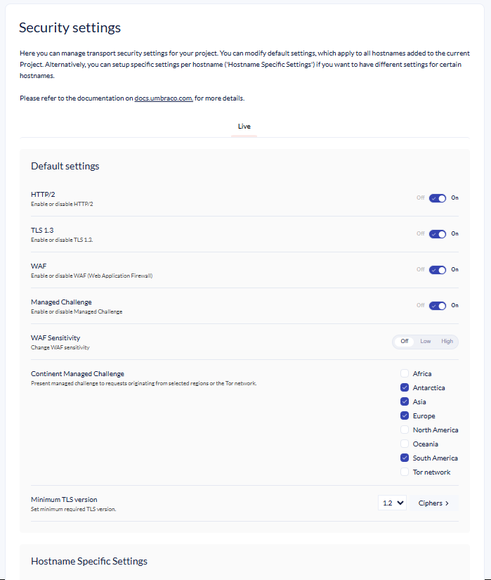
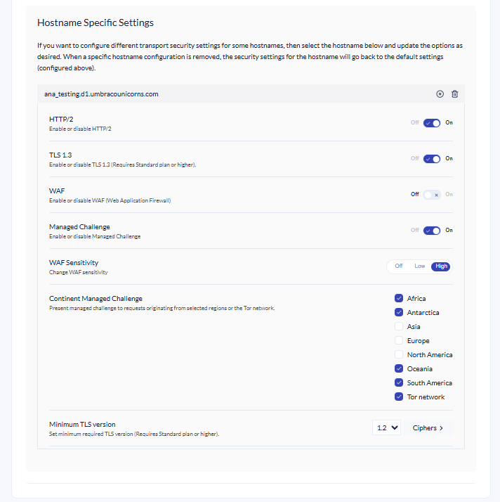

# Managing Transport Security

Once you have added your custom hostnames to your Umbraco Cloud project, it's possible to configure certain transport security options for all or specific custom hostnames within your project. These security options all relate to the traffic that goes through your hostname from the origin (Umbraco Cloud) to the end-user - meaning the protocols and encryption used to transport your website and assets from the webserver to the browser.

Currently, these options are available:

* HTTP/2 (default: on)
* TLS 1.3 (default: off)
* Minimum TLS Version (default: 1.2)
* Web Application Firewall (WAF) (default: on)
* Web Application Firewall Sensitivity (default: off)
* Managed Challenge (default: off)
* Continent Managed Challenge (default: none)

When a new custom hostname is added to a Project it will have the default settings applied. But you can change the defaults for your Project, so new custom hostnames will get the default settings you have chosen.

## HTTP/2 Explained

The first usable version of HTTP was created in 1997. Because it went through different stages of development, this first version of HTTP was called HTTP/1.1. This version is still in use on the web. In 2015, a new version of HTTP called HTTP/2 was created. HTTP/2 progressively enhances your website’s performance. When a browser supports HTTP/2, Umbraco Cloud will take full advantage of HTTP/2 performance benefits end to end. For older browsers or non-HTTPS requests, the traffic will fall back to HTTP/1.1. You don’t need to choose between better performance and backward compatibility, which is why HTTP/2 is enabled by default for all new custom hostnames added to a Umbraco Cloud project.

## TLS 1.3 Explained

Transport Layer Security (TLS) TLS 1.3 is the newest, fastest, and most secure version of the TLS protocol. SSL/TLS is the protocol that encrypts communication between users and your website. When web traffic is encrypted with TLS, users will see the green padlock in their browser window. By turning on the TLS 1.3 option, traffic to and from your website will be served over the TLS 1.3 protocol when supported by clients. TLS 1.3 protocol has improved latency over older versions, has several new features, and is currently supported in both Chrome (starting with release 66), Firefox (starting with release 60), and in development for Safari and Edge browsers.

## Minimum TLS Version Explained

The minimum TLS Version only allows HTTPS connections from visitors that support the selected TLS protocol version or newer. This option relates to the TLS versions mentioned above and the current default, which is TLS 1.2. If you want your website traffic to only use TLS 1.3 you can change the minimum version. But be mindful of the implications that this might have (see browser support above). You don't need to change the minimum version to use TLS 1.3.

## WAF Explained

A Web Application Firewall (WAF) is a security solution designed to protect web applications by filtering and monitoring HTTP traffic between them and the Internet. Common attacks like cross-site scripting, SQL injection, and file inclusion are mitigated by acting as a shield between the web application and potential threats. For more detailed information, please refer to our [WAF section](web-application-firewall.md).

## Web Application Firewall Sensitivity

The Umbraco Cloud WAF supports sensitivity configuration, extending the default [WAF](web-application-firewall.md) protection. The default [WAF](web-application-firewall.md) and WAF sensitivity configuration options don't interact and can be controlled separately. It is recommended to configure WAF sensitivity early in the project and adjust it based on the performance.

### Sensitivity levels
- **Low** severity configuration will block malicious requests with high confidence - blocks less requests.
- **High** severity configuration will block malicious requests with medium confidence, providing stricter filtering - blocks more requests. 
- **Off** configuration will not block any requests.

## Managed Challenge

A managed challenge is a lightweight JavaScript-based page that detects users without user inputs. After successfully passing a challenge, the user will receive a cookie. Users with a cookie won't be asked to pass another challenge for 30 minutes anywhere on the project/hostname.

Enabling the Managed Challenge presents an automatic captcha to all requests for the project/hostname. The managed challenge will ensure that only human users will be able to access the content on the website. Presenting an automatic managed captcha is useful in cases when a website is experiencing higher load. Higher load on the website can be caused by any reason such as, DDoS attack, aggressively scraped by bots or in high demand. Enabling a managed challenge will ensure that all of your website's resources are delivering value to the end users.

## Continent Managed Challenge

Selecting continent(s) in the list will present a managed challenge to all traffic from the continent(s).
Continent-based managed challenge presents a challenge meant to only pass through the human users requesting the website from selected continents. A continent-based managed challenge is useful when a website's primary users live in a specific continent. By presenting a challenge to selected continents you can block all malicious traffic from the continent while allowing humans to pass through.

All continents are supported as well as presenting a challenge to all requests from the [Tor](https://en.wikipedia.org/wiki/Tor_(network)) network.

## Plan specific features

Access to the different options varies depending on the Umbraco Cloud plan your project is on. Currently, the features are available as follows:

* Starter: HTTP/2
* Standard: HTTP/2, TLS 1.3, Minimum TLS Version
* Professional: HTTP/2, TLS 1.3, Minimum TLS Version

## Security subpage

Click **Security** from the **Settings** dropdown on your Umbraco Cloud Project. The Security settings are scoped per environment, so if you have multiple environments and add your custom hostnames to different environments you can select the environment at the top of the page.

Aside from the environments, the Security page is divided into 'Default Settings' and 'Hostname Specific Settings'. Use the **Default Settings** to configure what should be applied to new and existing custom hostnames by default.

<figure><figcaption>
Security Settings Umbraco Cloud
</figcaption></figure>

If you want to have different security options for different custom hostnames, then select the custom hostname under **Hostname Specific Settings** and adjust the options for that specific hostname. This might be useful if you want to test the different options on another custom hostname than your primary hostname.

<figure><figcaption>
Hostname Specific settings
</figcaption></figure>

### Cipher Suite Management

On the security page, it's possible to enable or disable the different cipher suites for your project.

Enabling or disabling the different ciphers can be done under the minimum TLS version in the Ciphers drop-down:

<figure><figcaption>
Enable or disable Cipher Suites for your project.
</figcaption></figure>

Like the other Hostname Specific Settings, you can enable/disable specific ciphers for your custom hostname based on your needs.
