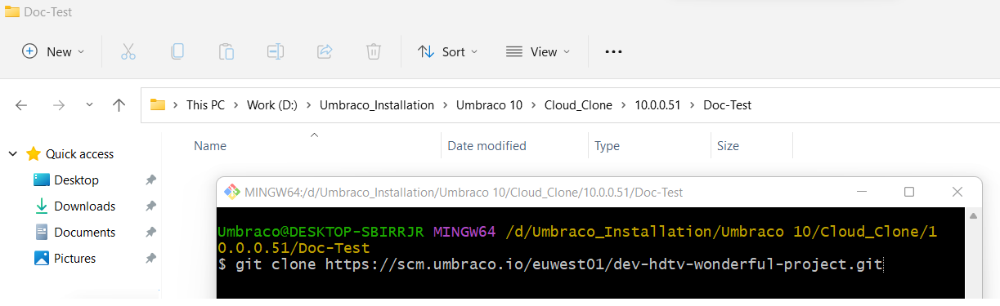
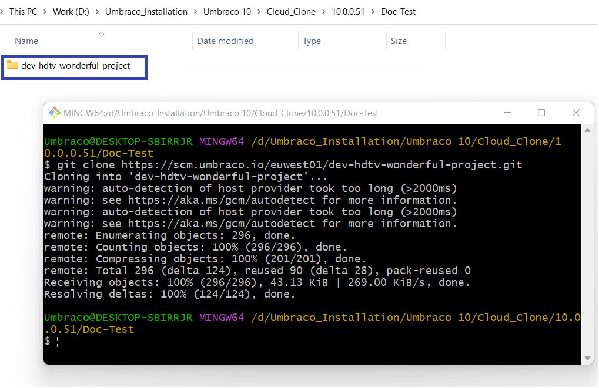
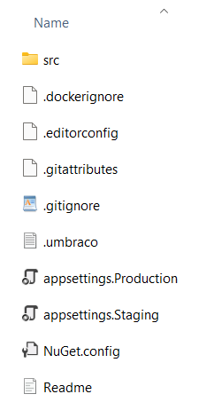

# Working with a Local Clone

## Video Tutorial


Learn how to clone your Umbraco Cloud project and work with it locally.


## Tools

We recommend using the following tools to work with a local clone of your Umbraco Cloud project:

* Git needs to be installed on your computer to clone down the project and push your changes up to Cloud.
  * We recommend using one of the following git-clients if you are new to Git:
    * [Fork](https://git-fork.com/)
    * [SourceTree](https://www.sourcetreeapp.com/)
    * [GitKraken](https://www.gitkraken.com/)
* [Microsoft Visual Studio](https://www.visualstudio.com/) or [JetBrains Rider](https://www.jetbrains.com/rider) - for running the project on your local machine.


In the root of your local project, there is a README file containing information about the project structure and the build process on Umbraco Cloud.


## Cloning an Umbraco Cloud Project

To clone an Umbraco Cloud project, follow these steps:

1. Open the project you wish to clone in the Umbraco Cloud Portal.
2. Click on the arrow next to the **Development** environment.
3. Select **Clone project**.

<div align="center"><figure><figcaption><p>Clone project option</p></figcaption></figure></div>

4. **Copy** the clone URL to copy the Development environment's git repository endpoint.

<figure><figcaption><p>Copy the clone URL</p></figcaption></figure>

5. Use your favorite Git client to clone down the project. In this guide, we will use **Git Bash**.
6. Type the following command in the **Git Bash** terminal:

```cs
git clone <Git clone URL>
```

The `<Git clone URL>` should be the URL you copied from the Cloud Development environment.

<figure><figcaption></figcaption></figure>

7. Press **Enter**.

Once the project has been cloned, you will get a folder with files for your Umbraco Cloud project. Now, you have a copy of your Umbraco Cloud Development environment that you can run locally.



## Running the site Locally

To run your Umbraco Cloud project locally, you will need to [install the latest .NET SDK](https://dotnet.microsoft.com/download) (if you do not have this already).

With dotnet installed, run the following commands in a terminal application of your choice. You can also refer to the `Readme` file in the project folder.

1. Navigate to the newly created project folder.
2. Run the following commands:

```cs
cd src/UmbracoProject
```

1. Build and run the project:

```cs
dotnet build
dotnet run
```

The terminal output will show the application starting up and will include localhost URLs which you can use to browse to your local Umbraco site.



We recommend setting up a developer certificate and running the website under HTTPS. If you haven't configured one already, run the following command:

```cs
dotnet dev-certs https --trust
```


The first time the project is run locally, you will see the **Restore from Umbraco Cloud** screen. If the environment you have cloned already contains Umbraco Deploy metadata files (such as Document Types, Templates, etc), these are automatically extracted with the option to restore content from the Cloud environment into the local installation.


Click **Restore** to restore your site's content if any. Wait until this process is completed as it also creates the local SQLite database for your site.

## Working with Visual Studio

When working locally, we recommend using Visual Studio but you can use any other development tool of your choice.

Once the project has been cloned down, you will get a folder with files for your Umbraco Cloud project.

<figure><figcaption><p>Umbraco files</p></figcaption></figure>

1. Navigate to `src/UmbracoProject`. Here, you will find the files for your Umbraco installation.

<figure><figcaption><p>Umbraco files</p></figcaption></figure>

2. Open the `UmbracoProject.csproj` file in Visual Studio.
3. Build and run your solution in Visual Studio.

You can create content, add media, and create your custom code. When you're ready to deploy your changes make sure to have a look at the [deployments](../deployment.md) documentation.


If you have more than "a few" media items, see our recommendations for working with [Media on Umbraco Cloud](../media.md).


### Adding a Solution File to your Cloud Project

Working with Visual Studio, you will likely want a solution file, so you and your team can work with an Umbraco Cloud project and have the option to add additional projects.

If you want to add a solution file for your Cloud project, you can do it either:

* [Using the Command Line](working-locally.md#using-the-command-line)
* [Using Visual Studio](working-locally.md#using-visual-studio)

#### Using the Command Line

Using the terminal of your choice, navigate to the root of the git repository of your Umbraco Cloud project and enter the following command:

```cs
dotnet new sln --name <MyAwesomeSolution>
```

#### Using Visual Studio

1. Open the `UmbracoProject.csproj` project in Visual Studio.
2. Click on the solution:


3. Save the solution file using the **Save as** option:


4. Provide a **File name** to create the solution file in the folder that you specified.


When creating a solution file, we recommend placing it at the root of the git repository.


### Adding Additional Projects to Your Solution


When creating new projects alongside the default Umbraco project, we recommend adding the projects to the `src` folder in the git repository.


If you want to add additional projects to your solution, you can do it either through the:

* [Command Line](working-locally.md#command-line)
* [Visual Studio](working-locally.md#visual-studio)

#### Command Line

Run the following commands to add additional projects to your solution:

```cs
dotnet new classlib --name MyAwesomeProject.Web --output src/MyAwesomeProject.Web
dotnet sln add .\src\MyAwesomeProject.Code\MyAwesomeProject.Code.csproj
dotnet sln add .\src\MyAwesomeProject.Web\MyAwesomeProject.Web.csproj
```

#### Visual Studio

1. Open the `UmbracoProject.csproj` project in Visual studio.
2. Click on the solution:

<div align="center"></div>

3. Right-click the solution and choose `Add` -> `New Project...`

<div align="center"></div>

1. Add a class library using the latest .NET SDK to your project:

<div align="left"></div>

Once the Class library (`.Core`) has been added, you can see the project(s) that have been added in Solution Explorer.


## Renaming the Project Files and Folders

To rename your Umbraco Cloud project files and folder, do the following:

1. Navigate to the `.umbraco` file at the root of the project and view the following:

```csharp
[project]
base = "src/UmbracoProject"
csproj = "UmbracoProject.csproj"
```

The `base` property provides the folder location which contains the application and the `csproj` property is the name of the .csproj file.

1. Rename the `UmbracoProject` directory and `.csproj` file.
2. Update the `.umbraco` file with the new name and any C# code namespaces reflecting the name of your project.
3. Additionally, if you prefer to organize your code, you can add additional Class Library projects that are referenced by the Umbraco application .csproj file.

For example: Rename `UmbracoProject.csproj` to `MyAwesomeProject.Web.csproj` and have one or more additional class library projects such as `MyAwesomeProject.Code.csproj`

```csharp
[project]
base = "src/MyAwesomeProject.Web"
csproj = "MyAwesomeProject.Web.csproj"
```


It's a good idea to update the namespace used in the `Program.cs`, `Startup.cs` and `_ViewImports.cshtml` files so the naming is consistent throughout your project structure. Once updated, you will need to clear out the `bin` and `obj` folders locally to avoid build errors. When you are done, commit the changes and push them to Cloud.


If you have already built and run the project locally using the original project file and folder, make an update in your local .git repository to reflect the change that has been made. When a Cloud project first runs, a git hook is created to trigger a schema update via Umbraco Deploy when changes are pulled from an upstream environment.

The file you'll need to update is `post-merge` within `.git/hooks/` in your cloned environment files. It can be opened with a text editor. You can either delete the file so it will be recreated with the new path or update it. The default contents are shown below and can be updated to reflect the new path to the `umbraco/Deploy` folder.

```
#!/bin/sh
echo > src/UmbracoProject/umbraco/Deploy/deploy
```

<details>

<summary>Legacy Umbraco Visual Studio Setup (Umbraco version 7 or 8)</summary>


This article is only relevant if you are working on a Umbraco Cloud project running **Umbraco 7** or **Umbraco 8** (legacy Umbraco).

if you are on a later version, follow the [working locally article.](working-locally.md)


## The Visual Studio Solution

If you're writing a lot of custom code (or like Intellisense), we recommend the following setup:

A Visual Studio solution with a

* Website Project for the Umbraco site (coming from the cloned git repository from the Umbraco Cloud Project), and
* Class Library Project for the code that will be created for the Umbraco site - this can be MVC Controllers, WebApi Controllers, Surface Controllers or data access plus whatever else you might need to write code for.

Below is a screenshot of our recommendation on how the projects should be configured. We use the following naming conventions: `*.Web` for the Umbraco website and `*.Core` for the accompanying code.


## Prerequisites

* Visual Studio 2017 v15.9.6 or later
* Git and/or Git Credential Manager for Windows


Are you used to using a Git client like GitKraken or SourceTree? You still need to make sure that you have Git CLI installed. Git CLI is used by the UaaS.cmd tool to clone down your Cloud project.


## Video tutorial

## Generate a Visual Studio Solution


**Important**: The UaaS.cmd tool is no longer supported by Umbraco HQ.


Manually creating and configuring a Visual Studio solution with the right projects can take a bit of time. We have made a little command line tool that will set the solution up for you.

Download the UaaS.cmd tool from [umbra.co/uaas-cmd](https://umbra.co/uaas-cmd) and place it in the folder you want the solution in.


**Important**: To use the UaaS.cmd tool you will need to have Visual Studio 2017 version 15.9.6 or any later version installed.



**Important**: Be aware if you run the Uaas.cmd tool as an administrator it will generate the files in your Windows/System folder.


This is a recommended setup. If you don't like the setup then you can play with it and make it your own. There's nothing magic about this setup. It is adding a few files to your Umbraco Cloud website to give you a flying start to begin working with Visual Studio.

What follows is **a recommendation and not the only way to work with Visual Studio**.

Before running the UaaS.cmd tool you will need the **git clone URL** for your Umbraco Cloud Project.

* Go to the Project in the Portal
* Copy the URL from "How to connect my machine"

<figure><figcaption><p>Clone down Umbraco Cloud project</p></figcaption></figure>

Running the UaaS.cmd tool will download the latest Visual Studio generator (waasp.exe) and prompt you to enter the clone URL for your Project. Then enter the "Namespace", which will be the name of the Visual Studio solution and thus the namespace for the solution as well.

Does an error appear where the tool says: "Unable to connect to the remote server", but you can still add the clone Url? You then need to allow the UaaS.cmd through your firewall/antivirus.

If you haven't cloned the repository before, you will be asked to enter the username and password for the Umbraco Cloud Project. This also happens if you do not have a [git credentials manager](https://github.com/Microsoft/Git-Credential-Manager-for-Windows) installed. In both cases, use the credentials you use to access the Portal and the Umbraco backoffice.


Once it's done running the tool will have created a Visual Studio solution file `*.sln` and two Projects.

* `*.Web` contains the Umbraco site that was (git) cloned from your Project
* `*.Core` is a Class Library that you can use for your custom code, as mentioned above

Both projects are configured with the NuGet packages for Umbraco using the version that corresponds to the site cloned from Umbraco Cloud.

The result should look something like this within the folder where the UaaS.cmd tool ran:


You can now open the solution in Visual Studio and hit `F5` to start the site directly from Visual Studio.

## The Git repositories

One thing to notice about this setup is that you will get two git repositories as well as two projects.

1. The site cloned from your Umbraco Cloud Project will be contained within a git repository that is connected to your Project on Umbraco Cloud. Whenever you want to deploy changes to your (remote) Umbraco Cloud site you should commit everything within the `*.Web` folder. This is where the git repository for Umbraco Cloud is also located.
2. Going up one level to where the `*.sln` file is located you will notice a `.git` folder. This is the second git repository. You should use this repository for all the code you write as well as the solution and project files for Visual Studio.

Think of everything within the `*.Web` folder as your **deployment repository**, and everything surrounding that folder as your **source code repository**. The Umbraco Cloud repository (within the `*.Web` folder) will not (and should not) be committed to the other git repository.

## What's next?

Now that you've added your own touch to your site, you're ready to deploy to your Umbraco Cloud environment. The key thing to know is that your custom code from the `*.Core` project will be built into a `.dll` file in your `*.Web` project. This `.dll` file is what you need to push up to the Cloud repository.

Once you have everything your site will need committed you can follow the [deployment workflow](../deployment.md) to complete the deployment.

## Working with Visual Studio

As mentioned in the previous section, you will start with two projects in Visual Studio. A `*.Web` project with the Umbraco site configured as a Website project, and a `*.Core` project configured as a class library.

_So what goes where?_

Anything that is used within Umbraco, like plugins and configuration, should by default be placed in the `*.Web` project. Here is a list of other elements that you want to place in the `*.Web` project:

* Website assets like CSS, JavaScript and related images
* Views, Partial Views and Partial View Macros
* Configuration (`web.config` and all the Umbraco specific or related config files in `~/Config/`)
* Usercontrol ascx-files
* Plugins (typically located in `App_Plugins`)
* Meta data (the files that Umbraco Deploy uses in the folder `~/Data/Revision/`)

Media files will also be placed under the `*.Web` folder. As Website projects show all files on disk by default you will be able to see these through Visual Studio. Media files from the `/Media/` folder should not be committed to the git repository, but more on that in the next section.

We recommend placing all your code in the `*.Core` project (instead of, for example, using App\_Code for that). This includes, but is not limited to:

* Controllers for MVC, Web Api
* Controllers for Umbraco Plugins, Surface, API
* Models and ViewModels
* Data Access (the `*.Core` project references Umbraco so you can use the Umbraco datalayer as needed)
* Extensions methods

### Using ModelsBuilder and IntelliSense

To use ModelsBuilder with IntelliSense in Visual Studio, you'll need to make some configuration changes to the web.config file of your `*.Web` project. This is to ensure that the models produced by ModelsBuilder are stored in the right place for compilation.

1. Make sure ModelsBuilder.Enable is set to true (default): `<add key="Umbraco.ModelsBuilder.Enable" value="true" />`
2. Set the Mode to `AppData` or `LiveAppData`. This will ensure you can use ModelsBuilder with Visual Studio. So in your Web.config, you should to have: `<add key="Umbraco.ModelsBuilder.ModelsMode" value="AppData" />`
3. Create a directory called "Models" in your App\_Code folder in the `*.Web` directory of your site. Then add: `<add key="Umbraco.ModelsBuilder.ModelsDirectory" value="~/App_Code/Models/" />` to Web.config.

This will make the models of your Document Types available with IntelliSense in Visual Studio. [You can read more about configuring ModelsBuilder here](https://docs.umbraco.com/umbraco-cms/reference/templating/modelsbuilder).


Are using the [Visual Studio Extension for ModelsBuilder](https://marketplace.visualstudio.com/items?itemName=ZpqrtBnk.UmbracoModelsBuilderExtension\&ssr=false) and getting the error message Unauthorized when generating models? You'll need to use or create a backoffice user in your local installation. You then need to supply the credentials for this user in the Visual Studio options. This is necessary because the extension is not able to authenticate against Umbraco Id.


### Using Umbraco namespaces in your `*.Core` project

In order to use Umbraco's features in your `*.Core` project, you have to add references to the DLLs in your `*.Web/bin`.

You can do this by right-clicking on **References** and selecting **Add Reference**. Browse and select the DLLs you'd like to use and then hit **OK**. Don't forget to build.


## Git - what should be committed

When working with this solution setup it's important to remember that you are operating with two different git repositories:

* One for your source code, and
* One within the `*.Web` folder for committing and deploying your changes to Umbraco Cloud.

The cloned git repository from Umbraco Cloud comes with its own `.gitignore` so files that should not be committed are already handled.

All files that are required to run the Umbraco site should be committed to the git repository in the `*.Web` folder. From there they can be deployed to Umbraco Cloud. This includes assemblies (`*.dll`).


To ensure that your `.dll` files are created in release mode, ensure that you switch to "Release" (instead of "Debug") mode when building the project.

It is recommend to build the project in release mode, before deploying the changes through Git.


For the `*.Core` part of the solution as well as the solution file and default `.gitignore` file you commit that to the source code repository. You should ideally set a remote for this git repository to your own git host like GitHub, BitBucket or Visual Studio Team Services.

These are the files and folders you typically want to commit in your own source code repository:

* The project and code files in `*.Core`
* The solution file `*.sln`
* `.gitignore`
* UaaSClone.cmd (used for re-establishing the `*.Web` folder with the git repository from Umbraco Cloud)

## Setup for new team members

When you are working in a team you will have additional people that will use this same setup. However, they will only clone your source code repository from your GitHub, Bitbucket, or Visual Studio Team Services account. They will, by default, not get the `*.Web` folder and the Umbraco site, because that part is not contained within the source code repository.

To help to get up and running we added a `UaaSClone.cmd`, which can be run after cloning the source code repository. Running this command line tool will clone the Umbraco Cloud repository to the right folder, and set up Visual Studio for them.

## Working with NuGet

Some Umbraco packages are available on NuGet and you can install NuGet packages into the `*.Web` project to add functionality to your site. Remember, this is a normal Visual Studio solution, so you can work with NuGet packages exactly like you're used to.

If you need to program something that depends on a NuGet package you should install that NuGet package in both projects.

* Install it in `*.Core` so you can write the code you need against the library you working with (obtained from NuGet)
* Also install it in `*.Web` so that the library files also end up in your website and your compiled code works there as well

</details>
