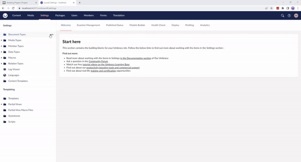

# Deploying changes with Umbraco Deploy

In this article, you can learn more about how to deploy your code changes and metadata from a local instance to your Cloud environment.

## Deploying from local to your Cloud environments

Local changes in your Umbraco Cloud project are automatically detected and synced with your Git client for seamless collaboration.

Here's a quick step-by-step on how you deploy these changes to your Cloud environment:

- You've cloned a site to your local machine to work on.
- You've made some changes to a Document Type.
- The corresponding `.uda` file for this Document Type is now updated with the changes. The file is located in the `/umbraco/Deploy/Revision` folder.
- You've also created a new Data Type that's used on the Document Type. This Data Type is also stored as a new file in the `/umbraco/Deploy/Revision` folder.
- Using Git, commit those two changed files to your local repository and push them to your Cloud repository.
- A deployment kicks in and the Document Type is updated and the new Data Type you created locally is now automatically created on the remote environment as well.



In the above example, Git Bash is used to stage, commit, and deploy changes made to a Document type. Additionally, it handles a newly added Data Type from a local environment to a Cloud Development environment.

After deploying changes locally to your Cloud environment, use the Umbraco Cloud portal's **'Deploy changes to ..'** button for subsequent deployments to other environments. For more information, see the [Deploying between Cloud environments](cloud-to-cloud.md) article.

## Deploying without using a Git client

If you don't have a Git client installed on your local machine, you can use alternatives like [Git for Windows](https://gitforwindows.org/). Navigate to the command line and use the following commands:

```cs
# Navigate to the repository folder
cd mySite
# Check the status of the repository for pending changes
git status
# Add pending changes
git add -A
# Commit staged files
git commit -m "Adding updated schema changes"
# Push to the environment
git push

# If the push is rejected you will need to pull first
git pull
# Try to push again if there were no conflicts
git push
```

If you have to pull down, it is a good idea to see if any of these commits contain changes to the schema (anything in `umbraco/Deploy/Revision/`). To validate your local site and ensure compatibility with the updated schema, navigate to `umbraco/Deploy/`. Create a deploy marker if absent and run the specified command in the command line.

```cs
/UmbracoProject/umbraco/Deploy> echo > deploy
```

The local site should be running when you do this. The deploy marker will change to `deploy-progress` while updating the site and to `deploy-complete` when done. If there are any conflicts/errors, you will see a `deploy-failed` marker instead, which contains an error message with a description of what went wrong.

Another way is to use the **Deploy** Dashboard in the **Settings** section of the Umbraco backoffice. Here, you can see the status of ongoing or completed deployment processes. The status will show whether an operation has been triggered and whether it is in progress, has been completed, or has failed.

The dashboard will show the status based on the marker files on the disk, eg. `deploy-progress`. From the **Deploy** Dashboard, it is also possible to trigger different processes. Learn more about this dashboard in the [Deployment](../deployment/README.md) article.
