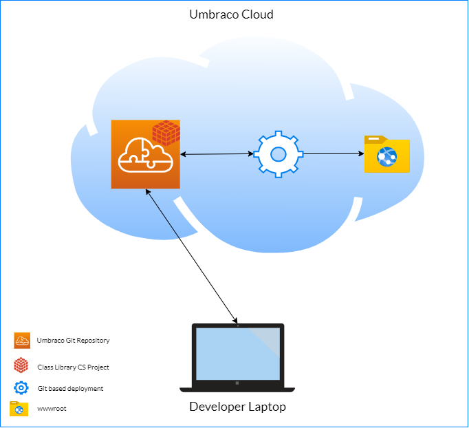

# Repositories in a Cloud Project

Each Umbraco Cloud project can have multiple environments: Mainline and Flexible Environments. Each environment has its own repository hosted on Umbraco's Cloud platform.

These repositories serve a specific purpose: **deploying code to your Cloud environments**. Understanding how they work and how to use them correctly will help you avoid common issues with deployments, performance, and repository management.

## Deployment Repositories vs. Source Code Repositories

The git repositories provided by Umbraco Cloud are **deployment repositories**. They exist to move code from one environment to another and are not designed for day-to-day development workflows.


Umbraco Cloud repositories are only deployment repositories and should not be used as source code repositories.


A deployment repository differs from a source code repository in the following ways:

* **Limited branch support** - Only the main branch (`master`) is guaranteed to be maintained. Any other branches may be removed without notice, potentially leading to data loss.
* **No pull request or review workflows** - The deployment repository does not support the collaboration features you would expect from a full source code management platform.
* **Size constraints** - Deployment repositories are optimized for lightweight, frequent deployments. Large repositories slow down cloning, deployments, and environment provisioning.

It is possible to use the Cloud repository as your source code repository. However, doing so means working within the limitations listed above. For the best experience, use a dedicated source code management platform and treat the Cloud repository as the last step in your development pipeline.

## Use Your Own Source Code Repository

Using a dedicated source code management platform as the **single source of truth** for your project is recommended. Popular options include GitHub, GitLab, Azure DevOps, and Bitbucket.

Your external repository is where you should:

* Store your complete project source code
* Manage branches, pull requests, and code reviews
* Track issues and project history
* Run CI/CD pipelines to automate deployments


Use CI/CD pipelines to deploy from your source code repository to Umbraco Cloud automatically. See the [Umbraco CI/CD Flow](../../build-and-customize-your-solution/handle-deployments-and-environments/umbraco-cicd/) documentation for setup instructions.




Your external Git repository stores the entire source code of your project. The Umbraco Cloud project must also contain all your source code, as you can no longer deploy only dll files to Umbraco Cloud.



Your external repository stores your custom models, controllers, class libraries, and C# source files. The Umbraco Cloud Git repository stores only the compiled dll files of your C# code.



## Best Practices for Managing Your Deployment Repository

Following these practices will keep your deployment repository healthy and your Cloud environments running smoothly.

### Do not store media, PDFs, or build artifacts

Media files, PDFs, images uploaded by editors, and build artifacts (such as compiled output or package archives) should not be committed to the deployment repository. These files are often large and grow over time, quickly inflating the repository size.

Instead, store media files in external storage. Umbraco Cloud supports Azure Blob Storage for this purpose.


See the [Azure Blob Storage](../../build-and-customize-your-solution/handle-deployments-and-environments/media/azure-blob-storage/) documentation for instructions on setting up external media storage.


### Keep the Git history clean and slim

Keep the repository focused on source code and configuration. Avoid committing:

* Large binary files (images, videos, archives).
* `node_modules` or other package manager directories.
* Temporary or generated files.

Every file committed to the repository stays in the Git history, even after it is deleted. This means a single large file committed by mistake will continue to bloat the repository until the history is cleaned up.

### Use a .gitignore file

Ensure your project includes a `.gitignore` file that excludes common non-essential files. A well-configured `.gitignore` prevents accidental commits of build artifacts, editor configuration files, and other files that do not belong in the deployment repository.

## Recommended Repository Size Limits

The size of your deployment repository directly affects how quickly environments can be cloned, provisioned, and deployed. Use the following guidelines to assess the health of your repository:

| <= 75 MB                                               | 75 MB - 150 MB                                                                                                                                                                       | > 150 MB                                                                                                                                                   |
| ------------------------------------------------------ | ------------------------------------------------------------------------------------------------------------------------------------------------------------------------------------ | ---------------------------------------------------------------------------------------------------------------------------------------------------------- |
| <mark style="color:green;">Healthy</mark>              | <mark style="color:$warning;">Warning</mark>                                                                                                                                         | <mark style="color:red;">Needs fixing</mark>                                                                                                               |
| Your repository is in good shape. No action is needed. | Your repository is growing large. Review what is being committed and remove any unnecessary files. Check for accidentally committed media files, build artifacts, or large binaries. | Your repository is too large and may cause deployment failures, slow environment provisioning, and degraded performance. Immediate cleanup is recommended. |

Large repositories cause problems because every deployment and environment clone requires downloading the full Git history. This affects:

* **Deployment speed** - Larger repositories take longer to push and pull.
* **Environment provisioning** - Creating new environments requires cloning the full repository.
* **Local development** - Cloning the repository becomes slow.

## How to Reduce Your Repository Size

If your repository has grown too large, follow these steps to identify and remove the files causing the bloat.

### Identify large files

Use the following Git commands to find the largest files in your repository history:

```bash
# List the 10 largest files currently tracked
git ls-tree -r -l --abbrev HEAD | sort -rnk4 | head -10

# List the largest objects in the entire Git history
git rev-list --objects --all | \
  git cat-file --batch-check='%(objecttype) %(objectname) %(objectsize) %(rest)' | \
  sed -n 's/^blob //p' | sort -rnk2 | head -10
```

### Remove large files from Git history

Once you have identified the problematic files, use a history-rewriting tool such as [Git filter-repo](https://github.com/newren/git-filter-repo) to remove them.


Rewriting Git history is a destructive operation. It changes commit hashes and requires a force push. Coordinate with your team before proceeding and ensure everyone re-clones the repository after the cleanup.


### Push the cleaned repository

After cleaning the history, push the updated repository back to Umbraco Cloud. You may need to force push if commit hashes have changed.


See the [Working with a Local Clone](../../build-and-customize-your-solution/handle-deployments-and-environments/working-locally/) documentation for instructions on cloning down a Cloud environment and pushing changes back.


## Working with a Locally Cloned Umbraco Project

It is recommended to create a Cloud project with at least two environments: a Live environment, including one extra mainline environment. Work with a local copy of the site by cloning down the left-most environment. This repository is different from your source control repository.

Once you're happy with the results or wish to see how your website has progressed, you push the changes back to the Cloud. If everything is working as expected, deploy your changes to the Live environment.



**Code Deployment Summary**



In the above diagram, the Umbraco Git repository contains the source code of a class library CS project.

Once you commit your code in the Umbraco Cloud Git repository, your C# source code is built and then deployed to the `wwwroot` folder.

**Disadvantages of using an Umbraco Cloud Project repository as a source code repository**

* We only guarantee to maintain and keep the `master` branch. If there are any other branches, they might be removed without any notification causing data loss.
* You will need to commit your frontend artifacts as the build pipeline only builds dlls from your C# code.



**Code Deployment Summary**

<figure><figcaption><p>Umbraco cloud overview Legacy versions</p></figcaption></figure>

In the above diagram, the external git repository contains the source code of a class library CS project with a class library project.

With this setup, you commit your changes twice. Once to commit your code in your source control and the other commit to the Umbraco Cloud Git repository to deploy your website. Your source code is not hosted on Umbraco Cloud but only your cloned project will be in the Umbraco Cloud Git Repository. Your code is built and compiled into the cloned project and then pushed to Umbraco Cloud. Thus updating the site with your latest code changes.

**Disadvantages of using an Umbraco Cloud Project repository as a source code repository**

* We only guarantee to maintain and keep the `master` branch. If there are any other branches, they might be removed without any notification causing data loss.
* You will always need to commit your dll files.


