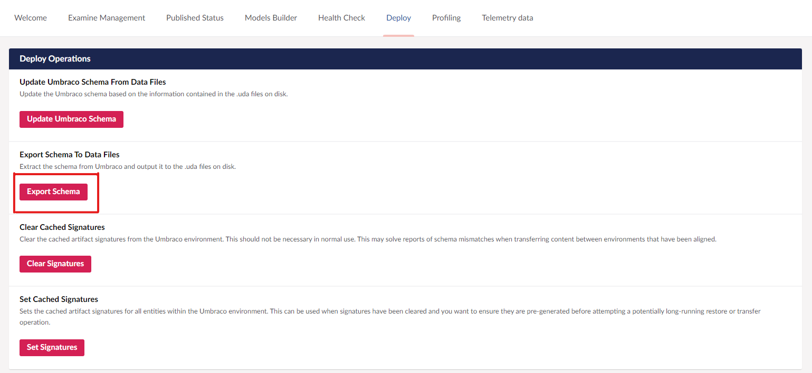
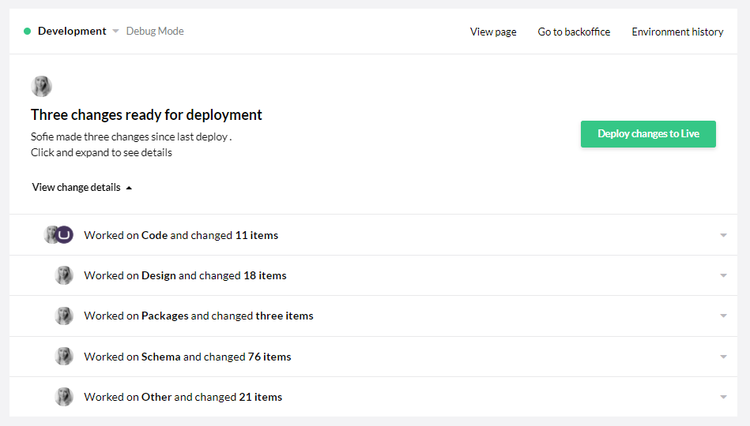

# Migrating an Existing Site

Sometimes you may already have a Umbraco site built that did not start with a clone of a Umbraco Cloud site. Or perhaps you have decided to move a site that's already live on Umbraco Cloud.

Migrating an existing site requires some specific steps and an understanding of how Umbraco Cloud deployments work can be helpful.

These are the steps you need to go through to complete the migration successfully:

1. [Requirements](./#id-1.-requirements)
2. [Tools](./#id-2.-tools)
3. [Prepare your site](./#id-3.-prepare-your-site)
4. [Prepare your Cloud project](./#id-4.-prepare-your-cloud-project)
5. [Clone down the Cloud project](./#id-5.-clone-down-the-cloud-project)
6. [Move and Merge files](./#id-6.-move-and-merge-files)
7. [Generate meta data](./#id-7.-generate-meta-data)
8. [Deploy to Umbraco Cloud](./#id-8.-deploy-to-umbraco-cloud)

## Video tutorial


Video tutorial.


If you prefer following a written guide, continue to read below.

## 1. Requirements

Before you start migrating your Umbraco site to Umbraco Cloud there are a few things you need to consider. To migrate your site smoothly, we have made a list of requirements your project(s) needs to meet.

Your Umbraco site has to fulfill these requirements:

* No obsolete/old packages
  * Not all packages will work on Umbraco Cloud
  * Read more about this in the section below
* Isn’t a site that has been upgraded from versions below Umbraco 7
  * Legacy code from older versions can potentially cause issues

If you have a site that does not meet the above requirements, feel free to contact us and we will help you find the best solution for your site.

## 2. Tools

There are a few tools we recommend using to make the migration process as smooth as possible. We've made a checklist for you here:

* Git needs to be installed on your computer
  * Optional: Git client, like [Fork](https://git-fork.com/), [SourceTree](https://www.sourcetreeapp.com/), or [GitKraken](https://www.gitkraken.com/)
* Visual Studio OR Visual Studio Code + IIS Express
* Merging tool - like [WinMerge](http://winmerge.org/) or [DiffMerge](https://sourcegear.com/diffmerge/)

Aside from these tools, you'll also need:

* A local copy of your existing site
* A new and clean Umbraco Cloud project
  * We strongly recommend having a project with **at least 2 environments**

## 3. Prepare your site

After making sure that your existing site meets all the requirements for being migrated to Umbraco Cloud, you are now ready to get started.

### Upgrade to the latest Umbraco version

The first order of business is to **upgrade your own Umbraco site to the latest minor version of Umbraco**. Why? Because Umbraco Cloud always runs the latest version and you need to make sure your project runs the same Umbraco version as Umbraco Cloud.

You can download the latest version of Umbraco from [Our](https://our.umbraco.com/download/).

If you need help upgrading your project, we have some [Upgrade instructions](https://docs.umbraco.com/umbraco-cms/fundamentals/setup/upgrading) you can follow. Be thorough when upgrading, as the latest upgrade might contain breaking changes and/or updated configuration.

If you have been using Umbraco Forms on your project, you will also need to upgrade this to the latest version. You can find and download the latest version of Umbraco Forms under [Projects on Our](https://our.umbraco.com/projects/developer-tools/umbraco-forms/). As with Umbraco CMS, we also have documentation on how to [Upgrade Umbraco Forms](https://docs.umbraco.com/umbraco-forms/installation/manualupgrade).

After upgrading your project make sure it runs without any errors. _Hint: Check the umbracoTraceLog.txt log file._

### Cleaning your project

Before moving on to the next step, you need to clean up the local clone of your existing site a bit.

While the site is running you need to:

* Go to the backoffice of your project
* Empty the recycle bins from both the Content and Media sections

Now, shut down the project, and delete the following files and folders from `/Umbraco/`

* `/Data/TEMP`
* `/Logs`

That was it! Now you are ready to start the actual migration process, or in other words: **now the real fun begins!**

## 4. Prepare your Cloud project

In this next part, you are going to set up your Umbraco Cloud project and clone it down to your local machine.

### Setup your Umbraco Cloud project

Before the migration process can start, you will need to have a Umbraco Cloud project you can migrate your project into.

<figure><figcaption><p>How to start a Umbraco Cloud trial</p></figcaption></figure>

1. The best way to get started with Umbraco Cloud is to [create a trial project](https://umbraco.com/)
2. You need to have an empty Cloud project for the migration to be successful
3. We recommend that you set up your project with at least two environments.


Have you been working with members and made changes to the default Member Type on your existing site?

Follow these steps on the Umbraco Cloud environment:

1. Head to the backoffice of the Development environment
2. Navigate to the _Settings_ section
3. Open the _Member types_ folder
4. Delete **Member**
5. Repeat these steps on all the Cloud environments


## 5. Clone down the Cloud project


Cloning down


With your Umbraco Cloud project ready for migration, it is time to clone down the project to your local machine.

Run the site locally and verify your project and the cloned Umbraco Cloud project are using the same Umbraco version. After you've verified this, shut down the site, and it's now time to start merging the two projects.

## 6. Move and merge files

Merging your existing site into the Umbraco Cloud project is a matter of moving and merging files between the two projects. When following the steps outlined below you mustn't overwrite any settings and configurations related to Umbraco Deploy.



1. Copy and replace the following folders from your project in to the Umbraco Cloud project
   * `/wwwroot`
   * `/Views`
   * `/Umbraco`
   * If your existing site uses Umbraco Forms, make sure you **do not overwrite** the `\umbraco\Licenses\umbracoForms.lic` file
   * When copying your `\umbraco\` folder, make sure you **do not delete** the `\umbraco\Licenses\umbracoDeploy.lic` file
   * If you have any custom code in your project, you should copy that code over too.
2. Merge `appsettings.json` files from your existing site with the cloud site.
   * Make sure that you merge your `appsettings.json` files with the ones from your existing site so that the settings you used are moved over to your Cloud project
3. Merge your Program.cs and Startup.cs with the one from your existing site
4. Merge your `ProjectName.csproj` with the `UmbracoProject.csproj` - especially if you have any packages installed on your project.
5. If you are using SQLite
   * Make sure the `Umbraco.sqlite.db`, `Umbraco.sqlite.db-shm` and `Umbraco.sqlite.db-wal` files from your project replaces the ones provided with your Umbraco Cloud project
   * You can find them in `/umbraco/Data/Umbraco.sqlite.db`
6. If you are using a local SQL server make sure to update the connection string in the `appsettings.JSON` for the Umbraco Cloud project.

That's it! Now that you've merged your existing site with the local clone of the Cloud project, make sure the project runs and verify that

* You can log in using your Umbraco ID user
* All the content is there
* All Document Types, Templates, Stylesheets, etc, are in the backoffice


Umbraco Identity (Umbraco ID) is the Single Sign-On (SSO) feature across all Umbraco Cloud services.

It is required to access any project pages as well as the backoffice.


With that confirmed, it's time to prepare to migrate the project to Umbraco Cloud.



If you are on Umbraco 8, follow the steps below to move and merge your Umbraco Files.

1.  Copy and replace all folders from your own project to the Umbraco Cloud project Do not copy and replace the following folders:

    ```
    /Config
    /App_Data
    ```

    If your existing site uses Umbraco Forms, make sure you do not overwrite the `App_Plugins/UmbracoLicenses/umbracoForms.lic` file
2. Merge the config files. Pay special attention to the following files:
   * `/web.config` - in the web.config file for the Umbraco Cloud project you will see some new configuration related to Umbraco Deploy, Umbraco Identity, Licenses and Forms. Make sure you **do not overwrite** these when you merge the files
   * `/Config/UmbracoDeploy.config` - only relevant if you are migrating a Cloud project
3. Copy the rest of the files in the `/Config` folder from your own project to the Cloud project
4. If you are using SQL CE
   * Make sure the SQL CE database from your own project replaces the one provided with your Umbraco Cloud project (`.mdf` or `.sdf`)
   * You can find it in `App_Data/umbraco.sdf`
5. If you are using a local SQL server make sure to update the connection string in the `web.config` for the Umbraco Cloud project.
6. Copy the rest of the files/folders in the `/App_Data` folder from your own project to the Cloud project

That's it! Now that you've merged your existing site with the local clone of the Cloud project, you need to make sure the project runs and verify that

* You can login using your Umbraco ID user
* All the content is there
* All Document Types, Templates, Stylesheets etc, is in the backoffice



## 7. Generate meta data

You have now moved and merged the files from your existing site into the Umbraco Cloud project files. So far, so good!

In this next part, it is time to generate the so-called UDA-files for all your project's meta data.

For more details about UDA files, read the [UDA Files](../../set-up/power-tools/generating-uda-files.md#what-are-uda-files) article.

* Make sure the folder `/Umbraco/Deploy/Revision` on your Umbraco Cloud project is empty
  * If you have any files in the folder, you can safely remove those at this point
* Start your local cloud project
* Go to the settings section in your project
* Go to the Deploy tab
* Under **Deploy Operations** > **Export Schema To Data Files** click `Export Schema`.
  * Generating the UDA files may take a while, depending on the extent of your project
  * You will see a `Last deployment operation completed` status once the export is done
  * Run `Update Umbraco Schema` to check that the UDA files have been generated correctly
  * When you see a `Last deployment operation completed` status at the top of this page, it means everything is working as expected
* You should now see that your `/Umbraco/Deploy/revision` folder has been populated with UDA files corresponding to your project's metadata



Now the migrated project is ready to be deployed to the Umbraco Cloud environment.

## 8. Deploy to Umbraco Cloud

All project files have been merged and we've generated UDA files for all the meta data. In this section, we are going to deploy the migrated project to the Umbraco Cloud Development environment.

### Deploying the metadata

1. In your Git client you should see a lot of changes ready to be committed
2. Stage and commit the changes
3. Do a _pull_ to ensure everything is in sync
4. **Push** your migrated project to the Umbraco Cloud environment - check that the _'Deploy Complete'_ message is displayed
   * If you have a very large commit to push, you may need to configure your Git client for this
   * Use: git config http.postBuffer 524288000

When the push is complete go check out the Umbraco Cloud Portal to verify the indicator on the Development environment is still _green_.

Go to the backoffice of your Development environment and make sure all your metadata is there. You won't see any content or media on the environment yet - this you will move in the next few steps.



### Transfer your content and media

1. With all your metadata in place, it's time to transfer your content, media, members and member groups as well
   * To transfer members make sure that [`AllowMembersDeploymentOperations` and `TransferMemberGroupsAsContent`](https://docs.umbraco.com/umbraco-deploy/deploy-settings#allowmembersdeploymentoperations-and-transfermembergroupsascontent)are configured in the `appSettings.json file`.
2. Go to the backoffice of your local clone of the Umbraco Cloud project
3. Right-click the top of the Content tree and choose _'Queue for transfer'_
   * **NOTE**: If you have a large amount of content and media you may have the best result in deploying content and media independently
   * **Media**: If you have more than "a few" media items see our recommendations for working with [media in Umbraco Cloud](../../set-up/media/).


```
Records from the Redirect URL Management are not transferred by deploy.
You will need to manually migrate them using SQL.
```



**Voila!** You've now migrated your site to Umbraco Cloud.

The final step is to deploy the migration to the next environment - Staging or Live.

You do this from the Umbraco Cloud Portal, using the green button on your Development environment _'Deploy changes to Staging/Live'_. Transfer content and media from the backoffice following the steps outlined above.
