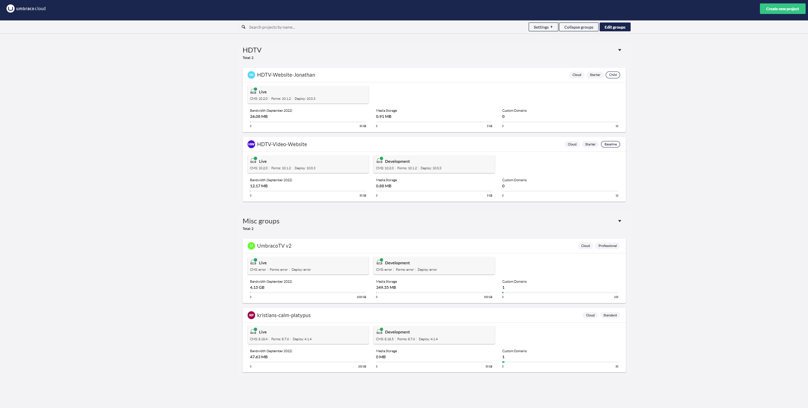
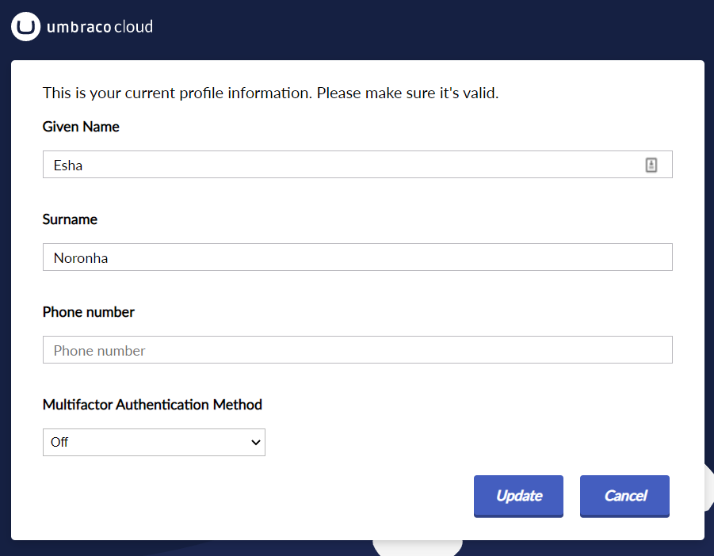

# The Cloud Portal

The Umbraco Cloud Portal helps you manage your Umbraco Cloud project. From here, you can view and manage all your Cloud projects in one place.

## Umbraco Cloud Portal Overview

When you log in to the [Umbraco Cloud Portal](https://www.s1.umbraco.io/home/login/), the projects dashboard gives an overview of all your Umbraco Cloud projects. Here, you can view all the projects you've created or have been added to as a team member.



You can see the project's environments, usage for each project and which plans it is on. You can also see whether it is a baseline or baseline-child project.

In the top-right corner of the Umbraco Cloud Portal, you will find:

* **Create New Project** - Allows you to create more projects using the plan you wish and a project will be ready for you within a few minutes.
* **Notifications** - You can also see notifications for your different projects. For example: if your project has been automatically updated or if an upgrade has failed.
* **Profile** - Manage projects, subscriptions, pending invites, organization information, profile details, view release notes, and log out of the portal.

## Project Groups

### Settings

In the right-side corner of the Umbraco Cloud Portal, you can enable **Show environments** and **Show usage** of the project from the **Settings** option.


### Collapse Groups

Collapse Groups allows you to collapse the groups on the project Dashboard. You can also expand the groups depending on the view you prefer.

### Edit Groups

To get a better overview of your projects, it is possible to sort your projects into **Groups**. This can be done by clicking the **Edit Groups** button on the top right side of the Umbraco Cloud Portal.


After clicking on **Edit Groups**, you can create new Groups to sort your project in and create a better overview for yourself.


Click **Add Group** to give the group a name and then drag and drop your projects into the group of your choice.

## Chat Feature

In the bottom-right corner of the Umbraco Cloud Portal, you'll find a chat bubble. This is where you can reach out to the Umbraco HQ Support Warriors, should you have any questions regarding your Umbraco Cloud projects.

<figure><figcaption><p>Chat Feature</p></figcaption></figure>

With the Starter and Standard plan, you are only entitled to support regarding specific issues regarding the Cloud platform. If you are on a Professional plan, you are entitled to support through the chat regarding implementation and issues with the CMS. For more information on plans and pricing, see [Umbraco Cloud plans](https://umbraco.com/pricing/).

## Profile Options

When you click on the User Profile link, you will find the following options:

* Projects
* Manage Subscriptions
* Pending Invites
* Organizations
* Profile
* Release Notes
* Logout

### Project Management

Managing your projects has been made even simpler with Umbraco Cloud. If you go to a particular project, you can get a quick overview of the environments in your project.


* Project Name along with the options to **Manage environments**, **Invite User**, or **Settings** section.
* Environment name along with the option to **Restart environment**, view **Error Logs** and **Logs**, **Clone project**, and access **Power Tools (Kudu)**.
* Links to **View errors**, **View page** (frontend), **Go to backoffice**, and the **Environment history**.
* Option to view change details.

While managing the environments on your project, click on **Manage environments** to add and/or remove environments as needed. Read more about how the number of environments varies depending on the plan you are on, in the [Project overview](../project-overview.md) article.

Aside from these features, it's also from the project view that changes are deployed from one Cloud environment to another. Find out more in the [Cloud-to-Cloud](../../deployment/cloud-to-cloud.md) article.

In the [Settings](../../set-up/project-settings/) section, you will find a lot more options to configure your project.

### Manage Subscriptions

For customers who have joined Umbraco Cloud before the 5th of May, 2021, can manage their subscriptions from Umbraco Shop. Umbraco Shop can be accessed through [Umbraco.com](https://umbraco.com). You can also click on the **Manage Subscriptions** link from the **Profile** dropdown on the Umbraco Cloud Portal. Find out more in the [Manage Subscriptions](../../set-up/manage-subscriptions/) article.

Customers who have joined Umbraco Cloud after the 5th of May, 2021, can manage their subscriptions directly through Umbraco Cloud. Find out more in the [Payments on Umbraco Cloud](../../set-up/manage-subscriptions/new-shop/) article.

### Pending Invites

On Umbraco Cloud, you can receive an invitation from different projects. These project details are available in the **Pending Invites** tab. On the **Pending Invites** page, as a user, you will see the following details:

* Project Name
* Invited by
* The expiration date of the invite
* Invitation status
* Options to approve, reject, or delete the invitations that have expired.


### Organizations

On Umbraco Cloud, it is possible to get an organization to manage your company's projects. The **Organization Projects** page displays an overview of all the projects created by you and members of your company. Find out more in the [Organization](organizations.md) article.

### Profile

The Profile consists of the following information:



* Name: The name that is displayed on Umbraco Cloud.
*   Email: This email address is used for logging in to Umbraco Cloud and will receive email notifications from the Umbraco Cloud Portal.

    
    It is not possible to change this email address at a later point.
    

\* Telephone: The contact number of the user. \* Edit profile: Allows you to update and ensure that your information is valid and up to date for your Umbraco Cloud profile. \* Change Password: Change the password for your Umbraco Cloud account from here.


## Release Notes

On the Umbraco Cloud portal, you can now find the link to the **Release Notes** in the **Profile** dropdown. Release notes are published every month and list the most relevant fixes and features added to the portal.

## Environment error log

Each environment has an error log that appears only if you have any unread errors in that specific environment. You can view the errors by clicking on **View errors** in the environment menu.

Once you're there, you can manually mark each error as read which will move it from the "New" section to the "Read" section. Errors marked as read will be permanently deleted after 30 days.

During development, you can happen to gather a large number of errors which might cause the error page to load slowly. A fix for that would be to locally connect to the database for that specific environment and delete the errors. You can read more about connecting to the environment database locally in the section about [Database on Umbraco Cloud](../../databases/cloud-database/).

Environment errors are stored in the `UCErrorLog` table.

The query below will delete 90% of the errors. The query will always delete the oldest errors first. You can tweak the query to delete any percentage of errors by changing the number in the first row.

```sql
DELETE TOP(90) PERCENT
  FROM [dbo].[UCErrorLog]
  WHERE [Read] = 0
```
