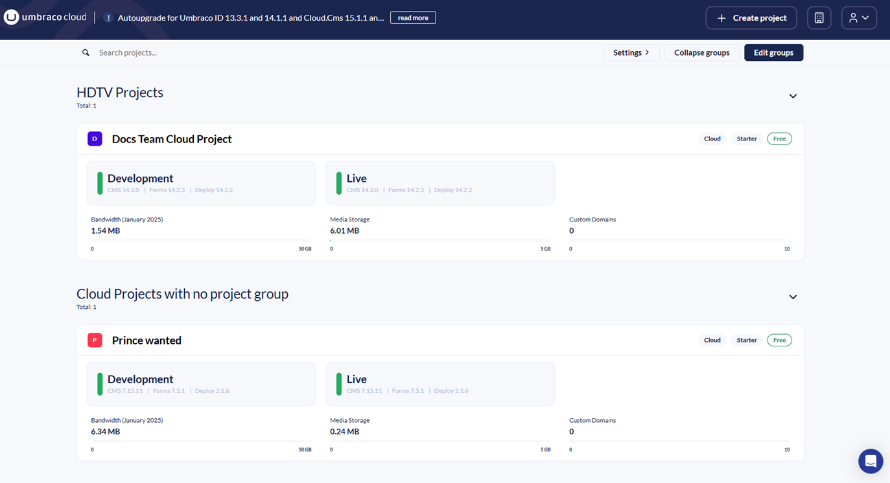
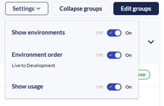
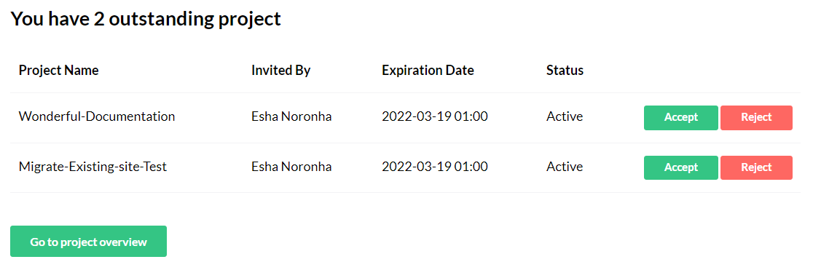

# The Cloud Portal

The Umbraco Cloud Portal helps you manage your Umbraco Cloud project. From here, you can view and manage all your Cloud projects in one place.

## Umbraco Cloud Portal Overview

When you log in to the [Umbraco Cloud Portal](https://www.s1.umbraco.io/home/login/), the projects dashboard gives an overview of all your Umbraco Cloud projects. Here, you can view all the projects you've created or have been added to as a team member.

You can see the project's environments, usage for each project, and which plans it is on. You can also see whether it is a baseline or baseline-child project.

In the top-right corner of the Umbraco Cloud Portal, you will find:

* **Create New Project** - Allows you to create more projects using the plan you wish and a project will be ready for you within a few minutes.
* **Notifications** - You can also see notifications for your different projects. For example: if your project has been automatically updated or if an upgrade has failed.
* **Profile** - Manage projects, subscriptions, pending invites, organization information, profile details, view release notes, and log out of the portal.

## Project Groups

### Settings

In the right-side corner of the Umbraco Cloud Portal, you can enable **Show environments** and **Show usage** of the project from the **Settings** option.

### Collapse Groups

Collapse Groups allows you to collapse the groups on the project dashboard. You can also expand the groups depending on the view you prefer.

### Edit Groups

To get a better overview of your projects, it is possible to sort your projects into **Groups**. This can be done by clicking the **Edit Groups** button on the top right side of the Umbraco Cloud Portal.

<figure><figcaption>
Edit Groups
</figcaption></figure>

After clicking on **Edit Groups**, you can create new groups to categorize your projects and create a better overview for yourself.

<figure><figcaption>
Create Group
</figcaption></figure>

Click **Add Group**, give the group a name, and then drag and drop your projects into the group of your choice.

## Chat Feature

In the bottom-right corner of the Umbraco Cloud Portal, you'll find a chat bubble. This feature allows you to contact the Umbraco HQ Support team for assistance with your Umbraco Cloud projects.

Support availability depends on your plan:

* Starter and Standard plans: Support is available for Cloud platform-specific issues.
* Professional plan: Includes support for implementation and CMS-related issues through chat.

For more details on plans and pricing, see [Umbraco Cloud plans](https://umbraco.com/pricing/).

## Profile Options

When you click on the User Profile link, you will find the following options:

* [Projects](./#projects)
* [Pending Invites](./#pending-invites)
* [Profile](./#profile)
* [Release Notes](./#release-notes)
* [Logout](./#logout)

### Projects

Managing your projects has been simplified with Umbraco Cloud. By navigating to a specific project, you can quickly view the environments within your project.

<figure><figcaption>
Project Overview
</figcaption></figure>

* **Project Name:** includes options to **Create environments** or **Invite User**.
* **Environment Name:** offers options to **Restart** the environment, view **History**, **Logs**, **Error Logs**, **Clone project**, **Delete** project.
* **Links:** Provides access to **View Website** (frontend), **Backoffice**, **Power Tools (Kudu)**, and **Clone project**.
* **Change Details:** Allows you to view change details.

To manage the environments in your project, click **Create Environments** to add or remove environments as needed. For more information on how the number of environments varies by plan, refer to the [Project Overview](../project-overview.md) article.

Additionally, changes are deployed from one Cloud environment to another from the project view. Find out more in the [Cloud-to-Cloud](../../deployment/cloud-to-cloud.md) article.

In the [Settings](../../set-up/project-settings/) section, you will find more options to configure your project.

### Pending Invites

On Umbraco Cloud, you may receive invitations to join different projects. These project details are available under the **Pending Invites** tab. On the **Pending Invites** page, as a user, you will see the following details:

* Project Name
* Invited By
* Expiration Date of the invite
* Status
* Options to approve, reject, or delete the invitations that have expired.

### Profile

The Profile section includes the following information:

* Name: The name displayed on Umbraco Cloud.
*   Email: The email address used for logging in to Umbraco Cloud and receiving email notifications from the Umbraco Cloud Portal.

    
    It is not possible to change this email address at a later time.
    
* Telephone: The contact number of the user.
* Edit profile: Allows you to update and ensure your information is valid and up to date for your Umbraco Cloud profile.
* Change Password: Provides the option to change the password for your Umbraco Cloud account.

### Release Notes

In the Umbraco Cloud portal, you can find a link to the **Release Notes** in the **Profile** dropdown. Release notes are published monthly and list the most relevant fixes and features added to the portal.

### Logout

The Logout option allows you to securely log out of your Umbraco Cloud account.
