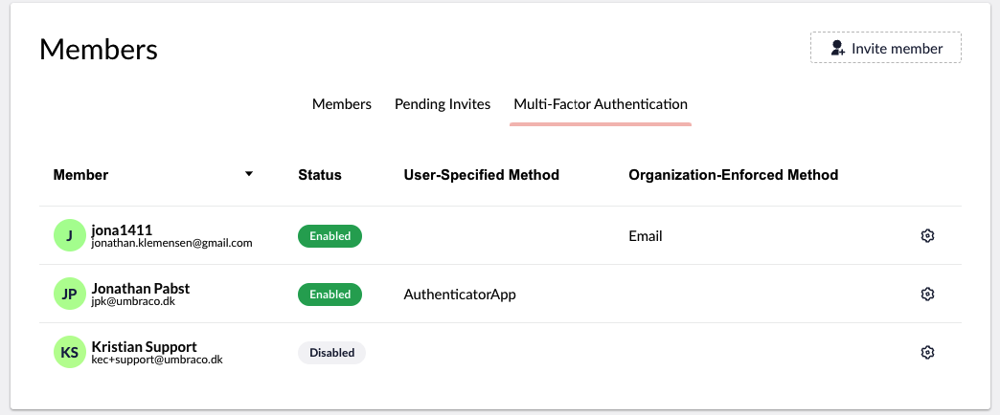

# Organizations

On Umbraco Cloud it is possible to get an Organization for all your projects. This is handy if you are a partner or are managing a lot of projects for different customers.

With an organization you get an overview of all projects and members part of the organization and you manage project payments and other options.

In the following sections, we will go through the different options that are available in an Organization:

If you are interested in getting an Organization, please reach out to our Support Team through the Chat box in your project overview.

### Information

In the **Information** section of the Organization, you can find information about your Organization. If there are any changes to your Information, you can change them from this section.

### Members

In the **Members** section, you can get an overview, view pending invites, and the Multi-Factor Authentication (MFA) for the Members of your Organization. It is also possible to set up different permissions for your Members, such as Read, Write, and Administrators for your organization.

<figure><figcaption></figcaption></figure>

Members added to your ogranization can see different information about the organization based on the user group they are added to. Currently there are three different groups, **Read**, **Write** and **Admin**.
Below you can see what each user group has access to under the organization they are a part of.

Organization Members with **Admin Access** can do the following in the organization:

* Update the organization information
* Invite to the organization
* Invite Users to project under the organization
* Edit organization team
* See pending invitations
* See organization information
* See organization projects
* See payment history
* See subscriptions
* See organization Members
* See payment history
* Handle Multi Factor Autentication (MFA) for users
* Handle payment methods
* Change permissions for Members
* Remove role from users

Organization members with **Write Access** can do the following in the organization:

* See Organization information
* See Organization Members
* Invite to the organization
* See pending invitations

Organization Members with **Read Access**, can do the following in the organization:

* See Organization information
* See Organization Members


Being a Member of an organization, does not give access to any projects under it. To get access to a project under an organization, you need to be [invited](/umbraco-cloud/set-up/users-on-cloud.md) to the project. This can be done by either someone that is part of the project or an administrator in your organization.


### Multi Factor Authentication (MFA) enforcement

When working in organizations on Umbraco Cloud, as a company, you might want to enforce a certain type of MFA for members.

Administrators of Organizations on Umbraco Cloud can enforce MFA for specific members of their organization.

To enforce a certain MFA for a member, follow these steps:

1. Go to the **Organizations** tab under your user on Umbraco Cloud.
2. Go to the **Members** tab under Organization.
3. Go to **Multi-Factor Authentication**.
4. Find the member that needs to have MFA enabled.
5. Click on the cogwheel and select the **Enforced MFA Method** from the drop-down list for the member.

Once it has been enabled, the next time the member logs in, they will be enforced to set up the MFA that has been chosen.
It is possible for an administrator to reset the authenticator app settings for members of the organization.

### Projects

In the **Projects** section, you can get an overview of all the Projects that have been created in your Organization.

Additionally, you can view if any Projects have been disabled under your Organization.

## Access Rights

In the **Access Rights** section, you can get a list of all the Access Rights your Members have to each Project in your Organization.

## Payment methods

In the **Payment methods** section, you can view the payment methods for your organization. From here, you can add or delete credit card details for your Organization. For more details on how to manage payments, visit the 

## Payment History

In the **Payment History** section, you can see the payment history for your organization.

## Subscriptions

In the **Subscriptions** section, you can see the current active subscriptions that are running under the Umbraco Cloud organization.
