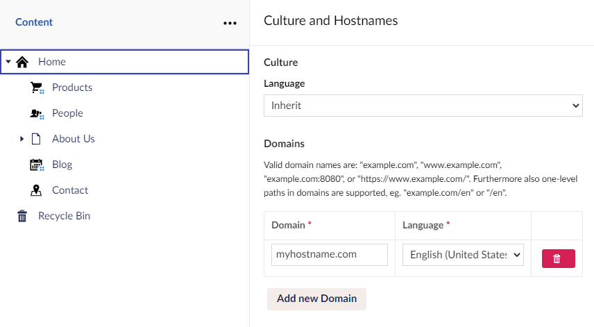

# Managing Hostnames

When you create an Umbraco Cloud project, the project URLs are based on the name of your project.

Let's say you have a project named `Snoopy`. The default hostnames will be:

* **Umbraco Cloud Portal** - `www.s1.umbraco.io/project/snoopy`
* **Live site** - `snoopy.euwest01.umbraco.io`
* **Development environment** - `dev-snoopy.euwest01.umbraco.io`
* **Staging environment** - `stage-snoopy.euwest01.umbraco.io`

The hostnames contain the region on which your project is hosted. The options available when choosing a region for your Umbraco project are:

* West Europe (euwest01)
* East US (useast01)
* South UK (uksouth01)
* Australian East (aueast01)
* Canada Central (cacent01)

To access the backoffice, add `/umbraco` at the end of the Live, Development, or Staging URL.

## Limitations

When working with hostnames on Umbraco Cloud, there are some limitations to be aware of:

* **Umbraco ID Login** - You can only enable a maximum of 100 hostnames for Umbraco ID login.

## Domains

To add and manage your hostnames on Umbraco Cloud, follow the steps below:

1. Go to your project on Umbraco Cloud.
2. Go to **Configuration** in the side menu.
3. Click on **Hostnames** in the menu.
4. Click **Add new hostname** to add a new hostname.

<figure><figcaption><p>Manage hostnames</p></figcaption></figure>

Ensure that the hostname you are binding to your Umbraco Cloud environment has a DNS entry that resolves to the Umbraco Cloud service. The DNS settings can either use a **CNAME** or an **A & AAAA** record:

* **CNAME**: Usually used for domains with "`www`" in the URL.

This is recommended to use, if possible, as the record is not changed as often as A & AAAA IPs are. When setting up a CNAME it needs to point to `dns.umbraco.io`.

* **A & AAAA** **records**: Are usually used for the Apex domain (without "`www`" in the URL).

It needs to be created at the root of your domain.

* **A-records** to either or both IPv4 addresses:
  * `162.159.140.127`
  * `172.66.0.125`
* **AAAA records** to either or both IPv6 addresses (to support IPv6 connectivity):
  * `2606:4700:7::7d`
  * `2a06:98c1:58::7d`

If you're using the [Former A and AAAA records](./#former-a-and-aaaa-records) consider changing them to the new A & AAAA records above.

<details>

<summary>Former A and AAAA records</summary>

The following Records are now obsolete and remain here for documentation purposes. 

* A Records
  * `104.19.191.28`
  * `104.19.208.28`
  * `104.17.17.9`
  * `104.17.18.9`
* AAAA Records
  * `2606:4700::6813:bf1c`
  * `2606:4700::6813:d01c`
  * `2606:4700::6811:1209`
  * `2606:4700::6811:1109`

</details>



Once you have updated your DNS records, remove the hostname and re-add it from Umbraco Cloud to re-validate the certificate with Cloudflare.

You can also check the DNS propagation using a site like [What is my DNS?](https://www.whatsmydns.net/).



Check with your DNS host or hostname registrar regarding configuration details for your Hostnames.


Adding hostname and configuring Content Delivery Network (CDN) and Cache


To specify the hostname for each root node using a multisite setup, follow these steps:

1. Go to the **Backoffice** of the project.
2. Right-click the root content node.
3. Select **Culture and Hostnames**.
4. Click **Add New Domain** in the **Culture and Hostnames** window.
5. Enter your **Domain** name and select the **Language** from the drop-down list.

<figure><figcaption><p>Enter domain and select Language.</p></figcaption></figure>

6. Click **Save**.

Once you've assigned a Hostname to your Umbraco Cloud environment, you may want to hide the default `umbraco.io` URL (e.g. _snoopy.euwest01.umbraco.io_). To do so, see the [Rewrites on Cloud](rewrites-on-cloud.md#hiding-the-default-umbracoio-url) article.

### Using special characters

Umbraco Cloud supports Internationalized Domain Names (IDN) allowing you to configure domain names including special characters.

When using an IDN direct access to the Umbraco backoffice from that domain is unavailable. If you have configured `måneskin.dk` as a domain, you cannot access the backoffice using `måneskin.dk/umbraco`. The backoffice will still be accessible using the default Cloud URL (`maaneskin.euwest01.umbraco.io/umbraco`), or from other domain names that do not include special characters.

### Automatic Transport Layer Security (TLS)

All hostnames added to an Umbraco Cloud project's environment will get a TLS (HTTPS) certificate added, by default. The certificate is issued by Cloudflare and valid for 90 days after which it will be automatically renewed. Everything around certificates and renewals is handled for you and you only need to ensure the DNS records are configured according to our recommendations above.


You will need to **remove the old DNS entry** before the Cloudflare service generates a new certificate for your Hostname.


### Is your hostname managed/proxied in your own Cloudflare account?

Cloudflare is a popular DNS provider, which offers a variety of different services to improve performance and security. We also use it for DNS and Hostnames on Umbraco Cloud.

When adding a hostname to your project hosted on Umbraco Cloud, using your own Cloudflare account the process is slightly different.

1. Set Proxy Status to **DNS Only** when creating a _CNAME_ or _A-record_ for your hostname in Cloudflare.
2. Change Proxy Status to **Proxied** once your hostname is **Protected** on the Hostname page for your Cloud project.

To minimize downtime, you can also use the [hostname pre-validation method](hostname-pre-validation.md).

### Using Certification Authority Authorization (CAA) for your domain?

CAA is a [DNS resource record](https://tools.ietf.org/html/rfc6844) defined in Resource Record (RFC) 6844. It allows domain owners to specify which Certification Authorities (CAs) can issue certificates for their domains. If you use CAA records on your domain, you will either need to remove CAA entirely or add the following through your DNS provider:

```sql
example.com. IN CAA 0 issue "pki.goog"
```

This is necessary because Google Trust Services is the Certificate Authority for the certificates issued on Umbraco Cloud.

CAA records can be set on the subdomain, but it's not something that is commonly used. If there’s a CAA record at, e.g., app.example.com, you’ll need to remove or update it. If you want to use wildcards and allow certificates for any subdomain, the CAA record should look like this:

```sql
example.com. IN CAA 0 issuewild "pki.goog"
```


The Certificate Authority (CA) used to issue certificates for all Umbraco Cloud sites' custom hostnames was changed on September 26, 2022. From October 31, 2022, certificate renewals for existing hostnames will also be updated to use the new CA.

**No action is required unless you set a Certificate Authority Authorization (CAA) record** on your domain. In that case you need to update the CAA record before renewal. Please follow the [Migrate to new Certificate Authority for custom hostnames](ca-record-migration.md) documentation.


## [Upload certificates manually](security-certificates.md)

On the Professional and Enterprise plans, you can manually add your certificate to your project and bind it to one of the configured hostnames.

## Using a custom Web Application Firewall (WAF) or a proxy on Umbraco Cloud

This section covers common configurations for using a custom WAF or proxy with your Umbraco Cloud website.


Configuration may vary depending on which WAF you are using, so you should always consult your vendor for best practices and recommendations or reach out to Umbraco Cloud Support.


### Proxying to the custom hostname

If your hostname can't point to `dns.umbraco.io`, Umbraco Cloud won't be able to reissue a certificate for your hostname during future renewals (3 months). You can publish a Domain Control Validation (DCV) record or use a custom certificate.

The DCV record is a CNAME record with key `_acme-challenge.<hostname>` pointing to `<hostname>.0df3da1ce1ef695a.dcv.cloudflare.com`. 
For example, `www.example.com` - CNAME `_acme-challenge.www.example.com` points to `www.example.com.0df3da1ce1ef695a.dcv.cloudflare.com`

The DCV record will ensure that Umbraco Cloud can always issue the 

When configuring the hostname on Umbraco Cloud use the [hostname pre-validation method](hostname-pre-validation.md).

### Proxying to default Umbraco Cloud hostnames *.{region}.umbraco.io

You can proxy freely to the default Umbraco Cloud hostname. The application runtime will see *.{region}.umbraco.io as the application url. Multisite set-ups aren't supported when proxying to default hostnames.

## [Rewrites on Umbraco Cloud](rewrites-on-cloud.md)

Learn more about best practices for working with rewrite rules on Umbraco Cloud projects.
