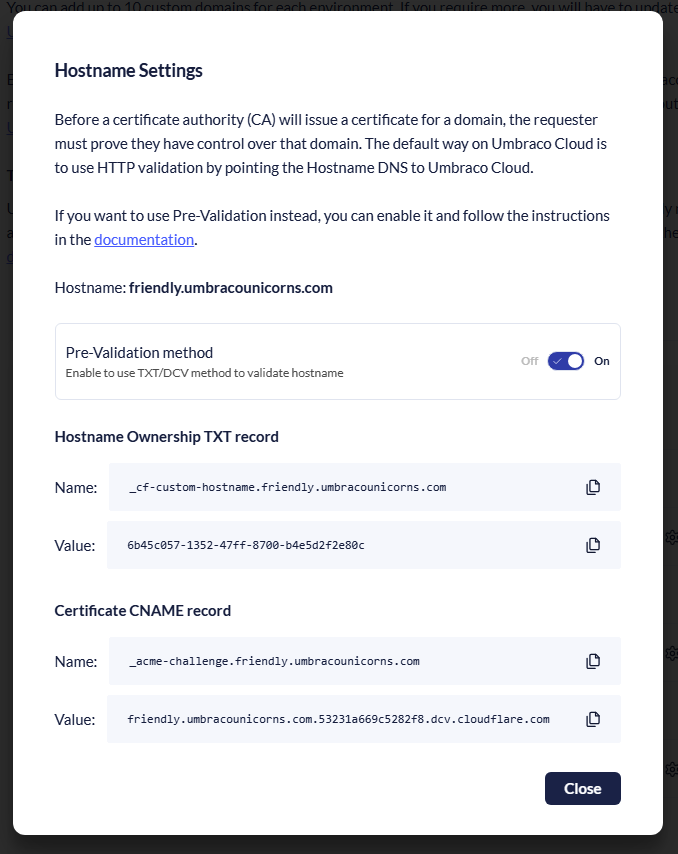

# Hostname Pre-Validation

When adding a hostname to Umbraco Cloud, we ask you to point your DNS records to Umbraco Cloud. 

Sometimes it's difficult to change the DNS record to point to Umbraco Cloud due to:
- Existing Proxy/Web Application Firewall (WAF) in front of the hostname (hostname is proxied outside of Umbraco Cloud)
- Requiring a zero downtime migration to Umbraco Cloud (hostname needs to be ready in Umbraco Cloud before pointing DNS records to Umbraco Cloud)

Add a hostname to Umbraco Cloud, activate the routing, and generate a certificate for the hostname before pointing it to Umbraco Cloud.

After the pre-validation completes, you can keep using an outside proxy or migrate the hostname fully to Umbraco Cloud. This is done by pointing the DNS records to Umbraco Cloud.

## When to Use Hostname Pre-Validation

Use pre-validation in any of the following situations:

- You're dealing with live or production domains that require 100% uptime.
- The hostname will be proxied in front of Umbraco Cloud
- You want to avoid the brief downtime that may occur while Transport Layer Security (TLS) certificates are being validated after pointing DNS to Umbraco Cloud.

## How to Use Hostname Pre-Validation

The following steps outline how to use hostname pre-validation.

### 1. Enable Pre-Validation for the Hostname

After adding your custom hostname in the Umbraco Cloud Portal:

1. Navigate to **Hostname Settings**.
2. Toggle the Pre-Validation option to enable it.

Umbraco Cloud will provide two DNS records:

- A **TXT** record used to verify domain ownership.
- A **CNAME** record that is required for the TLS certificate issuance.

<figure></figure>

### 2. Add DNS Records at Your Domain Registrar

1. Log in to your DNS provider or domain registrar.
2. Add the records provided:

| Record Type | Name                                 | Value/Description                                                                       |
|-------------|--------------------------------------|-----------------------------------------------------------------------------------------|
| TXT         | `_cf-custom-hostname.\<hostname\>`   | Provided by Umbraco Cloud                                                               |
| CNAME       | `_acme-challenge.\<hostname\>`       | Points to a domain under Umbraco's control (for example, `\<hostname\>.xxxx.dcv.cloudflare.com`) |


DNS propagation times can vary. Changes may take a while to become active globally. Tools like `https://www.nslookup.io/` can help verify that your records are live.


### 3. Check Validation Status

Return to the Hostname page in Umbraco Cloud. You'll see a Hostname Pre-Validation status dialog showing the current status of your validation.

The status will change to Active when everything is set up correctly. The hostname is validated, and the TLS certificate is issued.

<figure></figure>

### 4. Point Your DNS to Umbraco Cloud / Activate proxying

Once the certificate is issued:

1. Update your domain's A record or CNAME to point to [Umbraco Cloud DNS](README.md#domains).
2. Update your proxy to serve traffic from Umbraco Cloud.

Your site will be accessible securely via HTTPS without any downtime because the certificate and routing setup are in place.

### 5. Disable Pre-Validation and Clean Up DNS Records

After the hostname is active and secure:

1. Go back to Hostname Settings and disable the pre-validation method.
2. Remove the TXT and CNAME records you added for pre-validation.

Umbraco Cloud will automatically handle future certificate renewals without the need for manual DNS management.


In a proxy case, you'll need to ensure that the URI `http://{custom-hostname}/.well-known/acme-challenge/{token}` is accessible.


## Custom Certificate

If you plan to use a [custom certificate](security-certificates.md), the Hostname Pre-Validation method can be used to prove ownership of the hostname. This is done before binding the custom certificate.

You can do this by following these steps:

1. Enable Pre-Validation for the Hostname.
2. Add the TXT record provided to your Domain Name System (DNS) settings. The record will prove ownership of the domain.
3. Upload a custom certificate and set a binding to the Hostname.
4. Wait a couple of minutes, then disable Pre-Validation for the Hostname. The status will now show "Manual" for the Hostname.
