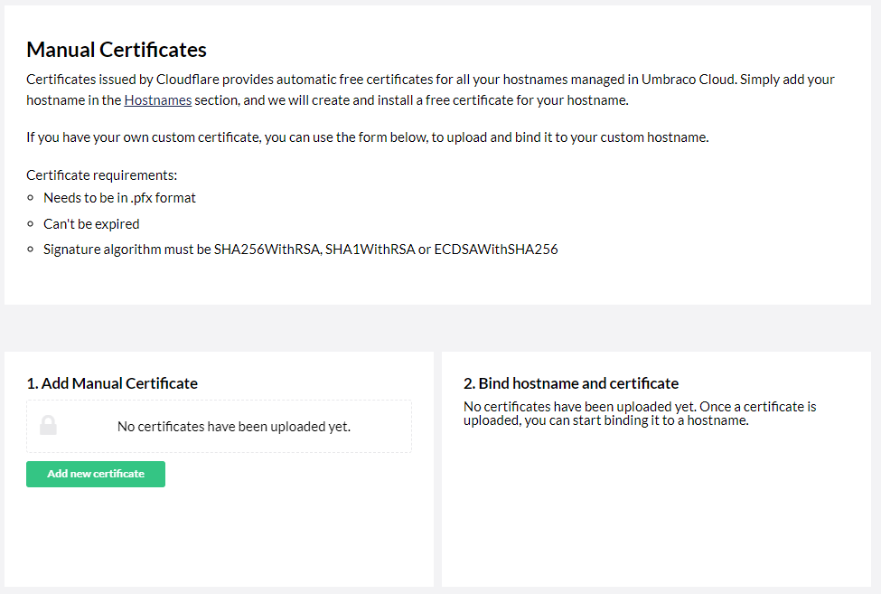
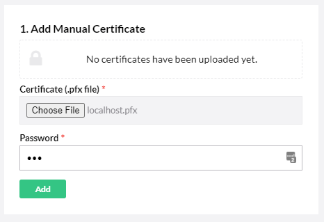

# Custom Certificates


This feature is _only_ available for Umbraco Cloud projects on a **Professional** or **Enterprise** plan.

All projects on Starter, Standard, or Professional plans will automatically be assigned a Transport Layer Security (HTTPS) certificate.

See the full list of features in the [Umbraco Cloud Pricing Plans](https://umbraco.com/umbraco-cloud-pricing/) on the Umbraco website.


To manually upload your certificate on the Umbraco Cloud Portal and assign it to one of the hostnames you've added:

1. Go to your project on the Umbraco Cloud portal.
2.  Click **Settings** -> **Certificates**. The **Manual Certificates** window opens.

    <figure><figcaption>
Manual certificates
</figcaption></figure>

Your certificates need to be:

1. In **`.pfx`** format.
2. Must use a password.
3. Cannot be expired.
4. Signature algorithm must be SHA256WithRSA, SHA1WithRSA or ECDSAWithSHA256

The **`.pfx`** file can only contain one certificate. Each certificate can then be bound to a hostname you have already added to your site. Make sure you use the hostname you will bind the certificate to as the Common Name (CN) when generating the certificate.

## Add Manual certificate

1. Click **Add New Certificate**.
2. Select **Choose file** in the **Certificate (.pfx file)** field and upload your certificate from your local machine.
3.  Enter the **Password** for your certificate.

    
4. Click **Add**.

## Bind Certificate to a Hostname

1. Click **Add new binding**.
2. Choose your hostname from the _Hostname_ dropdown.
3. Choose your newly uploaded certificate from the _Certificate_ dropdown.
4. Click **Add**.

You've now successfully added your certificate to the Cloud project.

## From Custom Certificate to Automatic TLS (HTTPS)

In some cases, you might want to switch from using your custom certificate to using the ones provided by the Umbraco Cloud service.

By removing your certificate from your Cloud project, the Umbraco Cloud service will automatically assign a new TLS (HTTPS) certificate to the hostname.


Did your manually uploaded security certificate expire?

You will need to remove the expired certificate for Umbraco Cloud to assign a new certificate to your hostname(s).


## Read more

* [Redirect from HTTP to HTTPS](rewrites-on-cloud.md#running-your-site-on-https-only)
