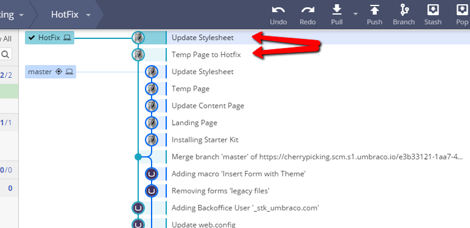

# Hotfixes

When managing an Umbraco Cloud project with multiple environments, you might need to push a hotfix to your Live environment. There might be a possiblity that you have pending changes in other environments that are not ready for deployment.

## Scenario

Imagine you have two environments: Live and Development. You are currently working on some changes in your local clone of the Development environment. These changes will not be ready for the Live environment for a couple of weeks. However, you need to apply a minor change to your Live environment – a _hotfix_.

### Standard Workflow

Typically, you would make the hotfix locally, push it to the Development environment, and then deploy it to Live. In this scenario, that process is not possible as you do not want to deploy the other pending changes you are still working on.

### Best Practices

Following Umbraco Cloud's workflow, you should never make changes directly to the Live environment unless it is the only environment you have. For more information about environments on Umbraco Cloud, see the [Project Overview](../begin-your-cloud-journey/project-overview/) article.

## Applying Hotfixes

It is possible to apply specific changes to your Live environment without breaking Umbraco Cloud workflow. Here are two approaches:

1. [Deploy hotfix with Git branching](hotfixes.md#deploy-hotfix-with-git-branching)
2. [Move files manually](hotfixes.md#move-files-manually)

## Deploy hotfix with Git branching

Clone the Development environment and use Git to push the selected changes to the Live environment. The advantage of using this approach is that your Git history is more accurate and you only work with one local repository. This method requires Git knowledge, but a Git client can simplify the process. You should only go with this guide if you feel comfortable working with Git.

Apply hotfix by using Git

Below you'll find a step-by-step guide on how to apply a hotfix to a Live environment using only Git.

* GitKraken


You can use whichever Git client or command line interface you prefer.

If you've never worked with cherry-picking before, we recommend that you use a Git client with a UI that gives you a visual overview of your commits.


## The scenario

You have an Umbraco Cloud project with two environments, Development and Live.

You have been working on building the site on a local clone of the Development environment, and now you want to send some but not all changes to the Live environment.

A set of commits have been pushed from your local clone to the Development environment. Out of these commits, you only need the changes from two of the commits in the Live environment for now.

## Apply selected changes to the Live environment

Here are the steps to follow to apply selected changes to the Live environment without deploying from Development to Live.

### Branching and Cherry-picking

1. Open your local clone of the Development repository in GitKraken (or your preferred Git client).
2. Make sure that the changes you push directly to your Live environment are already pushed to the Development environment. This will ensure that your environments are kept in sync.
3. Choose the commit where you want to create a new branch.
   *   This branch should be created in an earlier commit that is corresponding to the state of the Live environment (before the changes you've made locally have been committed).

       
4. With the new _Hotfix_ branch checked out, it's now time to _cherry-pick_ the commits you want to apply to the Live environment.
5. _Right-click_ the commit you want and choose **"Cherrypick commit"**.
   * You will be asked if you want to commit this directly to the new branch - Choose **Yes**.
   * Choose **No** if you want to create a new message for the commit.
6. You can cherrypick as many commit as you like.
7.  Your Git history will now look something like this.

    

### Push to Live

Before you push the newly created branch to Umbraco Cloud we need to change the _remote destination_. If you hit _Push_ now, the branch would be pushed to the Development environment. You need to add the Live environment as a _new remote_.

1. Find the clone URL for the Live environment in the Umbraco Cloud Portal.

<figure><figcaption>
Live Clone URL
</figcaption></figure>

1.  In GitKraken add a **new remote**, by clicking the **+** next to _Remote_.

    
2.  Give the new remote a name - like **Live**, and add the clone URL for the Live environment to both _Push URL_ and _Pull URL_ - click **Add Remote**.

    
3. You will be prompted to authenticate - use your Umbraco Cloud credentials.
4. You will see that the history from the Live repository is visible in the Git history.
5. Next step; hit **Push**.
6.  Choose to push to the newly added remote, and write **master** to make sure you are pushing to the master branch on the Live environment.

    
7. Hit **Submit** and the push will start.


When changes are pushed directly to a Live environment and you have more than one environment, the changes are not automatically extracted into the site.


Find a guide on how to extract the files in the [Manual Extraction](../power-tools/manual-extractions.md) article.

You have now applied a hotfix to the Live environment. Make sure that you merge and remove the branch you've created on the Development repository before pushing it to the Development environment on Cloud. You can always create a new branch if you need to apply another hotfix to the Live environment.

When you are ready to build on your Development environment, follow the [normal workflow of the Cloud](../build-and-customize-your-solution/deployment.md) to deploy the changes to the Live environment.

## Important notes

* This guide can also be used for applying a hotfix to a _Staging_ environment.
* The above describes the workflow in GitKraken. You can use a git client of your choice or Git terminal/command prompt if you are comfortable with that.

## Move files manually

Clone both your Development and Live environment to your local machine. Copy the updated files from the cloned Development environment to the cloned Live environment. Push the files to the Live environment on Umbraco Cloud. This allows you to test the changes on a cloned Live environment before pushing it to the Cloud.

Apply hotfix by manually moving files

### Tools

* A [Git GUI](https://git-scm.com/downloads/guis)


In this tutorial GitKraken has been used, however, you can use any Git GUI you prefer.


## The Scenario

You have an Umbraco Cloud project with two environments, **Development** and **Live**.

You have been working on building the site on a local clone of the Development environment, and now you want to send some but not all changes to the Live environment.

Three commits have been pushed from your local clone to the Development environment. Out of these three commits, you only need the changes from one of the commits in the Live environment.

## Apply selected changes to the Live environment

Here are the steps to follow to apply selected changes to the Live environment without deploying from Development to Live.

For the sake of simplicity here's an explanation of the names I'll be using in this guide:

* The cloned Development environment: **Development repository**
* The cloned Live environment: **Live repository**

### Move the files

1.  Clone down the Live environment.

    * The _clone URL_ for the Live environment can be found in the Umbraco Cloud Portal:

    <figure><figcaption>
Live Clone URL
</figcaption></figure>

    
2. Locate the files from the Development repository that you want to move to Live.
   *   Check the commits in the Git history for the Development repository to verify which files you need.

       
   * The _new files_ can be moved from the Development repository to the Live repository.
   * The same goes for _changed files_. You can also edit the files, and only move the code snippets you need on the Live environment.
3. Copy and paste the new and/or updated files from your Development repository to your Live repository.
4. You can now _Stage_ and _Commit_ these changes to the Live repository in Git.

One of the benefits of having the Live environment cloned down, is that you can test the new changes locally before sending them to the Live environment.

### Test changes locally

1. Run the Live repository through IIS
2. Go to the backoffice of your project
3. Navigate to the settings section
4. Go to the Deploy Dashboard in the Settings section
5. Run the Deploy operation `Update Umbraco Schema From Data Files`

The changes will now be reflected in the backoffice of your local Live environment.

Once you've checked that everything works locally, you are ready to push to the Live environment.

### Push to Live

1. Push the committed changes to the Live environment using Git.


When changes are pushed directly to a Live environment and you have more than one environment, the changes are not automatically extracted to the site.


2\. Run the Deploy operation `Update Umbraco Schema From Data Files`from the Deploy Dashboard

You have now applied a hotfix to the Live environment.

When you are done with development on your Development environment, follow the normal workflow of [Deploying the changes between Cloud environments](broken-reference). The hotfix which now exists in both environments should automatically be merged upon deployment.

## Important Notes

* Once you've applied the hotfix, we recommend that you delete the local clone of the Live environment. If you need to apply another hotfix at some point, clone the environment down again.
* Make sure that the changes you push directly to your Live environment are also pushed to the Development environment. This will ensure that your environments are kept in sync.
* This guide can also be used for applying a hotfix to a _Staging_ environment.

