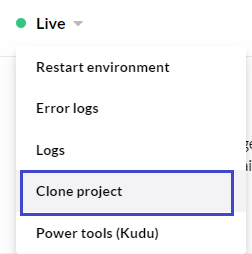

# Apply hotfix by manually moving files

### Tools

* A [Git GUI](https://git-scm.com/downloads/guis)


In this tutorial GitKraken has been used, however, you can use any Git GUI you prefer.


## The Scenario

You have an Umbraco Cloud project with two environments, **Development** and **Live**.

You have been working on building the site on a local clone of the Development environment. Now, you want to send some but not all changes to the Live environment.

Three commits have been pushed from your local clone to the Development environment. Out of these three commits, you only need the changes from one of the commits in the Live environment.

## Apply selected changes to the Live environment

Here are the steps to follow to apply selected changes to the Live environment without deploying from Development to Live.

For the sake of simplicity here's an explanation of the names I'll be using in this guide:

* The cloned Development environment: **Development repository**
* The cloned Live environment: **Live repository**

### Move the files

1.  Clone down the Live environment.

    * The _clone URL_ for the Live environment can be found in the Umbraco Cloud Portal:

    <figure><figcaption>
Live Clone URL
</figcaption></figure>

    
2. Locate the files from the Development repository that you want to move to Live.
   *   Check the commits in the Git history for the Development repository to verify which files you need.

       
   * The _new files_ can be moved from the Development repository to the Live repository.
   * The same goes for _changed files_. You can also edit the files, and only move the code snippets you need on the Live environment.
3. Copy and paste the new and/or updated files from your Development repository to your Live repository.
4. You can now _Stage_ and _Commit_ these changes to the Live repository in Git.

A benefit of having the Live environment cloned down, is that you can test the new changes locally before sending them to the Live environment.

### Test changes locally

1. Run the Live repository through IIS
2. Go to the backoffice of your project
3. Navigate to the settings section
4. Go to the Deploy Dashboard in the Settings section
5. Run the Deploy operation `Update Umbraco Schema From Data Files`

The changes will now be reflected in the backoffice of your local Live environment.

Once you've checked that everything works locally, you are ready to push to the Live environment.

### Push to Live

1. Push the committed changes to the Live environment using Git.


When changes are pushed directly to a Live environment and you have more than one environment, the changes are not automatically extracted to the site.


2. Run the Deploy operation `Update Umbraco Schema From Data Files`from the Deploy Dashboard

You have now applied a hotfix to the Live environment.

When you are done with development on your Development environment, follow the normal workflow of [Deploying the changes between Cloud environments](../../../build-and-customize-your-solution/handle-deployments-and-environments/deployment/cloud-to-cloud.md). The hotfix which now exists in both environments should automatically be merged upon deployment.

## Important Notes

* Once you've applied the hotfix, we recommend that you delete the local clone of the Live environment. If you need to apply another hotfix at some point, clone the environment down again.
* Make sure that the changes you push directly to your Live environment are also pushed to the Development environment. This will ensure that your environments are kept in sync.
* This guide can also be used for applying a hotfix to a _Staging_ environment.
