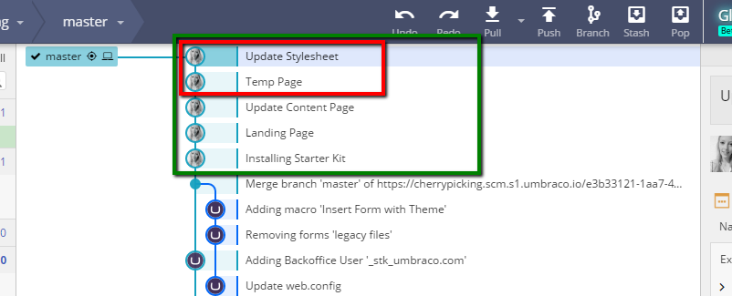
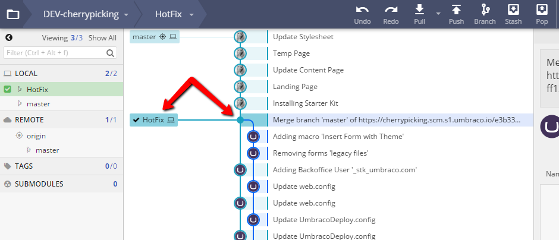
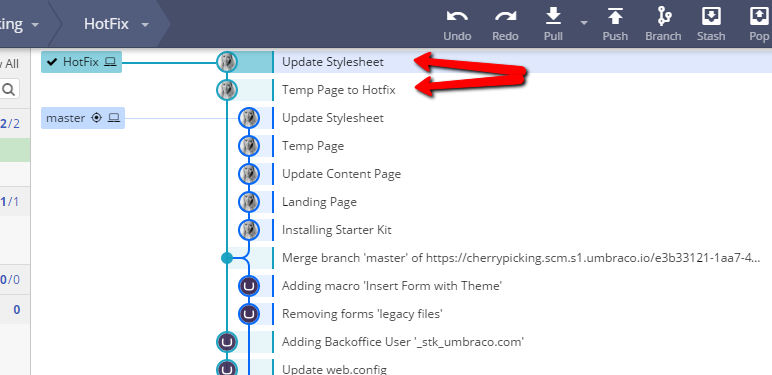
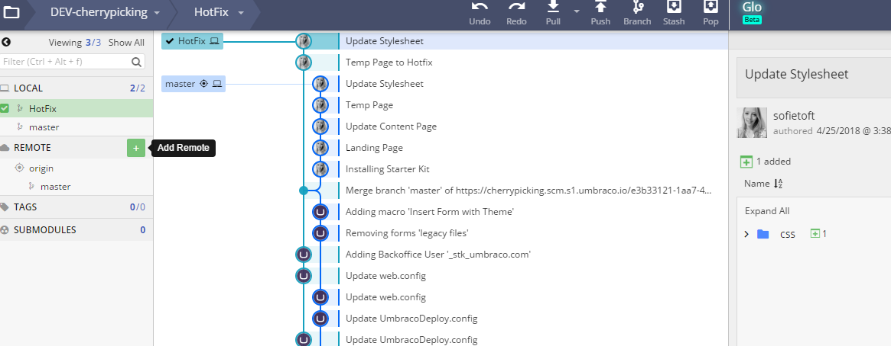
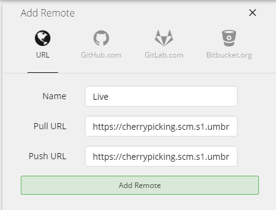

# Apply hotfix by using Git

In this article, you'll find a step-by-step guide on how to apply a hotfix to a Live environment using only Git.

* GitKraken


You can use whichever Git client or command line interface you prefer.

If you've never worked with cherry-picking before, we recommend that using a Git client with visual overview of your commits.


## The scenario

You have an Umbraco Cloud project with two environments, Development and Live.

You have been working on building the site on a local clone of the Development environment. Now you want to send some but not all changes to the Live environment.

A set of commits have been pushed from your local clone to the Development environment. Out of these commits, you only need the changes from two of the commits in the Live environment for now.

## Apply selected changes to the Live environment

Here are the steps to follow to apply selected changes to the Live environment without deploying from Development to Live.

### Branching and Cherry-picking

1. Open your local clone of the Development repository in GitKraken (or your preferred Git client).
2. Make sure that the changes you push directly to your Live environment are already pushed to the Development environment. This will ensure that your environments are kept in sync.
3. Choose the commit where you want to create a new branch.
   *   This branch should be created in an earlier commit that is corresponding to the state of the Live environment (before the changes you've made locally have been committed).

       
4. With the new _Hotfix_ branch checked out, it's now time to _cherry-pick_ the commits you want to apply to the Live environment.
5. _Right-click_ the commit you want and choose **"Cherrypick commit"**.
   * You will be asked if you want to commit this directly to the new branch - Choose **Yes**.
   * Choose **No** if you want to create a new message for the commit.
6. You can cherrypick as many commit as you like.
7.  Your Git history will now look something like this.

    

### Push to Live

Before you push the newly created branch to Umbraco Cloud we need to change the _remote destination_. If you hit _Push_ now, the branch would be pushed to the Development environment. You need to add the Live environment as a _new remote_.

1. Find the clone URL for the Live environment in the Umbraco Cloud Portal.

<figure><figcaption>
Live Clone URL
</figcaption></figure>

1.  In GitKraken add a **new remote**, by clicking the **+** next to _Remote_.

    
2.  Give the new remote a name - like **Live**, and add the clone URL for the Live environment to both _Push URL_ and _Pull URL_ - click **Add Remote**.

    
3. You will be prompted to authenticate - use your Umbraco Cloud credentials.
4. You will see that the history from the Live repository is visible in the Git history.
5. Next step; hit **Push**.
6. Choose to push to the newly added remote, and write **master** to make sure you are pushing to the master branch on the Live environment.

    
7. Hit **Submit** and the push will start.



When changes are pushed directly to a Live environment and you have more than one environment, the changes are not automatically extracted into the site.



Find a guide on how to extract the files in the [Manual Extraction](../../monitor-and-troubleshoot/power-tools/manual-extractions.md) article.

You have now applied a hotfix to the Live environment. Make sure that you merge and remove the branch you've created on the Development repository before pushing it to the Development environment on Cloud. You can always create a new branch if you need to apply another hotfix to the Live environment.

When you are ready to build on your Development environment, follow the [normal workflow of the Cloud](../../../build-and-customize-your-solution/handle-deployments-and-environments/deployment/) to deploy the changes to the Live environment.

## Important notes

* This guide can also be used for applying a hotfix to a _Staging_ environment.
* The above describes the workflow in GitKraken. You can use a git client of your choice or Git terminal/command prompt if you are comfortable with that.
