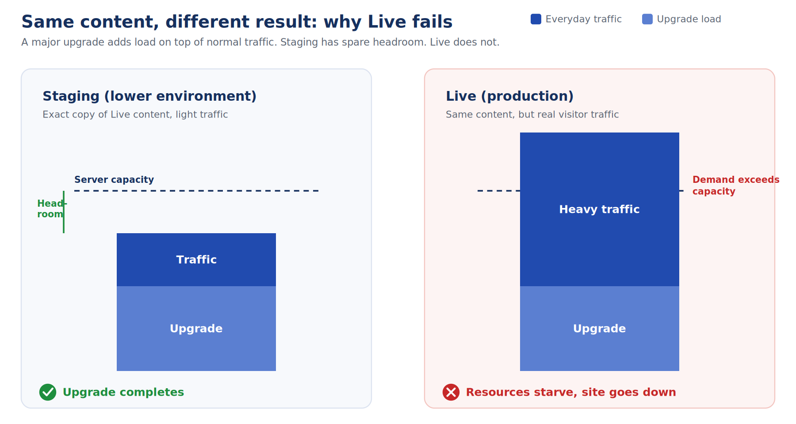
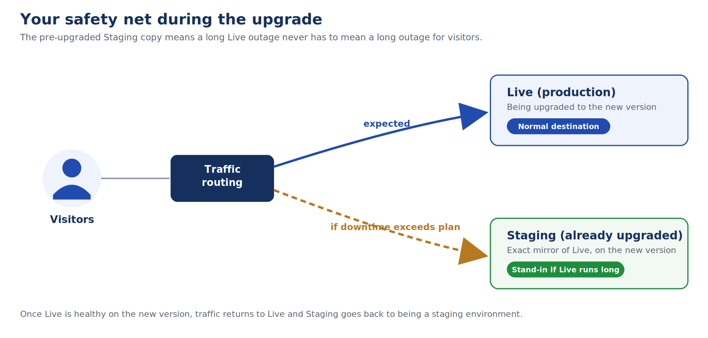
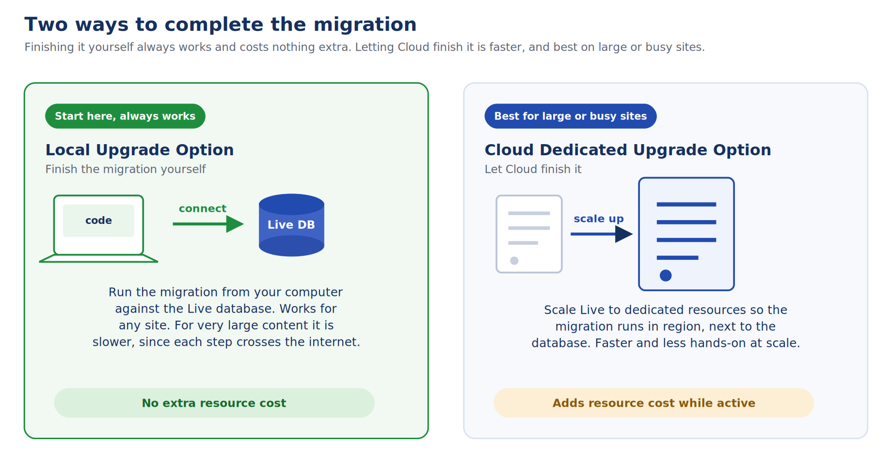
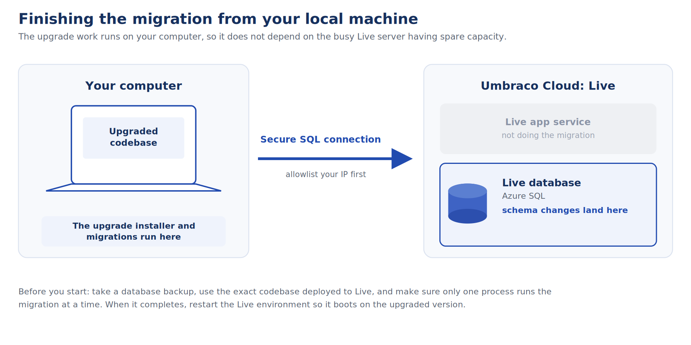

# Major Upgrades for Large sites

Major upgrades differ from normal deployments. The first startup on the new version must often run database migrations, update content, rebuild caches, and refresh indexes.

While many projects upgrade successfully on existing plans, larger or business-critical Live environments face risks. The migration process will compete with live traffic and editor activity for server resources.

To avoid surprises, it is recommended to plan the upgrade window carefully. Choose the upgrade path that matches the size and importance of the project.


This guide is about running the upgrade safely on the Live environment. It does not replace the standard upgrade steps. For updating packages, the .NET version, and your code to the new major, follow the [Major Upgrades](major-upgrades.md) guide and complete those steps locally first.


## Why Live Behaves Differently from Staging

A major upgrade can be resource-intensive. When the upgraded code first boots, it runs database migrations and rebuilds caches and indexes. That work happens on top of whatever the site is already doing.

- **Development/Staging Environments:** There is little or no public traffic, so almost all of the server's capacity is free for the upgrade. The migration completes comfortably.
- **Live Environments:** Real visitors are using the site when the upgrade starts. The environment is already handling normal production traffic, and the upgrade workload is added on top of that.

Many projects complete this successfully. However, on larger or busier sites, the combined workload can overload the environment during the upgrade. Requests may start to queue, the migration may not complete cleanly, and the site can become unavailable.

Consequently, an upgrade can pass on Staging but fail on Live. Even with identical content, the production environment faces entirely different conditions. The content is the same. The production conditions are not.

## Build a Staging Safety Net First

Before upgrading Live, create an exact, already-upgraded copy on Staging. Ensure this copy includes both the database and your Azure Blob Storage media. This gives you a working reference environment on the new version before you touch Live.

For many projects, Staging is mainly a validation and recovery safety net. This lets you confirm the upgraded site runs safely with Live content. It also gives you a known-good reference point if the Live upgrade encounters delays.

### Critical Considerations for Staging Fallbacks

Do not assume that Staging can automatically replace Live during the upgrade window. Many sites depend on processes that may write to the database or behave differently outside of Live. Review your environment for:

- External services and integrations
- Scheduled jobs, forms, and member activity
- Ecommerce flows and search services

If you want to use Staging as a temporary visitor-facing fallback, review the full production behaviour first. Make sure you understand:

- Which integrations are active.
- Which data may be written during the fallback period.
- Whether any of that data could be lost when traffic moves back to Live.


For business-critical sites, the safer approach is often a planned maintenance window. During this window, you take Live offline and display a maintenance page to visitors. You can then safely complete and verify the major upgrade.


### Building the Copy

1. Create a fresh Staging environment on your project. See [Manage Environments](../../../build-and-customize-your-solution/handle-deployments-and-environments/manage-environments.md).
2. Restore the Live database and media into it so it matches Live exactly. Each environment has its own SQL database and its own Blob Storage container, so you need both. See [Restoring Content](../../../build-and-customize-your-solution/handle-deployments-and-environments/deployment/restoring-content.md) and [Media on Cloud](../../../build-and-customize-your-solution/handle-deployments-and-environments/media/README.md).
3. Push the upgraded code to Staging and let the upgrade run there. If the migration does not complete, finish it from your local machine using the [Local Upgrade Option](#approach-2-run-a-controlled-local-migration-local-upgrade-option) below.
4. If Staging was used as a temporary fallback, move traffic back once Live is healthy on the new version. Staging can then return to its normal role.

## Completing the Migration: Choosing Your Path

With your safety net in place, determine whether the Live upgrade can run on your existing Cloud plan, or if the migration needs extra control.

### Approach 1: Run the upgrade on the existing Cloud plan

Many projects can complete the major upgrade on their existing plan. Best for projects where:

- The upgrade has already been tested.
- The migration is expected to be manageable.
- A planned upgrade window is acceptable.

### Approach 2: Run a controlled local migration (Local Upgrade Option)

This path grants direct control over the database migration. Your upgraded local project runs on your own machine while connected directly to the Live database.

- **Best for:** When you want to separate the database migration from the Live application startup, or when a Cloud-side migration does not complete as expected.

- **Emergency Recovery:** If a Live upgrade fails and the site goes down, use this path for recovery:

  1. Take the Live environment offline.
  2. Restore from a clean backup if the database was left half-migrated.
  3. Complete the migration from your machine, then restart Live.

#### Step-by-Step Local Upgrade Execution

1. Take the Live environment offline. This prevents outside processes from writing to the database or booting mid-migration.
2. Back up the Live database. If Cloud's migration attempt failed partway, restore from a clean backup first to ensure a known-good starting state.
3. Open the **SQL connection details** for the **Live** environment in the Cloud Portal and **allowlist your IP address**. For more information, see the [Project Settings](../../../build-and-customize-your-solution/set-up-your-project/project-settings/README.md) and [Working with a Cloud database locally](../../../build-and-customize-your-solution/set-up-your-project/databases/cloud-database/local-database.md) articles.
4. On your machine, check out the exact codebase and version that is deployed to Live, and point its connection string at the Live database. Ensure to set the [`Connection Timeout`](https://learn.microsoft.com/en-us/dotnet/api/system.data.sqlclient.sqlconnection.connectiontimeout?) value in the [`ConnectionString`](https://learn.microsoft.com/en-us/dotnet/api/microsoft.data.sqlclient.sqlconnection.connectionstring?) in the `appsettings.json` file.
5. Start the project so the upgrade installer runs the migrations against the Live database and completes them.
6. Restart the Live environment. It will boot on the new version, automatically rebuild local indexes and caches, and verify site health.


Examine indexes and the local content cache are not stored in the database. The Cloud server will rebuild them automatically when it restarts, regardless of where the database migration was run.



**Critical Migration Rules:**

- **Run one process at a time:** Keep Live offline while you work. Ensure Cloud is not mid-upgrade.
- **Match your codebase:** Always use the exact codebase version deployed to Live. Never point an older or different codebase at the database.
- **Guard against connection drops:** Large migrations over the internet can take a long time. A dropped connection can leave the database half-migrated.
- **Hold your backup:** Keep your database backup until Live is confirmed healthy on the new version.


### Approach 3: Use dedicated resources for the upgrade window (Cloud Upgrade Option)

If a local upgrade is too slow due to extensive content, let Cloud handle the migration using temporary dedicated capacity.

- **Best for:** Large sites with a lot of content or high-traffic projects where in-region speed is worth the temporary cost. Local Upgrade Option remains available as a fallback.

- **How to execute:** From the **Management** menu in the Cloud Portal, move your project onto dedicated resources for the upgrade window. The migration then runs from Cloud infrastructure close to the database, avoiding the round-trip latency of running it from your own machine.

- **Billing Note:** Scaling up changes your hosting plan and billing, so review pricing before switching. Once Live is verified on the new version, scale the plan back down. For more information, see the [Project Settings](../../../build-and-customize-your-solution/set-up-your-project/project-settings/README.md) article.

## Pre-Upgrade Optimization & Verification

### Reduce Migration Work Before the Upgrade

Some major upgrades take longer because they change database schemas. Before upgrading Live, review and remove any old or unnecessary data.

- Delete old content versions.
- Clear recycle bins.
- Remove unused media.
- Check for other project-specific data that is no longer needed.

Reducing the volume of data helps the upgrade complete faster and more predictably. Only remove data that you are sure is no longer needed, and make sure you have a backup before doing any cleanup.

### Run the Upgrade and Verify Live

1. With Staging ready and an approach chosen, push the major upgrade to Live following the [Major Upgrades](major-upgrades.md) guide.
2. If it completes successfully, verify the site on the new version and you are done.
3. If it stalls, complete it with [Local Upgrade Option](#approach-2-run-a-controlled-local-migration-local-upgrade-option).
4. If Live is unavailable for longer than you can accept, use your prepared fallback approach (either a maintenance page or your upgraded Staging copy).


Plan a content freeze during the migration window so editor changes are not lost while the upgrade runs. If you used dedicated resources, review the project’s ongoing resource needs once Live is verified; if the additional capacity was only needed for the upgrade, scale the project back to its previous plan.


## Self-Service Checklist

Run through this quick check to ensure everything is in place before you upgrade Live:

| What to have ready | Why it matters |
| :--- | :--- |
| **Data Cleanup:** Unneeded content versions, recycle bin items, and unused project data removed. | Helps reduce migration time and makes the major upgrade more predictable. |
| **Local Testing:** Project upgraded and tested locally with a copy of the live database on the new major version. | Confirms the upgrade itself is sound before you touch Live. |
| **Package Compatibility:** Packages and custom code confirmed compatible with the new version. | Incompatibilities are the other common cause of failed upgrades. |
| **Backups:** A database backup for every environment you will touch. | Lets you roll back cleanly if a migration goes wrong. |
| **Staging Safety Net:** An upgraded Staging copy of Live (both database and media). | Provides a validation and recovery reference before changing Live. |
| **Migration Path Chosen:** Existing Cloud plan, controlled local migration, or dedicated resources. | Decides how the migration gets enough capacity to finish. |
| **SQL Access:** SQL connection details noted and your IP allowlisted. | Needed to complete the migration from your machine (Local Upgrade Option). |
| **Content Freeze:** A content freeze planned for large sites. | Prevents editor changes being lost during a long migration. |

## Reference Documentation

- [Major Upgrades](major-upgrades.md)
- [Manage Environments](../../../build-and-customize-your-solution/handle-deployments-and-environments/manage-environments.md)
- [Restoring Content](../../../build-and-customize-your-solution/handle-deployments-and-environments/deployment/restoring-content.md)
- [Media on Cloud](../../../build-and-customize-your-solution/handle-deployments-and-environments/media/README.md)
- [Working with a Cloud database locally](../../../build-and-customize-your-solution/set-up-your-project/databases/cloud-database/local-database.md)
- [Project Settings](../../../build-and-customize-your-solution/set-up-your-project/project-settings/README.md)
