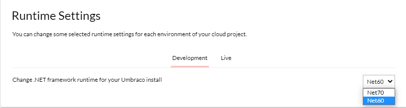

# Major Upgrades


**Are you using custom packages or code on your Umbraco Cloud project?**

Make sure any packages you use are compatible with the latest version of Umbraco. Additionally, confirm that your custom code works with the updated .NET version.

**Breaking Changes**

Be aware of any [Breaking changes](https://docs.umbraco.com/umbraco-cms/fundamentals/setup/upgrading/version-specific#breaking-changes) introduced in the latest version of Umbraco CMS to avoid issues during the upgrade.


## Before you start the upgrade

Before upgrading your Umbraco Cloud project to the latest major version, you must consider the version your project is already on. This will impact the upgrade flow you will be following.

### Upgrading from a Short Term Supported (STS) version

When upgrading from an STS version, you must start by upgrading to the closest Long-term Support (LTS) major. If the version you are upgrading to is an STS version, you can upgrade to that version, directly from the closest LTS. You can upgrade directly if there are no LTS versions between the current one and the one you are upgrading to.

Refer to the [Long-term support and EOL article](https://umbraco.com/products/knowledge-center/long-term-support-and-end-of-life/) to learn which versions are STS.

#### _Example: Upgrading from Umbraco 11 (STS) to Umbraco 15 (STS)_

Start by upgrading to the closest LTS. In this case, that is Umbraco 13. After that, you can upgrade directly from Umbraco 13 to Umbraco 15.

### Upgrading from a Long Term Supported (LTS) version

When upgrading from an LTS version, you must start by looking at the versions between yours and the one you are upgrading to. Is there another LTS version in that line, you need to upgrade to that version first.

Refer to the [Long-term support and EOL article](https://umbraco.com/products/knowledge-center/long-term-support-and-end-of-life/) to learn which versions are LTS.


Skipping upgrades to STS versions, like 11 and 12, means you will not receive warnings about obsolete features. We recommend keeping the [Breaking Changes documentation](https://docs.umbraco.com/umbraco-cms/fundamentals/setup/upgrading/version-specific#breaking-changes) handy to avoid any surprises.


#### Example: Upgrading from Umbraco 10 (LTS) to Umbraco 15 (STS)

Between version 10 and 15, there is another LTS version: Umbraco 13. The first step is therefore to upgrade to Umbraco 13. After that, you can upgrade directly from Umbraco 13 to Umbraco 15.

### Version-specific upgrade notes

Look for the "**Upgrade from/to Umbraco xx"** boxes. These boxes contain important information about any extra steps needed for a specific version.

## Prerequisites

* Follow the **requirements** for [local development](https://docs.umbraco.com/umbraco-cms/fundamentals/setup/requirements#local-development).
* An Umbraco Cloud project running [the latest version of your current Umbraco CMS installation](https://our.umbraco.com/download/releases)
* The **latest** .[NET version](https://dotnet.microsoft.com/en-us/download/visual-studio-sdks) is installed locally.
* **At least two environments** on your Cloud project.
* A backup of your project database.
  * Directly from your environment. See the [Database backups](../../../build-and-customize-your-solution/set-up-your-project/databases/backups.md) article,
  * Or clone down, restore the project, and back up the local database.

## Step 1: Enable .NET

Before proceeding, you must determine whether the .NET framework version needs to be updated for your project. If no changes to the .NET version are required, you can skip this step and proceed with Step 2.

Refer to the [Choose the correct .NET version](https://docs.umbraco.com/umbraco-cms/fundamentals/setup/upgrading#choose-the-correct-.net-version) section to identify whether a .NET version update is necessary for your upgrade.

1. Go to the project in the Umbraco Cloud portal.
2. Navigate to **Configuration** -> **Advanced**.
3. Scroll down to the **Runtime Settings** section.
4. Select the appropriate .NET version from the **Change .NET framework runtime for your Umbraco install** dropdown for each environment in your Cloud project.

<figure><figcaption><p>Runtime settings</p></figcaption></figure>

## Step 2: Clone down your environment

1. Clone down the **left-most mainline environment**.
2. Build and run the [project locally](../../../build-and-customize-your-solution/handle-deployments-and-environments/working-locally/#running-the-site-locally).
3. Log in to the backoffice.
4. Restore content from your Cloud environment.

## Step 3: Upgrade the project locally using Visual Studio

1. Open the `csproj` file located in the `/src/UmbracoProject` folder.
2. Determine if you need to update the .NET version based on the changes made in [Step 1](major-upgrades.md#step-1-enable-net):
   * **If the .NET version was updated:** Update the `<TargetFramework>` to match the version set in your Cloud environment.
   * **If the .NET version was not updated:** Skip this step.

<details>

<summary>Upgrading to Umbraco 15</summary>

The following packages are no longer needed on the Cloud platform:

* `Umbraco.Cloud.Cms.PublicAccess`
* `Umbraco.Cloud.Identity.Cms`

Delete the `<PackageReference>` entries for these packages.

</details>

3. Go to **Tools** > **NuGet Package Manager** > **Manage NuGet Packages for Solution**.
4. Navigate to the **Updates** tab.
5. Select the version you are updated to and follow the instructions:



Update the following packages:

* `Umbraco.Forms.Deploy`
* `Umbraco.Cms`
* `Umbraco.Deploy.Cloud`
* `Umbraco.Deploy.Contrib`
* `Umbraco.Forms`
* `Umbraco.Cloud.Cms`
* `Umbraco.Cloud.StorageProviders.AzureBlob`



Update the following packages:

* `Umbraco.Forms.Deploy`
* `Umbraco.Cms`
* `Umbraco.Deploy.Cloud`
* `Umbraco.Deploy.Contrib`
* `Umbraco.Forms`
* `Umbraco.Cloud.Cms`
* `Umbraco.Cloud.Identity.Cms`
* `Umbraco.Cloud.Cms.PublicAccess`
* `Umbraco.Cloud.StorageProviders.AzureBlob`
* `Microsoft.Extensions.DependencyInjection.Abstractions`



From Umbraco 13, the `Umbraco.Deploy.Forms` package has been replaced with the `Umbraco.Forms.Deploy` package.

* Remove the `Umbraco.Deploy.Forms` package.
* Update the following packages:
  * `Umbraco.Cms`
  * `Umbraco.Deploy.Cloud`
  * `Umbraco.Deploy.Contrib`
  * `Umbraco.Forms`
  * `Umbraco.Cloud.Cms`
  * `Umbraco.Cloud.Identity.Cms`
  * `Umbraco.Cloud.Cms.PublicAccess`
  * `Umbraco.Cloud.StorageProviders.AzureBlob`
  * `Microsoft.Extensions.DependencyInjection.Abstractions`
* Install the `Umbraco.Forms.Deploy` package.



Update the following packages:

* `Umbraco.Deploy.Forms`
* `Umbraco.Cms`
* `Umbraco.Deploy.Cloud`
* `Umbraco.Deploy.Contrib`
* `Umbraco.Forms`
* `Umbraco.Cloud.Cms`
* `Umbraco.Cloud.Identity.Cms`
* `Umbraco.Cloud.Cms.PublicAccess`
* `Umbraco.Cloud.StorageProviders.AzureBlob`
* `Microsoft.Extensions.DependencyInjection.Abstractions`




Update all projects and packages in your solution to support the latest .NET.


## Step 4: Finishing the Upgrade

1. Ensure the [Unattended Upgrades](https://docs.umbraco.com/umbraco-cms/fundamentals/setup/upgrading#run-an-unattended-upgrade) feature is **enabled**.
2. Run the **project locally**.
3. Log in to the Umbraco backoffice to **verify the upgrade** has happened.
   * If you cannot login locally via Umbraco ID and URL shows `/umbraco/authorizeupgrade?redir=` then this is because of the Unattended Upgrades setting. It must be set to `true` and deployed to the environment before the upgrade.

<figure><figcaption><p>Click on the Umbraco logo in the Umbraco backoffice to confirm the version number.</p></figcaption></figure>


have a valid license, this may be due to browser caching. Google Chrome, in particular, has aggressive caching that can interfere with license validation during startup.
To resolve this:
1. Open Chrome's Developer Tools (F12).
2. Right-click the reload button next to the address bar.
3. Select Empty cache and hard reload.

It is recommended to clear the cache and cookies thoroughly in all browsers you're using to access the Umbraco backoffice.
This step can help resolve unexpected startup issues after the upgrade.


5. Ensure that the project runs locally without any errors.

<details>

<summary>Upgrading from Umbraco 13</summary>

In Umbraco 14, Smidge has been removed from the CMS.

In the `_ViewImports.cshtml` of your project, remove the following lines:

```csharp
@addTagHelper *, Smidge
@inject Smidge.SmidgeHelper SmidgeHelper 
```

When upgrading **from** Umbraco 13, you need to be aware that `UseInstallerEndpoints()` no longer exists.

1. Open the `Program.cs` file.
2. Remove `u.UseInstallerEndpoints()` from the `app.UseUmbraco()` method.

.png>)

</details>

<details>

<summary>Upgrading from Umbraco 9</summary>

Update the `Program` class in the `Program.cs` file to the following:\
using Umbraco.Cms.Web.Common.Hosting;

```

public class Program
    {
        public static void Main(string[] args)
            => CreateHostBuilder(args)
                .Build()
                .Run();

        public static IHostBuilder CreateHostBuilder(string[] args) =>
            Host.CreateDefaultBuilder(args)
                .ConfigureUmbracoDefaults()
                .ConfigureWebHostDefaults(webBuilder =>
                {
                    webBuilder.UseStaticWebAssets();
                    webBuilder.UseStartup<Startup>();
                });
    }
```

Re-enable the app settings IntelliSense by updating your schema reference in the `appsettings.json` file from:

```json
"$schema": "./umbraco/config/appsettings-schema.json",
```

To:

```json
"$schema": "./appsettings-schema.json",
```

Apply this change to the following files as well:

* `appsettings.Development.json`
* `appsettings.Production.json`
* `appsettings.Staging.json`

Remove the following files and folders _manually_ from your local project:

* `/wwwroot/umbraco`
* `/umbraco/PartialViewMacros`
* `/umbraco/UmbracoBackOffice`
* `/umbraco/UmbracoInstall`
* `/umbraco/UmbracoWebsite`
* `/umbraco/config/lang`

Remove the same files from the left-most environment. This should be done from the left-most environment through `KUDU` -> `Debug Console` -> `CMD` -> `Site` -> from both the `repository` and `wwwroot` folders.

</details>

5. Push the changes to the Cloud environment. See the [Deploying from local to your environments](../../../build-and-customize-your-solution/handle-deployments-and-environments/deployment/local-to-cloud.md) article.
6. Test that everything works with the upgrade on the Cloud environment.

We highly recommend that you go through everything in your Cloud environment. This can help you identify any potential errors after the upgrade, and ensure that you are not deploying any issues onto your production environment.

## Step 5: Deploy the upgrade

The next part is to deploy the upgrade through to the production environment.

For major upgrades that include content migrations, the process can be extensive. This is especially true for sites with a large amount of content. In these cases, it is recommended to:

* Initiate a content freeze to prevent changes during the migration.
* Rearrange your custom hostname(s) to **minimize website downtime.**

You can choose between two approaches based on your needs:

* "**With content freeze**" - involves a more detailed upgrade process but helps reduce downtime on your live website.
* "**Without content freeze**" - provides a more straightforward process that may result in longer downtime on your live website.




The following steps involve setting a **content-freeze** period on the project. It is recommended to coordinate this with your content editors before moving forward.


1. Delete any environments between your left-most and production environments.
2. Create a new environment from the production environment - call it Staging.
3. Initiate **content-freeze**.
4. Import content using either of the following approaches:
   1. [Restore content and media](../../../build-and-customize-your-solution/handle-deployments-and-environments/deployment/restoring-content/) directly from the backoffice.
   2. Use the [Database Backup and Restore](../../../build-and-customize-your-solution/set-up-your-project/databases/backups.md) functionality in the Cloud Portal.
5. Deploy the upgrade from the left-most environment.
6. Verify and test all functionality on the upgraded environment.
7. [Remove your custom hostname(s)](../../../go-live/manage-hostnames/) from the production environment.
8. Ensure the hostname(s) no longer point to the production environment.
9. [Add the custom hostname(s)](../../../go-live/manage-hostnames/) to the new environment (Staging).
10. Deploy the upgrade to the production environment.
    1. In case the upgrade is taking longer than expected, restore a backup of the Staging database on the production environment.
11. Cancel **content-freeze**.
12. Verify and test all functionality in the production environment.
13. [Remove your custom hostname(s)](../../../go-live/manage-hostnames/) from the Staging environment.
14. Ensure the hostname(s) no longer point to the Staging environment.
15. [Add the custom hostname(s)](../../../go-live/manage-hostnames/) to the production environment.



1. Deploy the upgrade to the next environment.
2. Verify and test all functionality on the upgraded environment.
3. Deploy the upgrade to the production environment.
   1. In case the upgrade is taking longer than expected, restore a backup of the database on the production environment.
4. Verify and test all functionality in the production environment.


