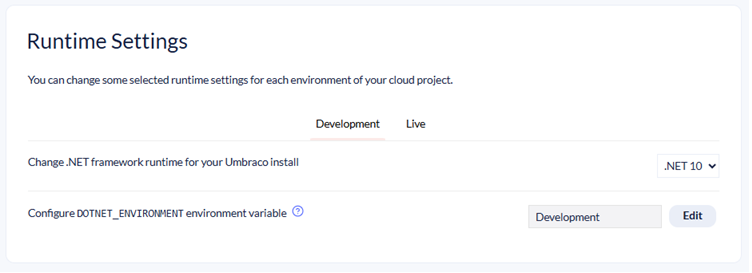
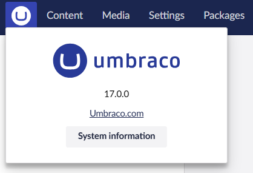

# Major Upgrades

A major Umbraco upgrade is more involved than a minor or patch update. Read this article before starting the upgrade process to avoid any unexpected site downtime.

## Why major upgrades are different

A major upgrade involves a database schema migration, as the structure of the database changes between major versions. On Umbraco Cloud, this migration may not run automatically during a standard cloud deployment. When this occurs, you will need to run the database migration locally, where your machine has full control over the process.

## High-level Upgrade Process

Watch this short video to understand why a local database migration is required and how your local machine handles the heavy lifting.

<TBA>

Use this visual map as a quick reference guide to track how code deployments and database schema migrations move across your environments sequentially.




**Do not perform major version upgrades directly in Umbraco Cloud.**

Major upgrades involve significant database schema changes. Running these migrations directly on Cloud can cause boot failures and 503 errors. These incomplete migrations are often difficult to diagnose.

Always perform the database migration locally first, verify that the backoffice loads successfully, and then deploy the upgraded project to Cloud. The steps below follow this recommended approach.


The following list outlines the upgrade process. Find the detailed upgrade steps further down the article.

* Upgrade the left-most (Dev) environment.
* Deploy to the next environment (Staging).
* Perform the Staging database migration locally.
* Validate Staging thoroughly.
* Repeat the same local database migration process for Live.
* Move hostnames back to Live.


**Are you using custom packages or code on your Umbraco Cloud project?**

Make sure any packages you use are compatible with the latest version of Umbraco. Additionally, confirm that your custom code works with the updated .NET version.

**Breaking Changes**

Be aware of any [Breaking changes](https://docs.umbraco.com/umbraco-cms/fundamentals/setup/upgrading/version-specific#breaking-changes) introduced in the latest version of Umbraco CMS to avoid issues during the upgrade.


## Determine your upgrade path

Before upgrading your Umbraco Cloud project to the latest major version, you must consider the version your project is already on. This will impact the upgrade flow you will be following.

### Upgrading from a Short-Term Supported (STS) version

When upgrading from an STS version, you must start by upgrading to the closest Long-term Support (LTS) major. If the version you are upgrading to is an STS version, you can upgrade to that version, directly from the closest LTS. You can upgrade directly if there are no LTS versions between the current one and the one you are upgrading to.

Refer to the [Long-term support and EOL article](https://umbraco.com/products/knowledge-center/long-term-support-and-end-of-life/) to learn which versions are STS.

#### _Example: Upgrading from Umbraco 11 (STS) to Umbraco 15 (STS)_

Start by upgrading to the closest LTS. In this case, that is Umbraco 13. After that, you can upgrade directly from Umbraco 13 to Umbraco 15.

### Upgrading from a Long-Term Supported (LTS) version

When upgrading from an LTS version, you must start by looking at the versions between yours and the one you are upgrading to. Is there another LTS version in that line, you need to upgrade to that version first.

Refer to the [Long-term support and EOL article](https://umbraco.com/products/knowledge-center/long-term-support-and-end-of-life/) to learn which versions are LTS.


Skipping upgrades to STS versions, like 11 and 12, means you will not receive warnings about obsolete features. Keep the [Breaking Changes documentation](https://docs.umbraco.com/umbraco-cms/fundamentals/setup/upgrading/version-specific#breaking-changes) open throughout your upgrade.


#### Example: Upgrading from Umbraco 10 (LTS) to Umbraco 15 (STS)

Between version 10 and 15, there is another LTS version: Umbraco 13. The first step is therefore to upgrade to Umbraco 13. After that, you can upgrade directly from Umbraco 13 to Umbraco 15.

### Version-specific upgrade notes

Look for the "**Upgrade from/to Umbraco xx"** boxes. These boxes contain important information about any extra steps needed for a specific version.

## Prerequisites

* Follow the **requirements** for [local development](https://docs.umbraco.com/umbraco-cms/get-started/installation/requirements#local-development).
* Your Umbraco Cloud project running [the latest version of your current Umbraco CMS installation](https://releases.umbraco.com/all-releases/).
* The **latest** [.NET SDK](https://dotnet.microsoft.com/en-us/download/visual-studio-sdks) installed locally.
* **At least three environments** on your Cloud project.
* A database backup taken before you begin either [directly from the Cloud portal](../../../build-and-customize-your-solution/set-up-your-project/databases/backups.md) or by cloning and backing up locally.

## Step 1: Enable .NET

Check whether the [.NET framework version](https://docs.umbraco.com/umbraco-cms/get-started/upgrading-and-migrating/upgrade-details#choose-the-correct-.net-version) needs to change for the target Umbraco version. If no change is needed, skip to [Step 2: Clone down your environment and restore](#step-2-clone-down-your-environment-and-restore).

1. Open your project in the Umbraco Cloud portal.
2. Go to **Configuration** -> **Advanced**.
3. Scroll to **Runtime Settings**.
4. Select the correct .NET version for each environment from the dropdown.

<figure><figcaption><p>Runtime settings</p></figcaption></figure>

## Step 2: Clone down your environment and restore

1. Clone down the **left-most mainline environment**.
2. Build and run the [project locally](../../../build-and-customize-your-solution/handle-deployments-and-environments/working-locally/README.md#running-the-site-locally).
3. Log in to the backoffice.
4. Restore content from your Cloud environment.

## Step 3: Upgrade the project locally in Visual Studio

1. Open the `csproj` file located in the `/src/UmbracoProject` folder.
2. If you updated .NET in [Step 1: Enable .NET](#step-1-enable-net), update the `<TargetFramework>` value to match.

<details>

<summary>Upgrading to Umbraco 15 and above</summary>

The following packages are no longer needed on the Cloud platform:

* `Umbraco.Cloud.Cms.PublicAccess`
* `Umbraco.Cloud.Identity.Cms`

Delete the `<PackageReference>` entries for these packages.

</details>

3. Go to **Tools** > **NuGet Package Manager** > **Manage NuGet Packages for Solution**.
4. Navigate to the **Updates** tab.
5. Select the version you are updating to and follow the instructions:




* Update the following packages:

  * `Umbraco.Forms.Deploy`
  * `Umbraco.Cms`
  * `Umbraco.Deploy.Cloud`
  * `Umbraco.Deploy.Contrib`
  * `Umbraco.Forms`
  * `Umbraco.Cloud.Cms`
  * `Umbraco.Cloud.StorageProviders.AzureBlob`

* Open the `Licenses` folder and delete all Umbraco-related `.lic` files.
* Keep any `.lic` files needed for your third-party tools.

If the folder is empty after deleting the files, you can safely remove the entire `Licenses` folder as well.

* _[Optional]_ If using Deploy and Forms on Umbraco Cloud:
  1. Locate and open the `appsettings.json` file (and any environment-specific variants).
  2. Add the following section to `Umbraco:Licenses:Products:<ProductName>`:

  ```json
  {
    "Umbraco": {
      "Licenses": {
        "Products": {
          "Umbraco.Deploy": "UMBRACO-CLOUD",
          "Umbraco.Forms": "UMBRACO-CLOUD"
        }
      }
    }
  }
  ```
  
  This ensures the built-in Umbraco Cloud licenses are recognized after upgrading. Without these values, you may encounter license validation errors even though your project is on Umbraco Cloud.

* _[Optional]_ If you use `InMemoryAuto` models builder, or rely on Razor runtime compilation for editing templates via the backoffice, reference the `Umbraco.Cms.DevelopmentMode.Backoffice` package. For more information, see the [Breaking Changes](https://docs.umbraco.com/umbraco-cms/17.latest/fundamentals/setup/upgrading/version-specific#umbraco-17) article.




Update the following packages:

* `Umbraco.Forms.Deploy`
* `Umbraco.Cms`
* `Umbraco.Deploy.Cloud`
* `Umbraco.Deploy.Contrib`
* `Umbraco.Forms`
* `Umbraco.Cloud.Cms`
* `Umbraco.Cloud.StorageProviders.AzureBlob`



Update the following packages:

* `Umbraco.Forms.Deploy`
* `Umbraco.Cms`
* `Umbraco.Deploy.Cloud`
* `Umbraco.Deploy.Contrib`
* `Umbraco.Forms`
* `Umbraco.Cloud.Cms`
* `Umbraco.Cloud.Identity.Cms`
* `Umbraco.Cloud.Cms.PublicAccess`
* `Umbraco.Cloud.StorageProviders.AzureBlob`
* `Microsoft.Extensions.DependencyInjection.Abstractions`



From Umbraco 13, the `Umbraco.Deploy.Forms` package has been replaced with the `Umbraco.Forms.Deploy` package.

* Remove the `Umbraco.Deploy.Forms` package.
* Update the following packages:
  * `Umbraco.Cms`
  * `Umbraco.Deploy.Cloud`
  * `Umbraco.Deploy.Contrib`
  * `Umbraco.Forms`
  * `Umbraco.Cloud.Cms`
  * `Umbraco.Cloud.Identity.Cms`
  * `Umbraco.Cloud.Cms.PublicAccess`
  * `Umbraco.Cloud.StorageProviders.AzureBlob`
  * `Microsoft.Extensions.DependencyInjection.Abstractions`
* Install the `Umbraco.Forms.Deploy` package.



Update the following packages:

* `Umbraco.Deploy.Forms`
* `Umbraco.Cms`
* `Umbraco.Deploy.Cloud`
* `Umbraco.Deploy.Contrib`
* `Umbraco.Forms`
* `Umbraco.Cloud.Cms`
* `Umbraco.Cloud.Identity.Cms`
* `Umbraco.Cloud.Cms.PublicAccess`
* `Umbraco.Cloud.StorageProviders.AzureBlob`
* `Microsoft.Extensions.DependencyInjection.Abstractions`




Update all projects and packages in your solution to support the latest .NET.


## Step 4: Finish the local upgrade

1. Enable [Unattended Upgrades](https://docs.umbraco.com/umbraco-cms/get-started/upgrading-and-migrating/upgrade-unattended) in your configuration.
2. Run the project locally.
3. Log in to the backoffice to **verify the upgrade** has happened.
   * If you cannot login locally via Umbraco ID and URL shows `/umbraco/authorizeupgrade?redir=`, this is because of the Unattended Upgrades setting. It must be set to `true` and deployed to the environment before the upgrade.

<figure><figcaption><p>Click on the Umbraco logo in the Umbraco backoffice to confirm the version number.</p></figcaption></figure>



If you receive a missing deploy license error after upgrading, even though the license is valid, it may be due to browser caching. Google Chrome has an aggressive caching that can interfere with license validation during startup.
To resolve this:

1. Open Chrome's Developer Tools (F12).
2. Right-click the reload button next to the address bar.
3. Select **Empty cache and hard reload**.

It is recommended to clear the cache and cookies thoroughly in all browsers you're using to access the Umbraco backoffice.
This step can help resolve unexpected startup issues after the upgrade.

If the issue persists and your project has CDN Caching and Optimization enabled, cached responses may interfere with license validation. In this case, try purging the cache and reloading the site.


4. Verify the project runs locally without errors.

<details>

<summary>Upgrading from Umbraco 13</summary>

In Umbraco 14, Smidge has been removed from the CMS.

In the `_ViewImports.cshtml` of your project, remove the following lines:

```csharp
@addTagHelper *, Smidge
@inject Smidge.SmidgeHelper SmidgeHelper 
```

When upgrading **from** Umbraco 13, you need to be aware that `UseInstallerEndpoints()` no longer exists.

1. Open the `Program.cs` file.
2. Remove `u.UseInstallerEndpoints()` from the `app.UseUmbraco()` method.

.png>)

</details>

<details>

<summary>Upgrading from Umbraco 9</summary>

Update the `Program` class in the `Program.cs` file to the following:\
using Umbraco.Cms.Web.Common.Hosting;

```cs
public class Program
    {
        public static void Main(string[] args)
            => CreateHostBuilder(args)
                .Build()
                .Run();

        public static IHostBuilder CreateHostBuilder(string[] args) =>
            Host.CreateDefaultBuilder(args)
                .ConfigureUmbracoDefaults()
                .ConfigureWebHostDefaults(webBuilder =>
                {
                    webBuilder.UseStaticWebAssets();
                    webBuilder.UseStartup<Startup>();
                });
    }
```

Re-enable the app settings IntelliSense by updating your schema reference in the `appsettings.json` file from:

```json
"$schema": "./umbraco/config/appsettings-schema.json",
```

To:

```json
"$schema": "./appsettings-schema.json",
```

Apply this change to the following files as well:

* `appsettings.Development.json`
* `appsettings.Production.json`
* `appsettings.Staging.json`

Remove the following files and folders _manually_ from your local project:

* `/wwwroot/umbraco`
* `/umbraco/PartialViewMacros`
* `/umbraco/UmbracoBackOffice`
* `/umbraco/UmbracoInstall`
* `/umbraco/UmbracoWebsite`
* `/umbraco/config/lang`

Remove the same files from the left-most environment. This should be done from the left-most environment through `KUDU` -> `Debug Console` -> `CMD` -> `Site` -> from both the `repository` and `wwwroot` folders.

</details>

5. Push the changes to the left-most (Dev) environment. See the [Deploying from local to your environments](../../../build-and-customize-your-solution/handle-deployments-and-environments/deployment/local-to-cloud.md) article.
6. Test that everything works with the upgrade on the left-most (Dev) environment.

It is highly recommended to go through everything in your Cloud environment. This can help you identify any potential errors after the upgrade, and ensure that you are not deploying any issues onto your production environment.

## Step 5: Deploy the upgrade to Production

The next part is to deploy the upgrade through to the production environment.

For major upgrades that include content migrations, the process can be extensive. This is especially true for sites with a large amount of content. In these cases, it is recommended to:

* Initiate a content freeze to prevent changes during the migration.
* Rearrange your custom hostname(s) to **minimize website downtime.**

You can choose between two approaches based on your needs:

* **With content freeze** (recommended for larger sites) - involves a more detailed upgrade process but helps reduce downtime on your live website.
* **Without content freeze** - provides a more straightforward process that may result in longer downtime on your live website.




The following steps involve setting a **content-freeze** period on the project. It is recommended to coordinate this with your content editors before moving forward.


1. Delete your existing Staging environment.
2. Recreate the Staging environment to ensure a clean environment in sync with production/Live.
3. Initiate **content-freeze**. Ask editors to stop all backoffice work.
4. Restore the production [database](../../../build-and-customize-your-solution/set-up-your-project/databases/backups.md) and [media](../../../build-and-customize-your-solution/handle-deployments-and-environments/deployment/restoring-content/) to Staging so the content is identical.


Depending on the size of your production site, restoring a full database backup and media blob library to your newly created Staging environment can be a time-consuming process. For larger sites, expect this step to take longer. Plan your upgrade window accordingly and ensure the data sync finishes completely before deploying your upgraded code.


5. Deploy the upgrade from the left-most (Dev) environment to Staging.


The deployment to Staging may not automatically complete the database migration. If the site does not boot correctly after deployment, this is expected. Proceed to the local database migration step below rather than retrying the deployment.


6. Perform the Staging database migration locally:
    1. Clone down the Staging environment (this pulls the upgraded codebase).
    2. Connect to the Staging cloud database using the connection string from the Cloud portal.
    3. Run the project locally. The migration executes against the cloud database, your local machine provides the compute.
    4. Verify the backoffice loads and the upgrade is confirmed.
    5. Push the result back to the Staging Cloud environment.



7. Verify and test all functionality on the upgraded Staging environment.
8. [Remove your custom hostname(s)](../../../go-live/manage-hostnames/README.md) from the production environment.
9. Ensure the hostname(s) no longer point to the production environment.
10. [Add the custom hostname(s)](../../../go-live/manage-hostnames/) to the Staging environment. Your live site is now running on the upgraded Staging environment.
11. Perform the same local database migration process for the production (Live) environment:
    1. Clone down the production (Live) environment codebase (which now contains your major upgrades files).
    2. Update your local `appsettings.json` with the Production (Live) Cloud Database Connection String.
    3. Run the project locally. Your local machine's compute power will execute the schema migration directly against the Live cloud database.
    4. Log into the Live backoffice to verify the upgrade version. No database push is required, as the migration occurred live over the connection string


If the production migration takes longer than expected, you can restore a backup of the Staging database onto production as a fallback. Both will be at the upgraded version.


12. Cancel the **content-freeze**.
13. Verify and test all functionality in the production environment.
14. [Remove your custom hostname(s)](../../../go-live/manage-hostnames/) from the Staging environment.
15. Ensure the hostname(s) no longer point to the Staging environment.
16. [Add the custom hostname(s)](../../../go-live/manage-hostnames/) to the production environment.




Use this approach for smaller sites where a short downtime window is acceptable.

1. Deploy the upgrade to the next (Staging) environment.
2. If the database migration does not complete automatically, perform it locally using the connection string method:
    1. Clone down the Staging environment (this pulls the upgraded codebase).
    2. Connect to the Staging cloud database using the connection string from the Cloud portal.
    3. Run the project locally. The migration executes against the cloud database, your local machine provides the compute.
    4. Verify the backoffice loads and the upgrade is confirmed.
    5. Push the result back to the Staging Cloud environment.


3. Verify and test all functionality on the upgraded (Staging) environment.
4. Deploy the upgrade to the production (Live) environment.
   1. In case the upgrade is taking longer than expected, restore a backup of the database on the production environment.
5. Verify and test all functionality in the production (Live) environment.


