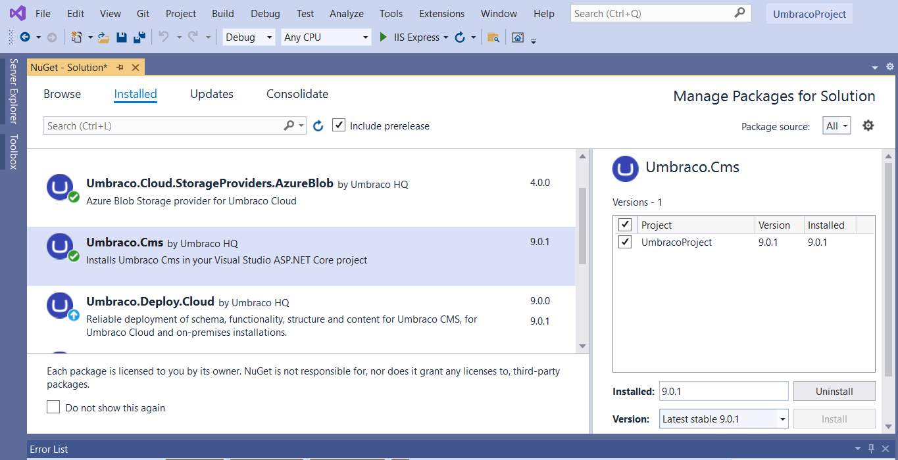
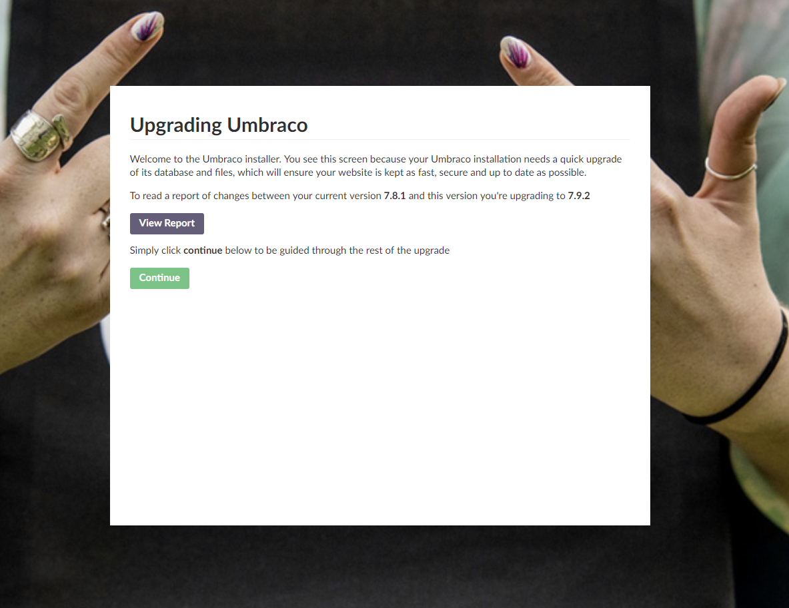

# Manual upgrade of Umbraco CMS

Projects on Cloud will either be automatically upgraded with patch releases or it can be done through the portal when new minors are available.

In rare cases, your project might not be on the latest patch or minor and you will need to upgrade the project manually.

This article will give you a step-by-step on how to manually upgrade your Umbraco Cloud project.

## Prepare for the upgrade

* When upgrading a Umbraco Cloud project manually, the first step is to either [clone down left-most mainline environment to your local machine](../../../../build-and-customize-your-solution/handle-deployments-and-environments/working-locally/) or pull down the latest changes for your left-most mainline environment.
* Navigate to the `/src/UmbracoProject/` folder to find the `.csproj` file.
* Make sure you can run your Cloud project locally and restore content and media. It's important that you check that everything works once the upgrade has been applied and for this, you need to have a clone locally that resembles the Cloud environment as much as possible.

## Get the latest version of Umbraco


If your Cloud project is running **legacy** **Umbraco (version 7 or 8)**, you will need to follow an approach specific to those versions.

Find the steps you need in the [Manual upgrades for legacy Umbraco](manual-cms-upgrade.md#manual-upgrades-for-legacy-umbraco) section.


To get the latest version of Umbraco you will need to upgrade the site using NuGet.

NuGet installs the latest version of the package when you use the `dotnet add package` command unless you specify a package version:

`dotnet add package Umbraco.Cms --version <VERSION>`

After you have added a package reference to your project by executing the `dotnet add package Umbraco.Cms` command in the directory that contains your project file, run `dotnet restore` to install the package.

Alternatively, you can update the CMS through the `NuGet Package Manager` in Visual Studio:



When the command completes, open the `.csproj` file to make sure the package reference was updated:

```xml
<ItemGroup>
  <PackageReference Include="Umbraco.Cms" Version="x.x.x" />
</ItemGroup>
```

<details>

<summary>Manual upgrades for legacy Umbraco</summary>

**Get the latest version of Umbraco**

* [Download the relevant version of Umbraco CMS from Our](https://our.umbraco.com/download/)
* Unzip the folder to your computer
* Copy the following folders from the unzipped folder to your Cloud project folder:
  * `/bin`
  * `/Umbraco`

**Merge configuration files**

In this step, you need to merge the configuration files containing changes. For this, we recommend using a tool like [WinMerge](http://winmerge.org/) or [DiffMerge](https://sourcegear.com/diffmerge/).

The reason you shouldn't overwrite these files is that this will also overwrite any **custom configuration** you might have as well as **Umbraco Cloud-specific settings**. Read more about which Cloud-specific details you should watch out for in the following sections.

**`Web.config`**

When merging the `web.config` file make sure that you **do not overwrite/remove** the following settings:

**`<configSettings>`**

```xml
<sectionGroup name="umbraco.deploy">
    <section name="environments" type="Umbraco.Deploy.Configuration.DeployEnvironmentsSection, Umbraco.Deploy" requirePermission="false" />
    <section name="settings" type="Umbraco.Deploy.Configuration.DeploySettingsSection, Umbraco.Deploy" requirePermission="false" />
</sectionGroup>
```

**`<appSettings>`**

```xml
<add key="umbracoConfigurationStatus" value="7.8.1" />
---
<add key="UmbracoLicensesDirectory" value="~/App_Plugins/UmbracoLicenses/" />
<add key="umbracoVersionCheckPeriod" value="0" />
<add key="umbracoDisableElectionForSingleServer" value="true" />
<add key="Umbraco.Deploy.ApiKey" value="9BEA9EAA7333131EB93B6DB7EF5D79709985F3FB" />
```

**`<connectionString>`**

```xml
<connectionStrings>
    <remove name="umbracoDbDSN" />
    <add name="umbracoDbDSN" connectionString="Data Source=|DataDirectory|\Umbraco.sdf;Flush Interval=1;" providerName="System.Data.SqlServerCe.4.0" />
    <!-- Important: If you're upgrading Umbraco, do not clear the connection string/provider name during your web.config merge. -->
</connectionStrings>
```

**`<umbraco.deploy>`**

```xml
<umbraco.deploy>
    <environments configSource="config\UmbracoDeploy.config" />
    <settings configSource="config\UmbracoDeploy.Settings.config" />
</umbraco.deploy>
```

**`Dashboard.config`**

This section only applies to Umbraco 7 projects.

When merging the `Dashboard.config` file make sure that you **do not overwrite/remove** the following settings:

**Deploy**

```xml
<section alias="Deploy">
    <areas>
    <area>content</area>
    </areas>
    <tab caption="Your workspace">
    <control>/App_Plugins/Deploy/views/dashboards/dashboard.html</control>
    </tab>
</section>
```

**`StartupFormsDashboardSection`**

```xml
<section alias="StartupFormsDashboardSection">
    <areas>
    <area>forms</area>
    </areas>
    <tab caption="Dashboard">
    <control>/App_Plugins/umbracoforms/backoffice/dashboards/licensing.html</control>
    <control>/App_Plugins/umbracoforms/backoffice/dashboards/yourforms.html</control>
    <control>/App_Plugins/umbracoforms/backoffice/dashboards/activity.html</control>
    </tab>
</section>
```

**Do not merge** the following section from the new version of Umbraco:

```xml
<section alias="StartupDashboardSection">
    <access>
    <deny>translator</deny>
    </access>
    <areas>
    <area>content</area>
    </areas>
    <tab caption="Get Started">
    <access>
        <grant>admin</grant>
    </access>

    <control showOnce="true" addPanel="true" panelCaption="">
        views/dashboard/default/startupdashboardintro.html
    </control>

    </tab>
</section>
```

**Other config files**

The following config files contain differences, and in most cases, you need to keep the ones from your Cloud project:

* `/Splashes/noNodes.aspx`
* `trees.config`
* `umbracoSettings.config`

This concludes the steps specific to the legacy Umbraco versions. To continue, follow the steps below.

</details>

## Run the upgrade locally

When you are done updating the NuGet packages as mentioned above, follow these steps to complete the upgrade and verify that everything is working as expected before you push the changes to your Umbraco Cloud project

* Run the project locally
* When the project spins up, you'll be prompted to log in to verify the upgrade
* On the installation screen, you need to verify the upgrade:

<figure><figcaption></figcaption></figure>

* Hit **Continue** - this will complete upgrading the database
* The upgrade will finish up
* When it's complete you will be sent to the Umbraco backoffice

Make sure that everything works on the local clone and that you can **run the project without any errors**.

## Push upgrade to Cloud

Before you deploy the upgraded project to the Cloud, it's important that you check if there are any [**dependencies**](broken-reference) on the new Umbraco version.

If updates are available for Umbraco Forms or Umbraco Deploy then you can upgrade those locally as well, before moving on.

When you've upgraded everything locally, and made sure that everything runs without any errors, you are ready to deploy the upgrade to Umbraco Cloud.

* Stage and commit all changes in Git
* Push the changes to the Cloud environment
* When everything is pushed, head on over to the Umbraco Cloud Portal
* Access the backoffice of the Cloud environment you pushed the upgrade
* You will again be prompted to log in to complete the database upgrade
* You will be sent to the backoffice once the upgrade is complete

Again it's **important** that you make sure everything runs without any errors before moving on to the next Cloud environment.
