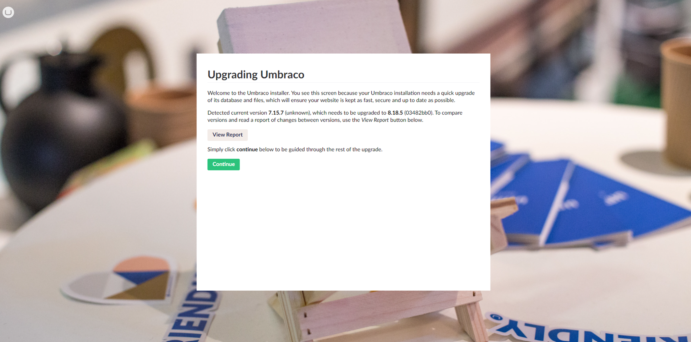

# Migrate from Umbraco 7 to Umbraco 8 on Umbraco Cloud

Taking your Umbraco CMS project from Umbraco 7 to 8 is called a migration as it requires that the data is migrated in the process. This article covers each step involved in this process.

Read the [general article about Content migration](https://docs.umbraco.com/umbraco-cms/fundamentals/setup/upgrading/version-specific/migrate-content-to-umbraco-8#what-are-the-limitations) to learn more about limitations and other things related to migrating your Umbraco site from 7 to 8.

## Video tutorial

You can find the full playlist here: [Migrate an Umbraco Cloud project from 7 to 8](https://www.youtube.com/playlist?list=PLgX62vUaGZsGceCXveMkprlDV5a3K94db)

## Prerequisites

* A Umbraco 7 Cloud project running **the latest version of Umbraco 7**.
* Make sure Umbraco Forms data is not handled as content.
  * See [Umbraco Forms on Cloud](../../../../expand-your-projects-capabilities/cloud-extensions/umbraco-forms-on-cloud.md#how-forms-are-handled-on-umbraco-cloud) for more details on how to check the setting.
* A clean Cloud project running the latest version of Umbraco 8 with **at least 2 environments**.


We strongly recommend having at least 2 environments on the Umbraco 8 project.

Should something fail during the migration, the Development environment can always be removed and re-added in order to start over on a clean slate.


## Step 1: Content migration

1. Clone down the Umbraco 7 Cloud project.
2. Run the project locally and **restore** Content and Media.
3. Clone down the Development environment from the Umbraco 8 Cloud project.


We recommend setting up the Umbraco 8 Cloud portal locally in Visual Studio.

This can be done after cloning down the Cloud environment or by using the [UaaS cloning tool](https://umbra.co/uaas-cmd).

To use the cloning tool, place it and run it in the local directory you want to clone the Cloud project into.


4. Install the [ProWorks Umbraco 8 Migrations](https://www.nuget.org/packages/ProWorks.Umbraco8.Migrations) community package on the cloned Umbraco 8 site.
5. Copy `~/App_Data/Umbraco.sdf` or `~/App_Data/Umbraco.mdf` from the cloned Umbraco 7 project.
6. Paste the file into `~/App_Data` on the clone of the Umbraco 8 project.
7. Open `web.config` from the Umbraco 8 project.
8. Locate the `Umbraco.Core.ConfigurationStatus` key.
9. Replace the value with the version your Umbraco 7 project is running.
10. Run the Umbraco 8 project locally
11. Authorize the migration - Cloud credentials are used for this.



12. Click **Continue** to start the migration.
13. Log in to the backoffice and verify that everything is there once the migration is complete.


If your login does not work, try the following approach:

Copy the `UsersMembershipProvider` attributes from your Umbraco 7 `web.config` file to the Umbraco 8 `web.config` file. Once you've done this, try to login again.

Below is an example of how the attribute can look:

```xml
<add name="UsersMembershipProvider" 
     type="Umbraco.Web.Security.Providers.UsersMembershipProvider, Umbraco" 
     minRequiredNonalphanumericCharacters="0" 
     minRequiredPasswordLength="8" 
     useLegacyEncoding="true" 
     enablePasswordRetrieval="false" 
     enablePasswordReset="true" 
     requiresQuestionAndAnswer="false" 
     passwordFormat="Hashed" />
```



Please be aware that this is **only a content migration**.

The database will be migrated, but updating view files, custom code, and implementation is a manual process.

See [Step 3](migrate-from-umbraco-7-to-8.md#step-3-setup-custom-code-for-umbraco-8) of this guide, for more detail on this.


## Step 2: Files migration

Before moving on to the next step, make sure that the Umbraco 8 project is no longer running.

The following files/folders need to be copied into the Umbraco 8 project:

* `~/Views` - do **not** overwrite the default Macro and Partial View Macro files, unless changes have been made to these.
* `~/Media`
* Any files/folders related to Stylesheets and JavaScripts.
* Any custom files/folders the Umbraco 7 project uses, that aren't in the `~/Config` or `~/bin`.
* `~/App_Data/UmbracoForms` - in the case Umbraco Forms was used on the Umbraco 7 site.

Merge the configuration files carefully to ensure any custom settings are migrated while none of the default configurations for Umbraco 8 is overwritten.

### Generating UDA files

1. Run the Umbraco 8 project locally
   * It **will** give you an error on the frontend as none of the Template files have been updated yet.
2. Open the command line tool in the `~/data` folder on the Umbraco 8 project.
3. Generate UDA files by running the following command: `echo > deploy-export`.
   * Once a `deploy-complete` marker is added to the `~/data` folder, it is done.
4. Check `~/data/revision` to ensure all the UDA files have been generated.
5. Run `echo > deploy` in the `~/data` folder to make sure everything checks out with the UDA files that were generated.

Running the `echo > deploy` command will generate a new marker. Move forward with the migration based on the marker:

* `deploy-failed`
  * Something failed during the check
  * Run `echo > deploy-clearsignatures` followed by `echo > deploy` to clear up the error
* `deploy-complete`
  * Everything checks out: Move on to the next step

## Step 3: Setup custom code for Umbraco 8

Umbraco 8 is different from Umbraco 7 in many ways. This means that in this step, all custom code, controllers, and models need to be reviewed and rewritten for Umbraco 8.

### Example of changes that need to be made

One of the changes made, is how published content is rendered through Template files. Due to this, it will be necessary to update **all** Template files (`.cshtml`) to reflect these changes.

Read more about these changes in the [IPublishedContent section of the Documentation](https://docs.umbraco.com/umbraco-cms/reference/querying/ipublishedcontent).

* Template files need to inherit from `Umbraco.Web.Mvc.UmbracoViewPage<ContentModels.HomePage>` instead of `Umbraco.Web.Mvc.UmbracoTemplatePage<ContentModels.HomePage>`.
* Template files need to use `ContentModels = Umbraco.Web.PublishedModels` instead of `ContentModels = Umbraco.Web.PublishedContentModels`.
* `@Model.Value("propertyAlias")` replaces `@Umbraco.Field("propertyAlias")`.
* `@Model.PropertyAlias` replaces `@Model.Content.PropertyAlias`.
* `@Model.Value<IPublishedContent>("propertyAlias")` replaces `Model.Content.GetPropertyValue<IPublishedContent>("propertyAlias")`.

Depending on the size of the project and the amount of custom code and implementations, this step is going to require a lot of work.

## Step 4: Deploy and test on Umbraco Cloud

Once the Umbraco 8 project runs without errors on the local setup, the next step is to deploy and test on the Cloud Development environment.

1. Push the migration and changes to the Umbraco Cloud Development environment


The deployment might take a bit longer than normal.

To track the process, keep an eye on the deploy markers in `site/wwwroot/data` using KUDU.


2. Progress through the steps based on the deployment result:
   * `deploy-failed`: Run `echo > deploy-clearsignatures` followed by `echo > deploy` to clear up the error.
   * `deploy-complete`: The Development environment has been upgraded.
3. Transfer Content and Media from the local clone to the Development environment.
4. Test **everything** on the Development environment.
5. Deploy to the Live environment.

## Step 5: Going live

Once the migration is complete, and the Live environment is running without errors, the site is almost ready for launch.

1. Setup rewrites on the Umbraco 8 site.
2. Assign hostnames to the project.
   * Hostnames are unique, and can only be added to one Cloud project at a time.

## Related information

* [Content Migration for Umbraco CMS - 7 to 8](https://docs.umbraco.com/umbraco-cms/fundamentals/setup/upgrading/version-specific/migrate-content-to-umbraco-8)
* [Issue tracker for known issues with Content Migration](https://github.com/umbraco/UmbracoDocs/issues)
* [Forms on Umbraco Cloud](../../../../expand-your-projects-capabilities/cloud-extensions/umbraco-forms-on-cloud.md)
* [Working locally with Umbraco Cloud](../../../../build-and-customize-your-solution/handle-deployments-and-environments/working-locally/)
* [KUDU on Umbraco Cloud](../../../../monitor-and-troubleshoot/power-tools/)
