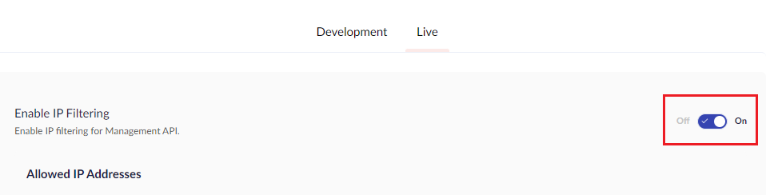
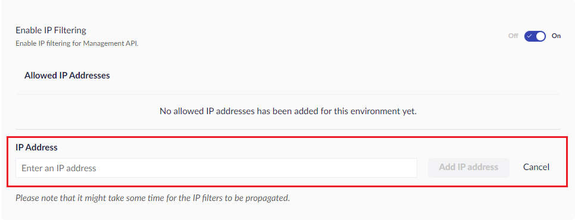

# Management API Security


This is a beta feature. Enabling this feature might have other side effects for your Umbraco Cloud project.


Management API Security lets you secure access to the back-end services of your Umbraco Cloud project.

When enabled, the following domains will be protected by an IP filter:

* Git Domains: Used for version control and deployment processes, identified by the _\*.git_ suffix.
* Scm Domains: Used for additional back-end service operations, such as builds and deployment management. They follow the _your-project-alias.regional-identifier.scm.umbraco.io_ pattern.

If the IP address is not whitelisted, these domains will not be accessible.

## How to enable Management API IP filter and allow IPs

1. Go to **Management API Security** under the **Security** tab.
2. **Enable IP Filtering** for Management API on the project.

3. Once enabled, add **IP Address** for users that need access to the Management API of your project.

After **IP Filtering** has been enabled, users with IPs not added to the allowlist will be denied access to the Management API.
