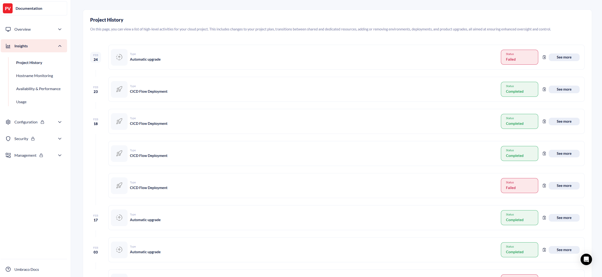
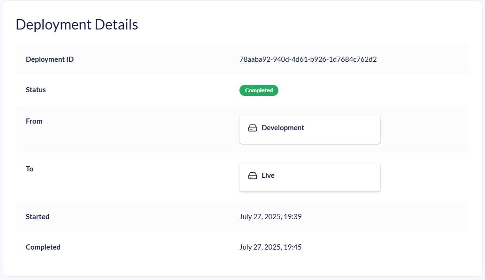
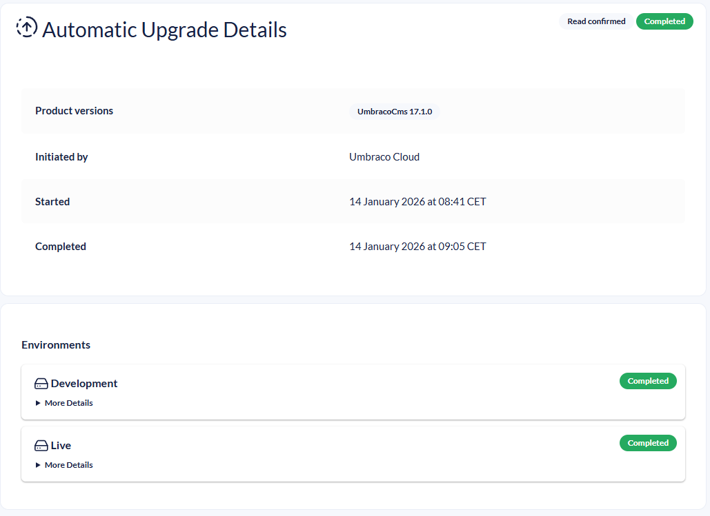
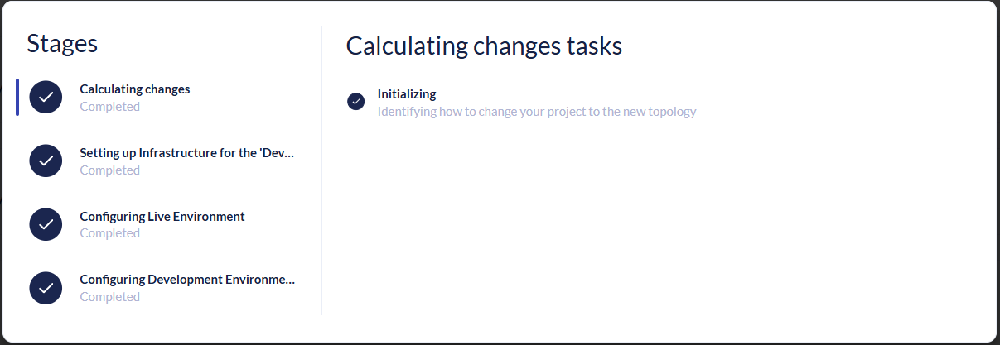

# Project History

The Project History page shows details about the following changes to your project:

* Deployments and CI/CD flow deployments.
* Pulling and pushing changes between a flexible environment and it's mainline environment.
* Adding or removing environments.
* Project plan changes.
* Transitions between shared and dedicated resources.
* Database restores.
* Product upgrades (manual and automatic).

This is to provide you with better oversight and control over your project.

<figure><figcaption>
Project History page
</figcaption></figure>

For each activity, you can see the following information:

* The type of activity
* Information about the activity
* Who started the activity
* When the activity was started
* When the activity ended
* The status of the activity (In Progress, Completed, or Failed)

You can copy the activity ID to your clipboard using the clipboard icon on each entry. This is useful when contacting support.

## Viewing Activity Details

To get a detailed view of an activity, click the button on the right side of the entry.

For deployments, CI/CD flow deployments, pull/push operations, and upgrades, clicking **See more** opens a detail page with logs, timestamps, and error information.

<figure><figcaption>
Deployment details
</figcaption></figure>

For upgrades, clicking **See more** redirects to an Upgrade Details page where you can see details about how the upgrade went.

<figure><figcaption>
Upgrade details
</figcaption></figure>

Click **See activity** to view a dialog showing the stages and tasks for environment changes, plan updates, resource moves, or database restores.

<figure><figcaption>
Activity details dialog
</figcaption></figure>
