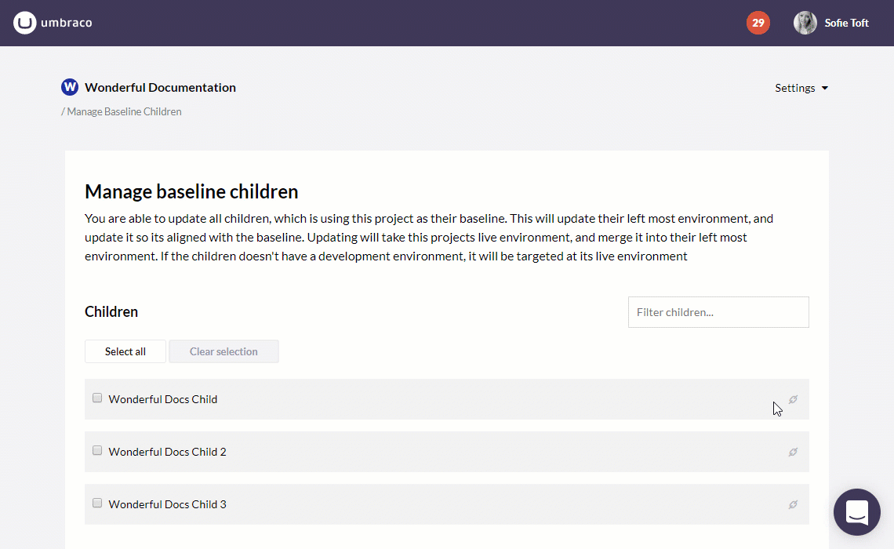
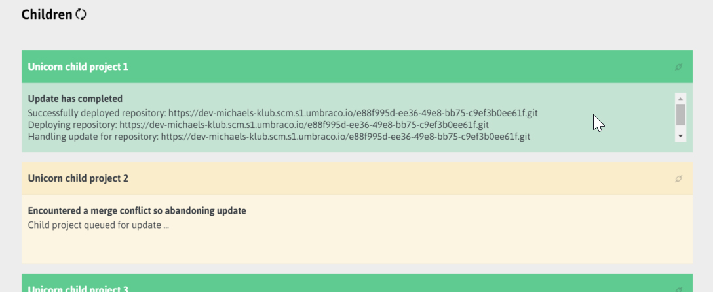
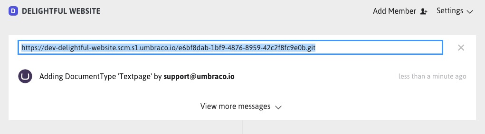
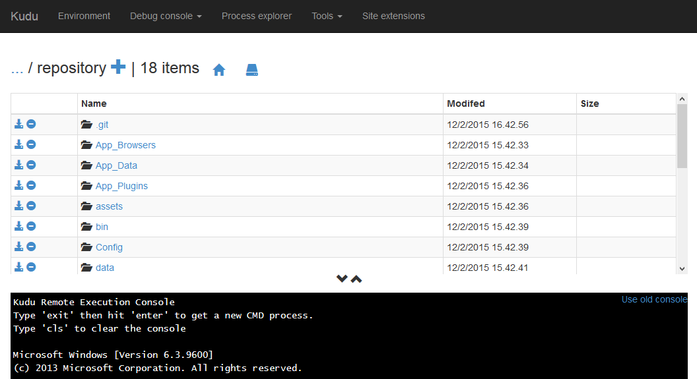

# Baseline Merge Conflicts

This section outlines how to manually resolve a merge conflict after having updated the children for a Baseline project.

On a Baseline project, click _Manage updates here_. This enables you to push updates to your child projects from the Live environment of the Baseline project.



Select the child projects you want to upgrade, and click **Update selected children**. The overview will then change to show the progress and status for updating the different child projects.

The outcome of the update will result in one of three statuses:

* Updated has completed
* Error while updating from upstream
* Encountered a merge conflict so abandoning update

A merge conflict needs to be handled manually to push future updates to the child project, which encountered a merge conflict upon updating.



## Resolving merge conflicts

**Note:** Since the following documentation was outlined there have been a few improvements to the Baseline workflow. For the most part this documentation is still relevant and we are working on getting them updated with the latest details.

To resolve the conflict you need to go to the **child site** open up the Source Control Management (SCM)/Kudu site for the development environment. Click the “[link]” for the project (see screenshot above) and find clone URL for the development site, similar to `https://dev-my-website-alias.scm.umbraco.io/c565ead8-7a27-4696-9ab4-dad7eba2cd2c.git`. Remove everything after the last slash, so you have a URL that looks like `https://dev-my-website-alias.scm.umbraco.io`.



You will be prompted to login to the SCM/Kudu site - use the credentials you normally use to login to the Umbraco Cloud portal. Now click “Debug console” from the top menu and select “CMD”. This will take you to a command line interface from where you need to navigate to the repository folder: site / repository



From here you need to merge the `upstream/master` branch, which contains the updates which were fetched from the Baseline project. In the console enter: `git merge upstream/master`

This will result in an output showing the files, which contains conflicts that you need to resolve in order to fully merge the two branches:

```cs
Auto-merging data/Revision/properties/77279e39-ed1f-428a-ad7e-258db5f9e6ee.courier
CONFLICT (content): Merge conflict in data/Revision/properties/77279e39-ed1f-428a-ad7e-258db5f9e6ee.courier
Auto-merging data/Revision/documents/77279e39-ed1f-428a-ad7e-258db5f9e6ee.courier
CONFLICT (content): Merge conflict in data/Revision/documents/77279e39-ed1f-428a-ad7e-258db5f9e6ee.courier
Automatic merge failed; fix conflicts and then commit the result.
```

In the above output, two files are listed. Pick the ones that comes from the current project (the child). In other words, keep our files, as these are content changes. Use the following commands to achieve that:

```cs
git checkout --ours data/Revision/properties/77279e39-ed1f-428a-ad7e-258db5f9e6ee.courier

git checkout --ours data/Revision/documents/77279e39-ed1f-428a-ad7e-258db5f9e6ee.courier
```

_Note_: To select the files from the Baseline project instead of the ones from the current project, use “--theirs” instead of “--ours” in the command. “Ours” corresponds to the current project (the development site) and “Theirs” corresponds to the Baseline project.

Now you need to add the (modified) files to Git and finally commit the changes using the following commands:

```cs
git add .
git commit -m “Resolving merge conflicts”
```

The merge conflict has now been resolved, and you can update your local repository with the latest changes by pulling from the development site. The changes from the commit haven’t been deployed to the website yet, as we have only applied the changes to the Git repository. To deploy the recent changes to the website, push your local changes to the development site or use the Kudu API to trigger a deployment. You can use the following command from the Kudu Debug Console to deploy the latest changes:

```cs
curl https://dev-my-website-alias.scm.s1.umbraco.io/api/deployments -X PUT -H "Content-Type: Application/json" --data "{ }" --user yourusername:password
```

If you prefer to use the Kudu REST API for triggering a deployment, you can find the details here: [https://github.com/projectkudu/kudu/wiki/REST-API#deployment](https://github.com/projectkudu/kudu/wiki/REST-API#deployment)
