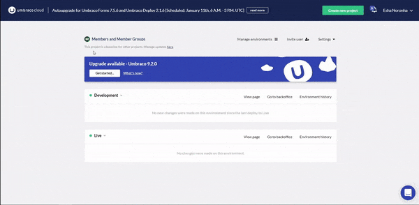

# Break Reference between Baseline and Child Project

Umbraco Cloud Portal offers a powerful baseline-child relationship between projects. A Baseline Child project is similar to a Fork (forked repository) on GitHub. We create a clone of an existing project while maintaining a connection between the two projects.

If, at some point, you wish to sever the connection between the baseline and one of its child projects, you can do so. This action is possible with admin privileges.


Kindly be aware that this action cannot be undone.


From this page, you can break the connection of all the Child Projects this Baseline project has.

To break reference between a baseline and child project:

1. Go to the Baseline project on the Cloud portal.
2. Click on Manage updates **here**.
3. Click on the  icon in the **Manage child projects** page.
4. A window with the consequences of the action is displayed.
5. Check all the boxes after reading and understanding the consequences mentioned.
6.  Click **Disconnect**.

    
