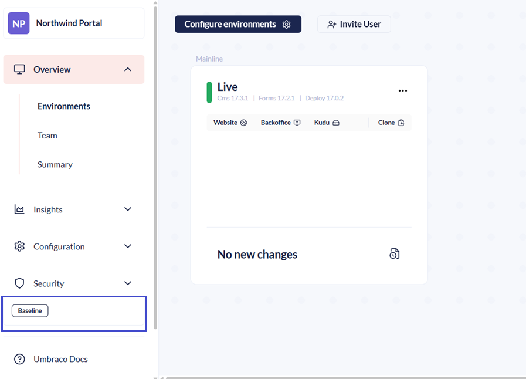
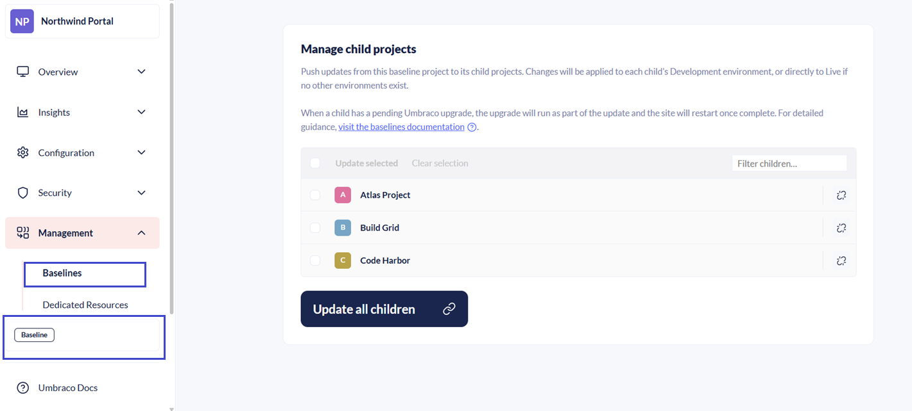

# Pushing Upgrades to a Child Project

When a Baseline project has one or more Child projects, a **Baseline** label appears at the bottom of the left-side menu. Click it to go to the **Manage child projects** page.

You can also access this page via **Management** > **Baselines** in the left-side menu.

From here, you can see all Child projects connected to this Baseline project, and push updates to any or all of them.

Before pushing upgrades to Child projects, run the upgrade on the Baseline project itself.

Follow the upgrade guides for [Minor](../../../manage-product-upgrades/product-upgrades/minor-upgrades.md) and/or [Major](../../../manage-product-upgrades/product-upgrades/major-upgrades.md) upgrade notes to upgrade your Baseline project.

Once the upgrade has been verified on the Baseline project, follow the steps in the sections below to push the upgrade to the Child projects.



Set up a Development environment on your Child projects before deploying updates.

A Development environment gives you a place to test and verify that everything deployed correctly.

Once you are happy with the Development environment, deploy it to the Live environment.



## Upgrading Child Projects to a New Major Version



If you completed version-specific steps when upgrading the Baseline project, apply those same steps to the Child projects before pushing the upgrade.



1. Go to the Child projects you are upgrading.
2. Go to **Configuration** > **Advanced**.
3. Match the **.NET version** under **Runtime Settings** with the major version you are upgrading to.
4. Go to the Baseline Project.
5. Click the **Baseline** label at the bottom of the left-side menu.
   * Alternatively, go to **Management** > **Baselines**.
6. Select the Child Projects you want to push your upgrades to.
7. Click **Update selected** or **Update all children**.
8. Click **Update children** once the selection looks correct.

If the upgrade has been completed successfully, the Child Projects will be displayed under the **Successful Updates/upgrades** section.

## Deploying Minor Upgrades to Child Projects

1. Go to the Baseline project.
2. Click the **Baseline** label at the bottom of the left-side menu.
   * Alternatively, go to **Management** > **Baselines**.
3. Select the projects you want to upgrade.
4. Click **Update selected** or **Update all children**.

First, any pending changes made on the Baseline will be deployed to the Child project.

Once the changes have been deployed, the Child project will be upgraded to the same version as the Baseline project.


All CMS and Commercial products will be upgraded.


Clicking the Upgrade button starts an update that applies all files from the Baseline to the Child projects.

Once the files are in place, the upgrade process runs to ensure the Child projects are fully upgraded.

When using this feature, the Baseline Child projects must be set up following the [best practices for handling config files](configuration-files.md). This means that any changes to the Child project should be applied via a config transform file.

Child project config files are merged by choosing the parent's config files first. This ensures that config file changes from the minor upgrade are also applied to Child projects.

## Errors While Upgrading Child Projects from a Baseline

If the upgrade of a Child project fails or leaves the project in a bad state, the Child project likely could not be merged properly.

When updating Child projects from a Baseline, the Child project configuration takes precedence over the Baseline configuration. The configuration file may not change when the update runs.

Follow the flow shown in [Handling configuration files](configuration-files.md). It prevents Child projects from overwriting configuration files and ensures the best flow between the Baseline and Child projects.

If the flow is not used, the repository will have updated code but outdated configuration files. Fix the outdated files by manually comparing the configuration files on the Baseline and Child project. Make sure all changes from the Baseline are applied to the Child project's configuration files.
