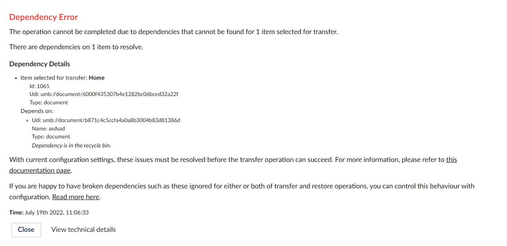
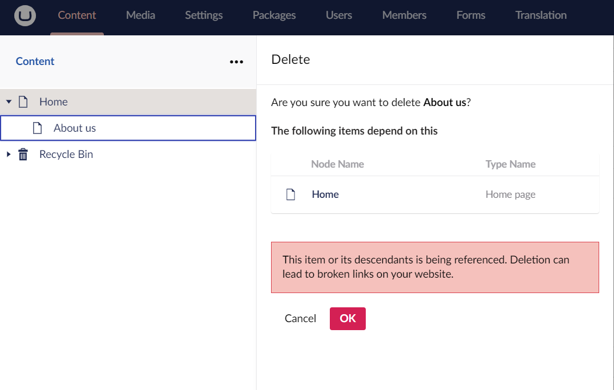

# Dependency Exception

Deleting a content node that references a deleted content node, will give you the following error when trying to transfer the node:

The error indicates that on the `Home page`, a picker, for example, refers to another content item. This other content item has either been deleted or is in the recycle bin in the environment you're deploying from.


If you try and delete a node that references another one, you will be warned in the backoffice that it has a reference and you might encounter issues if you delete it: 


## How to fix your dependency error

To resolve the issue, find the Contact page (hint: the nodeId can be used in the search field in the top-right of the backoffice) and publish it again. This should remove the reference to the node that is no longer available. Transferring the Contact page node should now succeed.
