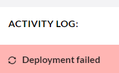

# Troubleshooting deployments failing with no error message

This error might pop up if your project's files were recently upgraded/updated to the latest version. Any deployment you try will end up failing instantly.

## Cause

This error is caused by leftover upgrade markers interfering with the Deploy process. This might happen if your environment was restarted during the upgrade, or the upgrade process encountered some issues.

## Fixing

In order to fix this issue, you would need to use [KUDU](../../power-tools/) to remove the leftover marker files.

1. Access KUDU on the source environment (the one you are deploying from)
2. Navigate to `site` > `locks` folder
3. In the folder, there should be a file named `upgrading`, `upgrade-failed` or `failed-upgrade`. Remove these files.
4. Repeat the operation on the target environment - it might also have the leftover marker

Once the leftover marker files are removed, your deployments should go through without problems.
