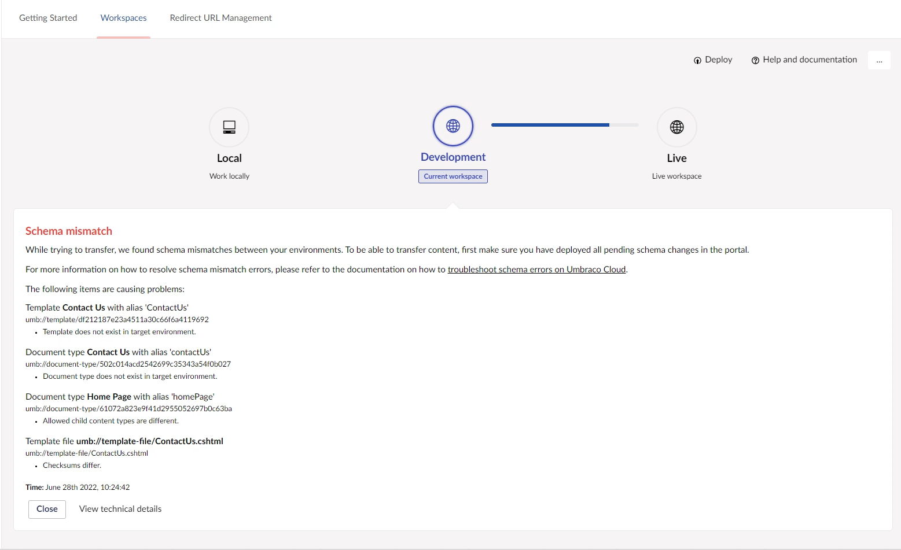

# Schema Mismatches

When transferring or restoring content between two Umbraco Cloud environments, you might run into Schema mismatch errors. These usually occur when the schema isn't in sync between the source environment and the target environment. Schema refers to Document Types, Media Types, Data Types, Templates, and Dictionary items.

In this article, you can learn how to resolve schema mismatch issues and how you can avoid them in the future.

## Video Tutorial


How to fix Schema mismatches


## Step-by-step

When you run into schema mismatch errors, they will usually look something like this:

In this error message, you can see exactly which schema mismatch(es) is preventing the content transfer/restore.

To resolve this error, check for pending deployments on the source environments. If you are working locally, push any changes that have not been committed through Git. If you are transferring between two Umbraco Cloud environments, you can see and deploy pending changes through the Umbraco Cloud Portal.

If there are no pending deployments in your source environment, there are two ways to go about resolving the schema mismatch:

1. Make a minor change to the schema with mismatches in the source environment (in the example above, it would be the **Contact Us** Document Type).
2. Deploy the change to the next environment.
   * This will update your schema in the target environment and ensure it is in sync with the source environment.

If the mismatches involve differences in the `aliases` or `names`, changing these manually on the target environment will enable you to transfer your content.
