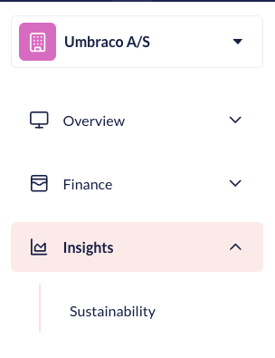

# Sustainability Dashboard

The Sustainability Dashboard helps you monitor and reduce the environmental impact of your websites on Umbraco Cloud. You can use it to track CO2 emissions for your projects and align your digital presence with your sustainability goals.

## Key Features

* **Monthly CO2 emission data**: The dashboard reports CO2 emissions per month. A month's data becomes available a few weeks after the month ends.
* **Historical trends**: The dashboard tracks emissions over time, so you can review monthly and yearly trends.
* **Per-component breakdown**: You can see which Azure resources contribute to your emissions.
* **Comparative analysis**: You can compare emissions across your projects to find high-impact areas.
* **Date range selection**: You can choose the period to report on. The dashboard defaults to the current year to date.
* **CSV export**: You can download the emission report as a CSV file.

## CO2 emission calculation methodology

The dashboard reports CO2 emissions based on Microsoft's reported emissions data from Azure Carbon Optimization. Microsoft reports the emissions for the Azure resources that host your websites. Umbraco Cloud attributes those emissions to your projects and environments.

The emissions are reported as carbon dioxide equivalent (CO2e). The data covers Scope 1, Scope 2, and Scope 3 emissions.

### Covered resources

The dashboard includes emissions from the following Azure resource types:

* App Service
* SQL Database
* SQL Elastic Pool
* Storage Account
* Key Vault

### Shared resource attribution

Some Azure resources are shared between websites. Umbraco Cloud divides the emissions of a shared resource across the websites that use it:

* Emissions from a SQL Elastic Pool are divided across the databases in the pool.
* Emissions from a shared App Service Plan are divided across the websites on the plan.
* Emissions from storage are divided across the websites in the subscription.

These attributed values are approximations. Azure reports the emissions at the shared-resource level, not per website.

### What is not included

The dashboard reports emissions from the Azure infrastructure that hosts your websites. It does not include:

* Network traffic and data transfer
* Frontend or visitor-side impressions
* Emissions from the Umbraco Cloud platform itself


Data from before Azure Carbon Optimization was available is derived from the previous calculation method. Trends across that change might not be directly comparable.


## Getting Started

### Accessing the Dashboard

1. Log in to [Umbraco Cloud](https://s1.umbraco.io/): Use your credentials to log in to your Umbraco Cloud account.
2. Navigate to the [Organization view](https://s1.umbraco.io/organization).
3. Navigate to the Dashboard: From the left menu, open the **Insights** category and select **Sustainability**.

<figure><figcaption></figcaption></figure>

### Using the Dashboard

From the dashboard you can:

* Select a date range to report on. The dashboard defaults to the current year to date.
* Sort the project table by emissions to find your highest-impact projects.
* Expand a project to see its per-component breakdown.
* Download the report as a CSV file.

### Decreasing Carbon Emission Impact

* Monitor Regularly: Regularly check the Sustainability Dashboard to stay informed about your website's carbon footprint.
* Implement Recommendations: Follow up to date [sustainability best practices](https://docs.umbraco.com/sustainability-best-practices).
* Optimize Resource Usage: Analyze your website's resource usage and optimize high-consumption areas.
