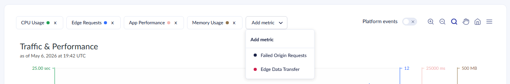
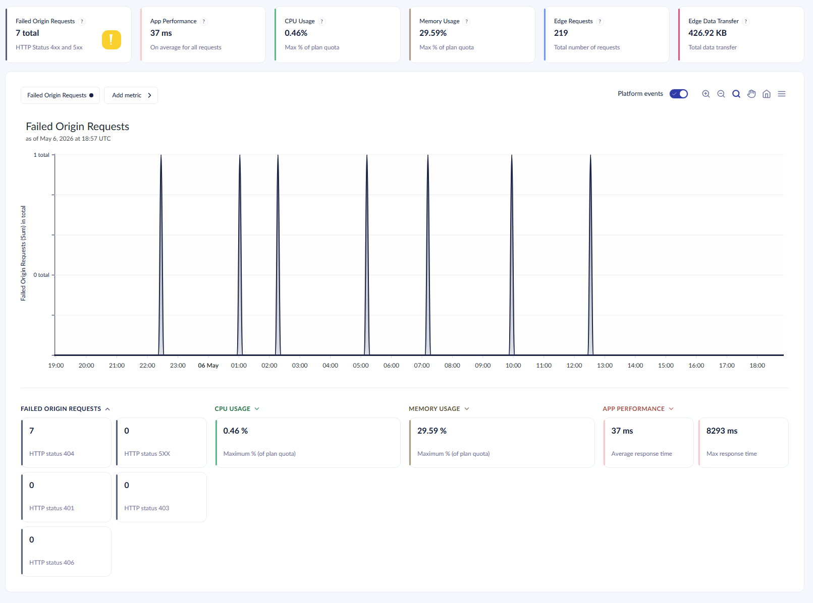
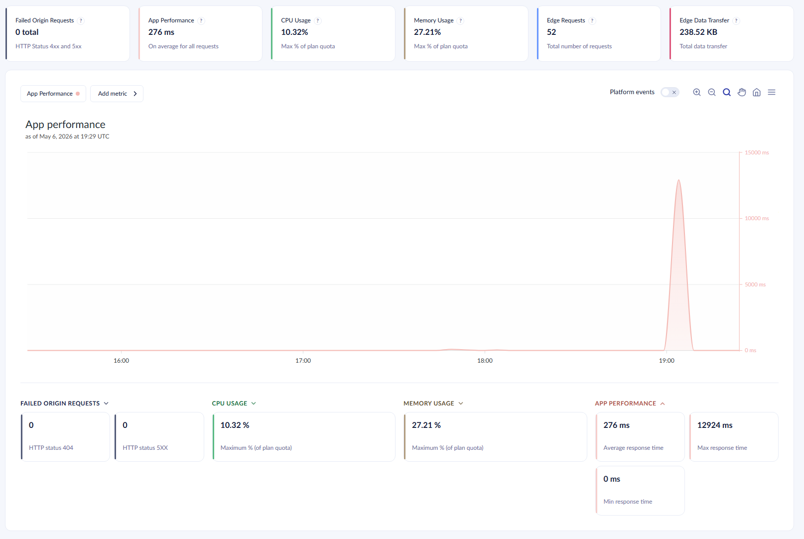
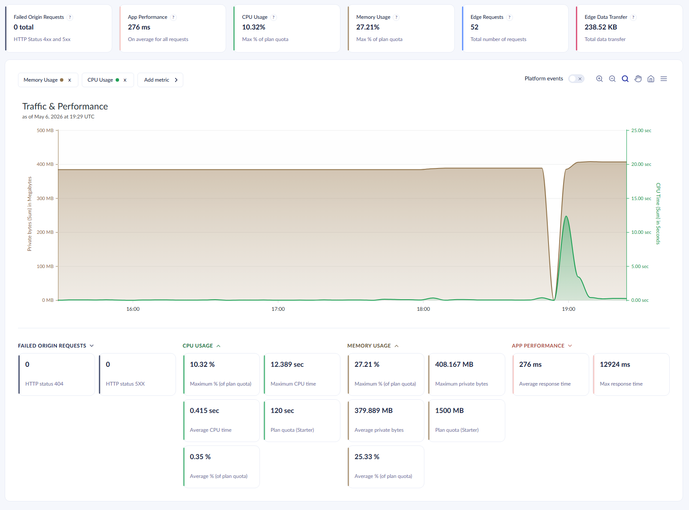
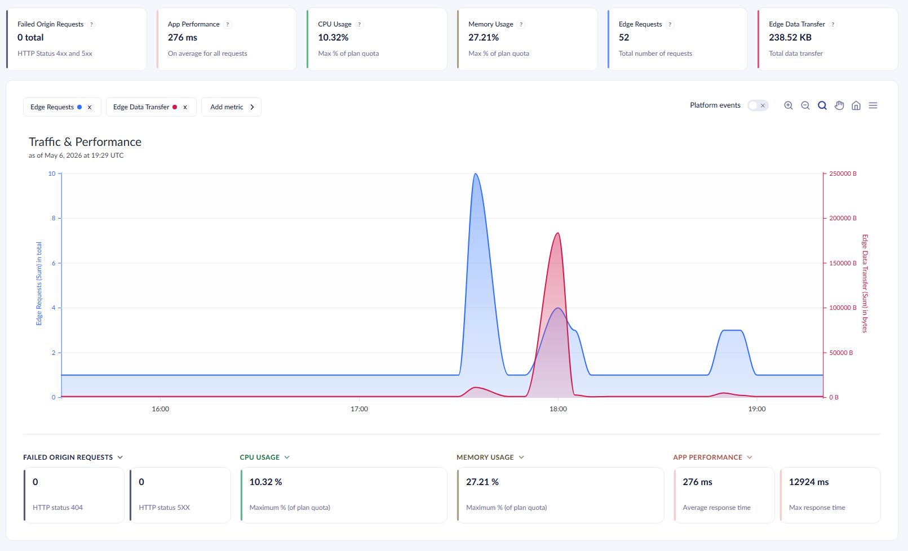
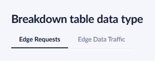

# Traffic and Performance

**Traffic & Performance** combines Azure application metrics with Cloudflare edge analytics. You get a complete picture of your cloud project's health and traffic patterns. The page lets you monitor HTTP traffic, response times, resource usage, and detailed traffic breakdowns — helping you identify and resolve issues that impact user experience.

## Overview

The page is made up of the following sections:

* [Time range, environment, and hostname selectors](#time-range-environment-and-hostname-selectors)
* [Performance overview tiles](#performance-overview-tiles)
* [Dataset selector and chart](#dataset-selector-and-chart)
* [Traffic breakdown tables](#traffic-breakdown-tables)
* [Edge data granularity](#edge-data-granularity)
* [Edge data limitations](#edge-data-limitations)

<figure><figcaption><p>The Traffic & Performance page.</p></figcaption></figure>

## Time Range, Environment, and Hostname Selectors

At the top of the page, you will find controls that determine which data is displayed.

### Time Range

The default view shows data for the **last 24 hours** with data points every 5 minutes. See the [Edge Data Granularity](#edge-data-granularity) section for the edge analytics granularity table.

You can change the time range to a predefined interval or define a specific start and end time.


### Environment

Use the environment dropdown to select which environment (for example, Live, Staging, or Development) to view metrics for.

### Hostname Selector

The hostname selector lets you pick one or more custom hostnames associated with your project. Selecting at least one hostname **enables edge analytics** — the Requests and Data Transfer tiles, edge metrics on the chart, and the traffic breakdown tables.


Edge analytics data is only available when at least one hostname is selected.


## Performance Overview Tiles

The overview section shows summary tiles for key metrics. There are up to six tiles in total. Four application metric tiles are always visible. Two-edge metric tiles appear when hostnames are selected.


Each tile includes relevant statistics and potentially a warning or an error indicator in case there is something you might want to consider.

### Application Metric Tiles

#### Failed Requests

Displays the total count of HTTP 4xx and 5xx responses.

* **Error indicator** appears when one or more HTTP 5xx (server error) responses occur.
* **Warning indicator** appears when HTTP 4xx client errors exist, but there are no server errors.

#### App Performance

Displays the average response time in milliseconds across all requests.

#### CPU Usage

Displays CPU time consumed.

* **Shared plans**: Shown as a percentage of your plan quota. An orange warning appears when the maximum CPU usage exceeds **80%** of the plan quota within a 5-minute period. A red error appears when the maximum CPU exceeds **100%**.
* **Dedicated plans**: Shows average CPU time.

#### Memory Usage

Displays private bytes (memory) consumed.

* **Shared plans**: Shown as a percentage of your plan quota. An orange warning appears when maximum private bytes exceed **80%** of the plan quota within a 5-minute period. A red error appears when maximum private bytes exceed **100%**.
* **Dedicated plans**: Shows average private bytes in MB.


CPU and Memory warning/error indicators only display for shared plans.


### Edge Metric Tiles

These tiles appear when you have selected one or more hostnames in the hostname selector.

#### Requests

Displays the total number of HTTP requests hitting your site through Cloudflare's edge network.

#### Data Transfer

Displays the total data transferred from your site through the edge. High values may indicate large media files or heavy traffic.

## Dataset Selector and Chart

### Dataset Selector



Above the chart, a pill-based selector lets you choose which metrics to display. You can:

* Click a pill to remove a metric from the chart.
* Click **Add metric** to add additional metrics.
* Display multiple metrics simultaneously on the same chart for comparison.

Available metrics include:

* Four application metrics — Failed Requests, App Performance, CPU Usage, and Memory Usage.
* Two edge metrics (when hostnames are selected) — Requests and Data Transfer.

At least one metric must always be selected.

The chart also shows [platform and CMS events](#platform-and-cms-events), making it convenient to see how different events impact performance.

### Chart

The chart displays an interactive line graph of the selected metrics over the chosen time range.

#### Failed Requests

The chart shows the breakdown of HTTP status codes for each data point with the selected granularity. Only responses indicating a client (4xx region) or server errors (5xx region) are shown.



In the statistics tiles under the graph, you will find the total instances of the status code in the time range.

#### App Performance

The chart shows the average response time during the selected time range. All requests to the Umbraco solution in the time periods with the length of the selected granularity count to the average response time.



The statistics tiles show the average, maximum, and minimum response for the shown data points.

#### CPU Usage

The chart depicts the CPU time consumed by the application in the selected time range with time periods equaling the selected granularity.

Cloud projects with shared resources and a granularity of 5 minutes will display assigned CPU time in seconds, along with a comparison to [plan quota](https://docs.umbraco.com/umbraco-cloud/getting-started/umbraco-cloud-plans).

For shared plans at 5-minute granularity, the statistics tiles show the following:

* The maximum CPU time
* The average CPU time
* The plan quota
* The maximum and average percentage of the consumed CPU in a 5-minute period compared to the plan quota.

For Cloud projects on dedicated options, or shared plans at other granularities, you see the average assigned CPU time in seconds. The statistics panel displays the maximum, average, and minimum CPU time based on the selected granularity.

#### Memory Usage

The chart shows the memory usage in private bytes consumed by the application in the selected time range with time periods equaling the selected granularity.



Cloud projects utilizing shared resources with a granularity of 5 minutes will display the allocated private bytes in megabytes (MB). The chart also displays a comparison against the [plan quota](https://docs.umbraco.com/umbraco-cloud/getting-started/umbraco-cloud-plans).

For Cloud projects with dedicated options, or shared plans at other granularities, you see the average assigned private bytes displayed in bytes. The statistics tiles below display the maximum, average, and minimum allocation of private bytes based on the selected granularity.

#### Edge Requests

The chart depicts the number of HTTP requests served through Cloudflare's edge network for the selected hostnames in the selected time range.

The [Traffic Breakdown Tables](#traffic-breakdown-tables) section further down the page shows a more detailed view of edge traffic, broken down by status code, cache status, HTTP version, path, host, and data center.

#### Edge Data Transfer

The chart depicts the amount of data (in bytes) transferred through Cloudflare's edge network for the selected hostnames in the selected time range.



The [Traffic Breakdown Tables](#traffic-breakdown-tables) section below details edge data transfer, categorized by status code, cache status, HTTP version, path, host, and data center.

#### Chart Toolbar

The chart toolbar provides the following controls:

* **Platform events toggle** — Show or hide deployment events, restarts, and other platform events as vertical annotations on the chart.
* **Zoom in / Zoom out / Reset zoom** — Adjust the chart zoom level.
* **Selection zoom** (default) — Click and drag to zoom into a specific area.
* **Pan mode** — Click and drag to move across the chart.
* **Export** — Download the chart as SVG, PNG, or CSV.

#### Platform and CMS Events

The charts are enhanced with platform events like restarts, automatic and manual upgrades, environment-to-environment deployments, and plan changes.

These events help you correlate performance changes with deployments and other project activity.

By utilizing the `Umbraco.Cloud.Cms` package, the platform tracks the **hot** and **cold** boots of your Umbraco environment on Cloud.

<figure><figcaption><p>Hot and Cold boot.</p></figcaption></figure>

Learn more about the difference between [Hot vs. Cold restarts](https://docs.umbraco.com/umbraco-cms/reference/notifications/hot-vs-cold-restarts).

The package is installed on all environments running Umbraco 10, 13, and 14 on Umbraco Cloud. The package will be part of new Cloud projects on upcoming versions of Umbraco CMS.


Only installations running in Umbraco Cloud are tracked. The following data is recorded:

* Environment identifier
* Timestamp
* The Umbraco version
* Boot mode, like "warm" or "cold" boot

The telemetry is not sent if you are running a cloned environment on your local machine.



You can disable Hot/Cold boots tracking on your Umbraco Cloud Project by adding `Umbraco:Cloud:DisableBootTracking` and set to true in the `appsettings.json` file.

```json
"Umbraco":{
  "Cloud": {
    "DisableBootTracking": true
  }
}
```

You can also remove the reference to the `Umbraco.Cloud.Cms` package in the UmbracoProject.csproj.

## Traffic Breakdown Tables

The breakdown tables provide detailed Cloudflare edge analytics, giving you visibility into how traffic flows through the edge network. The section appears when edge analytics are available (hostnames selected and a valid time range).

A toggle at the top of the section lets you switch between viewing data by **Edge Requests** (count) or **Edge Data Traffic** (bytes transferred).



Each table shows the top entries sorted by count or bytes. 

### Response Characteristics


#### Edge Status Codes

Shows the distribution of HTTP status codes returned by the Cloudflare edge. Examples:

* 200 OK
* 301 Moved Permanently
* 404 Not Found
* 500 Internal Server Error

#### Cache Statuses

Shows how the Cloudflare cache serves requests — for example, `HIT` (served from cache), `MISS` (fetched from origin), or `BYPASS` (cache skipped).

#### HTTP Versions

Shows the distribution of HTTP protocol versions used by clients (HTTP/1.0, HTTP/1.1, HTTP/2, HTTP/3).

### Traffic Destination


#### Paths

The most requested URL paths on your site.

#### Hosts

The hostnames receiving traffic.

#### Data Centers

The Cloudflare data centers serve requests to your site. The data centers help you understand the geographic distribution of your edge traffic.

#### HTTP Methods

The distribution of HTTP methods used by clients (for example, GET, POST, PUT, DELETE).

### Traffic Source


#### Referers

The HTTP referer headers — showing which sites or pages are sending traffic to you.

#### Countries

The geographic origin of requests by country.

#### Source IPs

The client IP addresses that make requests.

#### Source Browsers

The browser types used by visitors (for example, Chrome, Firefox, Safari).

#### Source Device Types

The device classification of visitors — desktop, mobile, tablet, and so on.

#### Source Operating Systems

The operating systems used by visitors (for example, Windows, macOS, Android, iOS).

#### Source User Agents

The full user agent strings from requests.

#### Autonomous System Numbers (ASN)

ASNs are the network providers from which requests originate.

### Other


#### X-Requested-With Headers

Shows values of the `X-Requested-With` HTTP header, commonly used to identify AJAX requests. Entries without this header appear as "(not set)".

## Edge Data Granularity

Cloudflare edge data (the Requests and Data Transfer chart series, and the traffic breakdown tables) is bucketed automatically based on the selected time range:

| Selected time range   | Data point interval |
| --------------------- | ------------------- |
| 30 minutes to 6 hours | 5 minutes           |
| 6 hours to 3 days     | 15 minutes          |
| 3 days to 8 days      | 1 hour              |
| 8 days and longer     | 1 day               |

Granularity is not user-configurable. Application metric tiles and charts use a separate fixed 5-minute granularity.

## Edge Data Limitations

Cloudflare edge analytics has the following constraints:

* Data is available for up to **90 days** in the past.
* A single time range query can span at most **30 days**.
* Select at least one hostname.
* The page displays a notice when the selected time range is too far back, the time range is too wide, or extends into the future.
* Cloudflare applies **adaptive sampling** to high-traffic datasets. For projects with high request volumes, Cloudflare samples the data and extrapolates totals. The edge tiles, chart, and breakdown tables show estimates rather than exact counts. Cloudflare does not sample smaller projects, and the sampling thresholds are not user-configurable.

## Key Benefits

The **Traffic & Performance** page supports the following use cases.

### Health Monitoring

Use the application metrics to monitor your cloud project's health. The metrics cover HTTP and HTTPS status codes, response times, CPU time, and memory usage in private bytes. With hostnames selected, the edge metrics also show request volume and data transfer.

On shared plans, keep an eye on CPU and memory usage to ensure your project does not exceed its plan quotas.

### Traffic Analysis

The traffic breakdown tables show:

* Where traffic comes from — geography, devices, browsers, and network providers.
* How traffic flows through the Cloudflare edge — cache hit rates, status codes, and HTTP versions.
* Where traffic goes — paths, hosts, and data centers.

### Issue Discovery

Use the application metrics to discover application-level issues, such as slow response times or rising CPU and memory consumption. Real-time HTTPS status codes help you identify errors or availability disruptions early.

Cloudflare edge analytics surfaces issues that occur before traffic reaches your application. Examples include unexpected spikes in request volume, low cache hit rates, or a high share of edge-level errors. Combining Azure and edge data makes it easier to pinpoint whether a problem originates in your application, the edge layer, or the traffic itself.

### Side-by-Side Comparison

Cloudflare edge analytics appear alongside the application metrics in the same chart and overview tiles. You can compare application and edge behavior without leaving the page. The traffic breakdown tables let you drill into specific dimensions on the same view.
