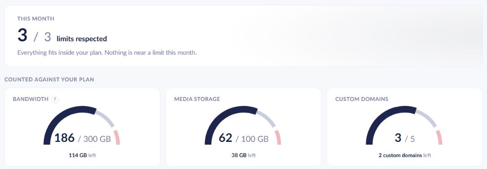
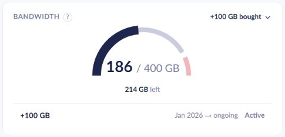
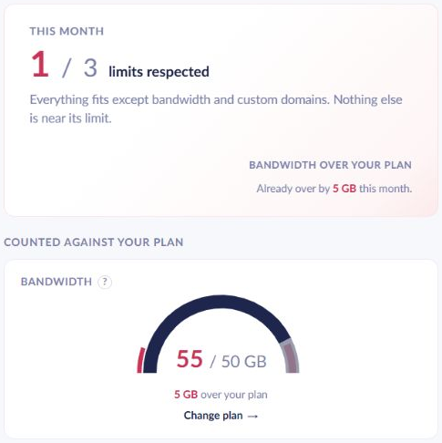
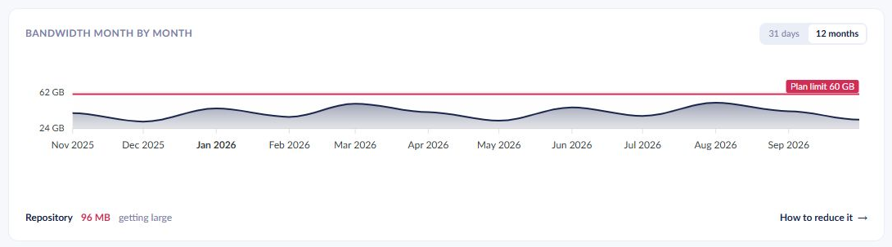
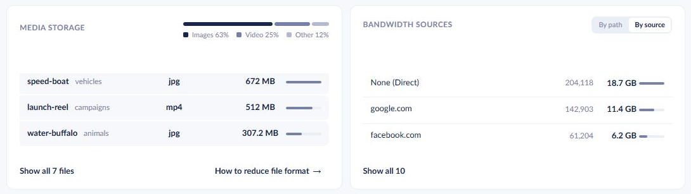
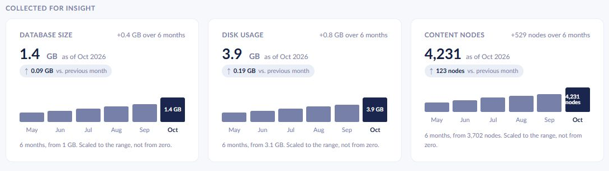
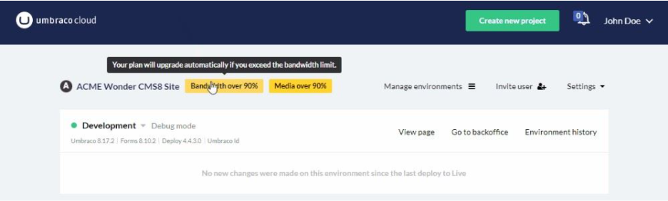

# Usage

In the Umbraco Cloud Settings menu, you can find a page called _Usage_.

On the Usage page, you can see how your project's usage compares to the limits of your plan. The page also shows bandwidth history, the largest media files, what drives bandwidth usage, and additional metrics such as database size.

## Usage overview

The top of the page shows your plan and when the plan figures were last collected. The **This month** summary indicates how many limits your project respects and highlights resources that are close to or over their limit.

<figure><figcaption>
The Usage overview
</figcaption></figure>

### Counted against your plan

The three usage indicators show the amount used, the available limit, and how much is left or over the limit:

| Metric | What it measures |
| --- | --- |
| Bandwidth | Data transferred from your Live environment to visitors during the current month, including responses served from the edge cache. |
| Media storage | The size of all files in the Live environment's blob storage, including cached media. |
| Custom domains | The number of custom domains added to your Live environment. |

Bandwidth is measured from the data sent from the edge to visitors. Responses served from the edge cache still count toward the monthly total, even when the request does not reach the origin server.

The page marks a resource as close to its limit at 85% usage. When usage exceeds a limit, the usage indicator shows the excess and a **Change plan** link. A resource without a plan limit is labeled **No limit on your plan**.

Active bandwidth and media storage plan extensions increase the displayed limits. When an active extension applies, the corresponding usage indicator shows **+X GB bought**. Select this label to expand the list of active and scheduled extensions.

<figure><figcaption>
Bandwidth usage indicator with an active plan extension
</figcaption></figure>

### Bandwidth forecast

For projects with a bandwidth limit, the summary estimates end-of-month usage after at least three days of daily data become available. The forecast takes the average daily usage from up to the last seven recorded days. The projected remaining usage is then added to the collected monthly total.

If this estimate exceeds the bandwidth limit, the summary also shows approximately when the available bandwidth will run out. The projection assumes traffic continues at the recent rate; it is an estimate, not a measured monthly total.

If monthly usage already exceeds the limit, the summary shows how much it is over, like **Already over by 5 GB this month**, instead of a forecast.

<figure><figcaption>
Bandwidth summary when the monthly limit has been exceeded
</figcaption></figure>

Read [Bandwidth](bandwidth.md) for more information about how usage is measured and how to reduce it.

## Bandwidth history and repository size

The bandwidth chart has two views:

* **31 days** shows daily bandwidth usage over a rolling 31-day period.
* **12 months** shows monthly totals for the available history within the last 12 months.

Hover over the chart to see usage for a date or month. In the monthly view, a plan-limit line is shown when the limit is within the chart's comparison range.

<figure><figcaption>
Monthly bandwidth history and repository size
</figcaption></figure>

Below the chart, **Repository** shows the latest collected Git repository size in MB and an indication of its health. Repository size is separate from bandwidth usage. A large repository can slow cloning and deployment. Use **How to reduce it** to open the [Repositories in a Cloud Project](../../../explore-umbraco-cloud/technology-overview/repositories-in-a-cloud-project.md#how-to-reduce-your-repository-size) guide.

## Media storage and bandwidth sources

<figure><figcaption>
Media storage and bandwidth sources
</figcaption></figure>

### Media storage

The media list loads automatically and shows the three largest files first. Select **Show all … files** to expand the list of up to 50 media files in your Live environment.

Each row shows the file name, folder, file type, and size. Select a file name to open the file. When multiple categories are present, the breakdown above the list shows their share of the size of the listed files. Select a category, such as **Images** or **Video**, to filter the list; select it again to clear the filter.

The breakdown covers the largest files returned by the list, rather than all files in blob storage. The media storage usage indicator includes the complete storage size, including cached media.

### Bandwidth sources

Use **By path** and **By source** to investigate what contributes most to bandwidth usage in the current month. Each row shows a path or source, its request count, and the bandwidth generated by those requests.

* **By path** lists the top 10 resource paths in your Live environment. The first three appear initially. Select **Show all 10**, then **Show top 50**, to load up to 50 paths when more are available.
* **By source** lists the top 10 HTTP referrers. Select **Show all …** to expand the list. A referrer is an optional HTTP header identifying the page from which a resource was requested. **None (Direct)** indicates that no referrer was recorded for those requests. It does not necessarily mean the visitor entered the URL directly.


Be aware that any third party services will also consume bandwidth. For example, an uptime service implementation can increase bandwidth usage as it pings the website more frequently.


## Collected for insight

The **Collected for insight** section shows additional metrics for your Live environment:

| Metric | What it measures |
| --- | --- |
| Database size | The size of the environment's database. |
| Disk usage | The environment's file system usage, separate from media blob storage. |
| Content nodes | The number of content nodes reported by the environment's Umbraco backoffice. |

These cards provide insight into growth and are separate from the three usage indicators counted against your plan. Each card shows the latest available value and its month. When history is available, it also shows the change since the previous recorded month and up to six months of history.

<figure><figcaption>
Additional metrics collected for insight
</figcaption></figure>

Use the displayed values and changes to assess growth over time.

## Data availability

Usage figures are collected periodically. Check **Plan figures collected** at the top of the page and the **as of** month on the insight cards when interpreting the data.

New projects may show **No usage collected yet** until the first collection completes. History can be shorter than the selected range, and individual metrics may show **Not collected for this project yet**. If a section cannot load, use its retry control when available.

## Usage limits

You can see the Usage limits and prices for the different plans on Umbraco Cloud on our [website](https://umbraco.com/umbraco-cloud-pricing/) or when [changing your plan](../../../build-and-customize-your-solution/set-up-your-project/project-settings/change-your-plan.md).

You can always upgrade your project to a higher plan if you have reached the limit of what you are allowed on your project. You can **Upgrade the Plan** from the **Management** tab on your project.


When one of the limits reaches 90%, you’ll see a warning banner in the portal and an email is sent to the project owner and the technical contact(s) of the project, notifying you that you’re getting close to your limit(s).


