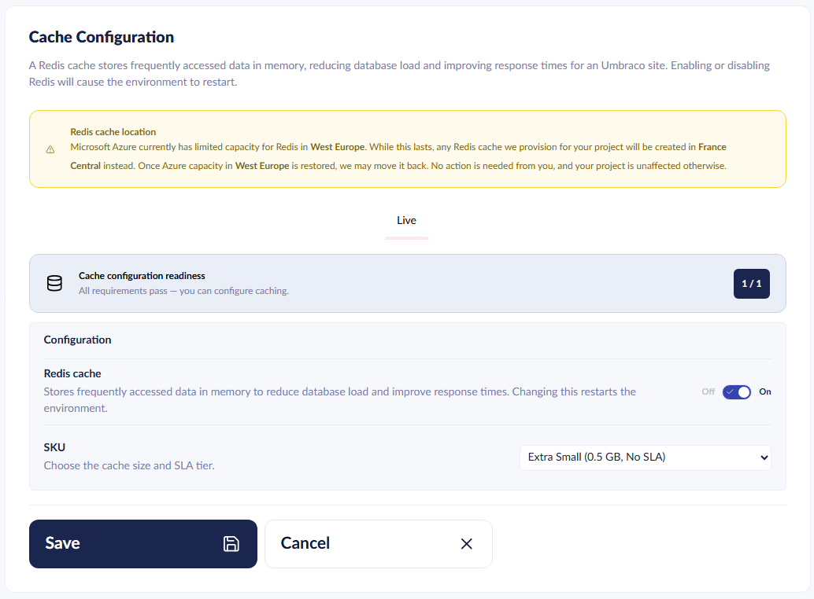

# Cache Configuration

You can enable a managed Redis cache on your Umbraco Cloud project. The cache improves performance on a single-instance project and backs [Load Balancing](load-balancing.md) on load-balanced environments.


You enable and configure the managed Redis cache in the [Umbraco Cloud Portal](https://www.s1.umbraco.io/) under `Project -> Configuration -> Cache Configuration`.


## When to enable Cache

Enable Cache when you need:

* A distributed cache shared by all instances of your environment.
* A SignalR backplane to coordinate backoffice messages across instances.
* Lower database load on read-heavy sites.



You do not need to enable Cache before turning on Load Balancing. If Cache is not already enabled on the environment, Umbraco Cloud provisions a managed Redis cache as part of enabling Load Balancing.



## How the managed Redis cache is used

When you enable Cache, Umbraco Cloud provisions a managed Redis instance for your environment. Redis serves two roles:

* **Distributed cache** — keeps cached state consistent across instances so every visitor sees the same content.
* **SignalR backplane** — coordinates real-time backoffice messages across all running instances.

Umbraco CMS uses Microsoft's HybridCache for in-memory and distributed caching. See the [HybridCacheOptions reference](https://docs.umbraco.com/umbraco-cms/reference/configuration/cache-settings#hybridcacheoptions) for more details and for how to tune the cache.

## Available Redis SKUs

Umbraco Cloud offers six Redis SKUs. The entry-level **Extra Small** tier runs without High Availability (HA) and is not covered by a Service Level Agreement (SLA). All other tiers include HA and an SLA on the Redis instance.

| Display Name | High Availability | Cache Size | Description                |
| ------------ | :---------------: | ---------- | -------------------------- |
| Extra Small  | ❌                 | 0.5 GB     | Entry-level cache, no SLA  |
| Extra Small+ | ✅                 | 0.5 GB     | Entry-level cache with SLA |
| Small+       | ✅                 | 1 GB       | Small cache with SLA       |
| Medium+      | ✅                 | 3 GB       | Medium cache with SLA      |
| Large+       | ✅                 | 6 GB       | Large cache with SLA       |
| Extra Large+ | ✅                 | 12 GB      | Extra-large cache with SLA |

The default SKU for your environment is selected automatically based on your Cloud plan. See [Cache Configuration by Cloud Plan](load-balancing.md#cache-configuration-by-cloud-plan) for the default mapping.

## Choose the right SKU

Pick a SKU that fits your working set — the active content, sessions, and backoffice state your environment caches at peak. Choose a larger SKU when:

* Your site has a large catalogue of content or media metadata.
* You serve many concurrent backoffice editors.
* You see frequent cache evictions on the current SKU.

For pricing of each SKU, see the [Umbraco pricing page](https://umbraco.com/pricing/).

## Related articles

* [Load Balancing](load-balancing.md) — uses the managed Redis cache as a backplane and distributed cache across instances.
* [HybridCacheOptions](https://docs.umbraco.com/umbraco-cms/reference/configuration/cache-settings#hybridcacheoptions) — CMS reference for the Hybrid Cache implementation.
